# Java项目打包部署

# 普通JavaWeb项目

> **1、查看facets是否配置正确**

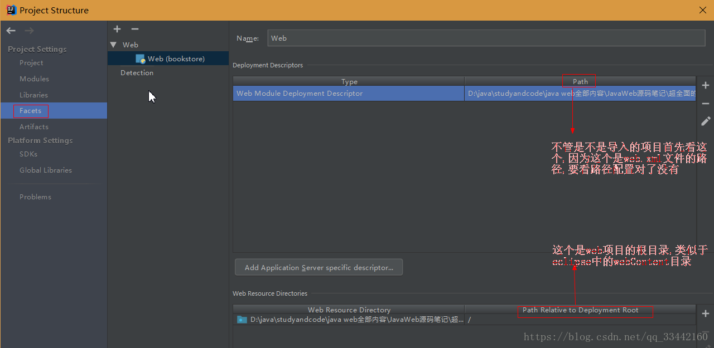

> **2、Artifacts到底是什么?**

 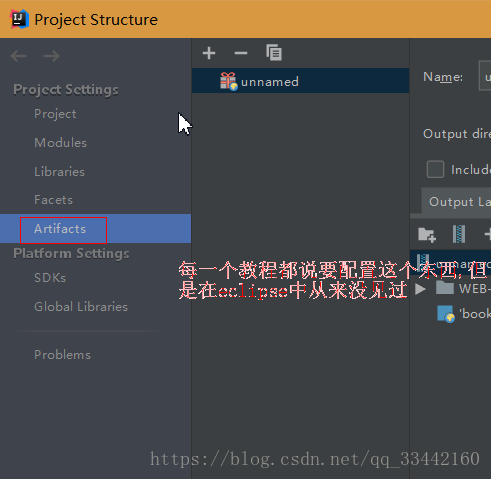

**Artifacts是一种用于装载项目资产以便于测试，部署，或者分布式软件的解决方案**。简单来说就是一个工具包，只要把项目在这里包装就能够放入Tomcat去运行。

> **3、创建war包(war包就是web项目打包后的后缀名，比如普通java项目打包后的后缀名是jar包)**

 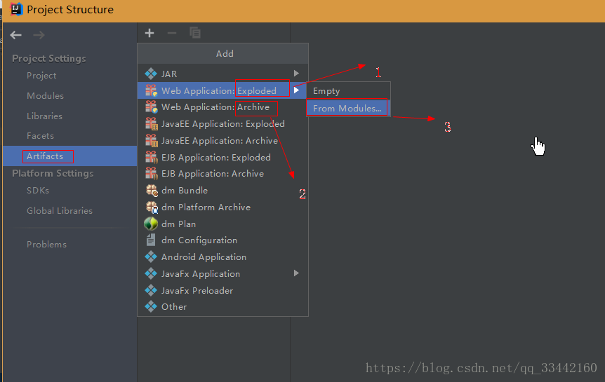

- **标注1**：使用该方式创建的war包是解压好的，也就是可以进行热部署(热部署就是实时更新修改的java代码或者jsp页面等等)的项目，建议开发时选择这个Exploded的方式打包。
- **标注2**：使用Archive打包的web项目时压缩包，后缀名为.war的压缩包，不支持热部署。
- **标注3**：选择从Modules，从模块中选择要打包的项目。

此时打包已经完成：

 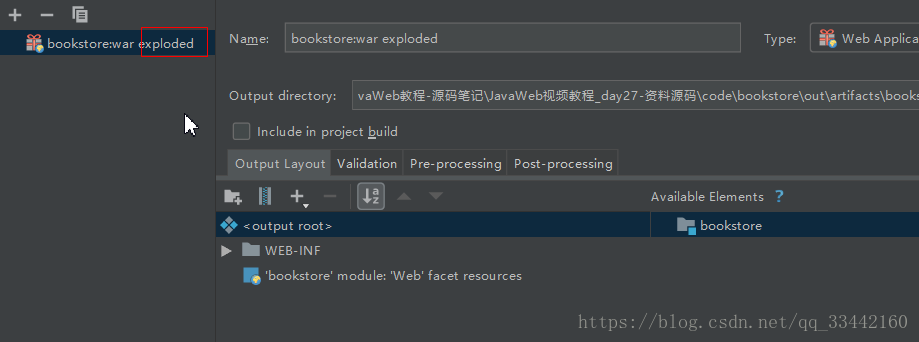

---

接着就可以开始**配置Tomcat**，当然如果你是导入的项目可能需要配置输出目录和jdk，最重要的是配置好web.xml文件和web根目录。

> **4、配置Tomcat并部署项目到Tomcat中**

 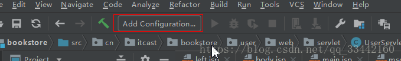

点击添加Tomcat服务器：

 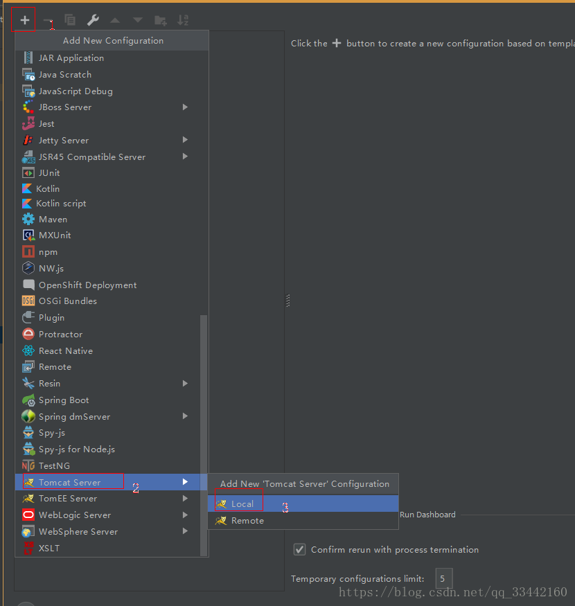

依次点击添加Tomcat本地服务器：

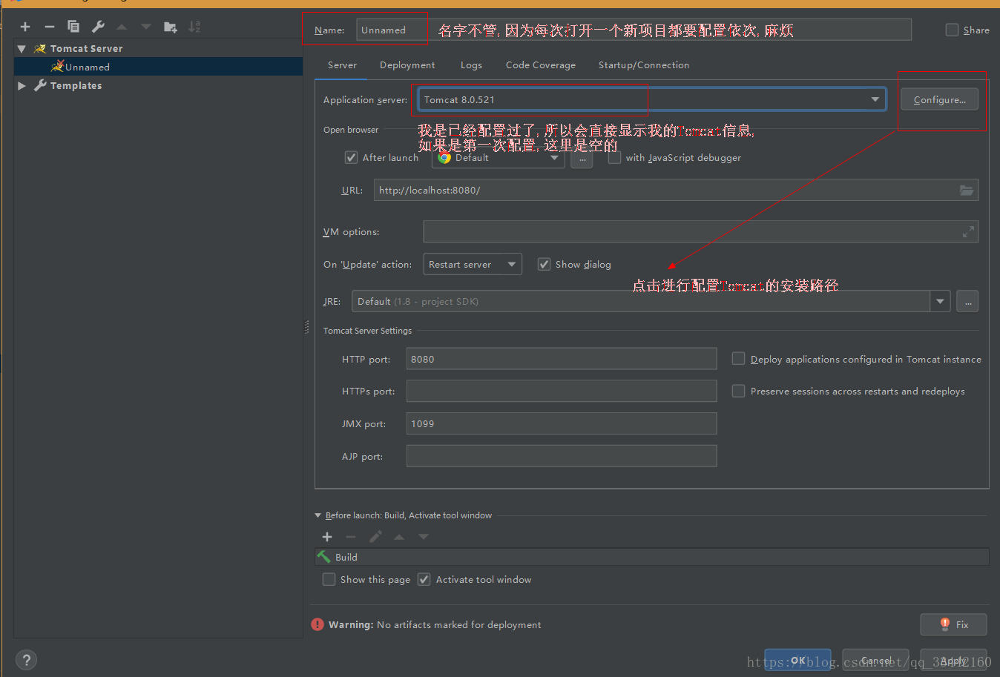

如果没有下载Tomcat需要自己下载，去[官网](https://tomcat.apache.org/)下载就可以了

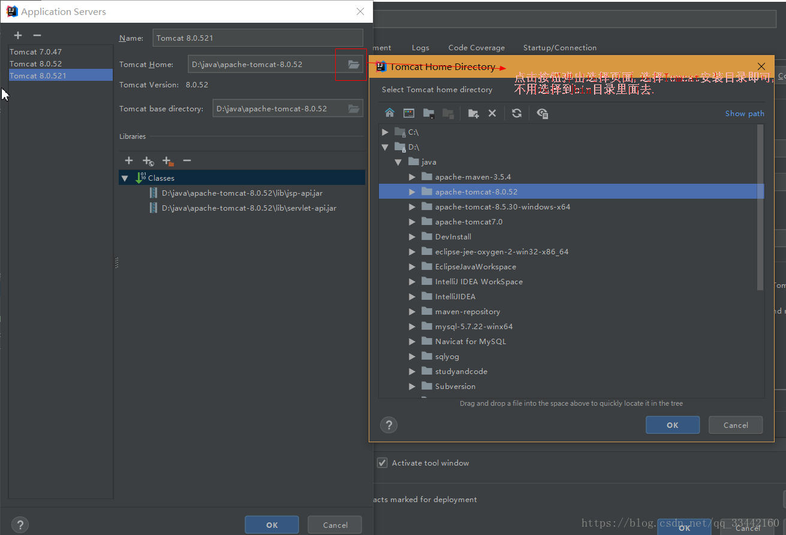

**注意**：选择Tomcat安装目录即可，不用选择到bin目录里面去

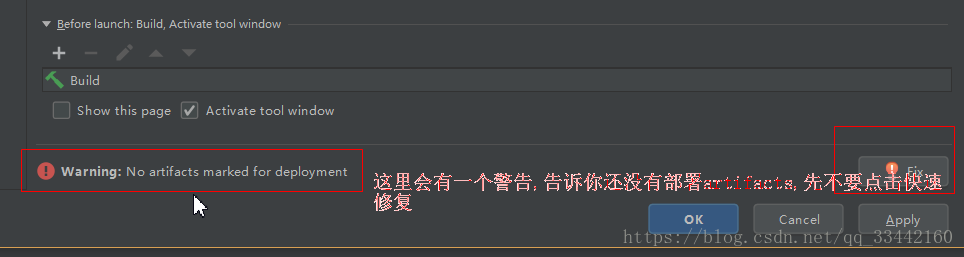

这里有一个快速修复，可以快速部署项目，但是先不要点击。

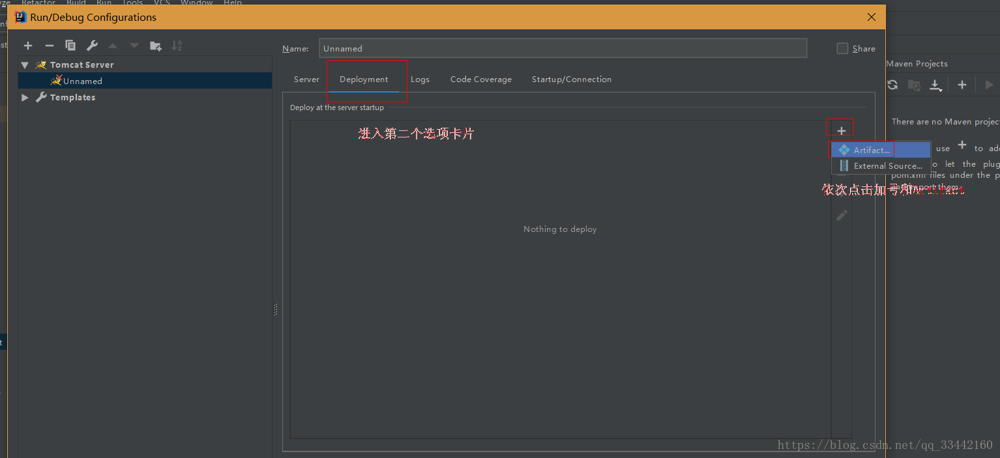

看到这里应该明白为什么要使用Artifacts了吧，Artifacts可以把项目包装成war包。

部署后的效果：

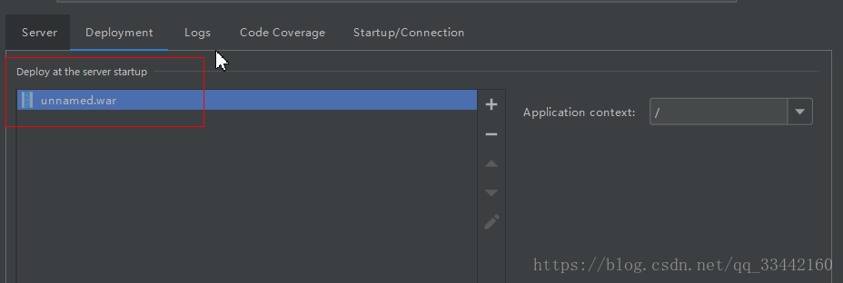

当然也可以选择Artifacts下面的按钮(External Source)进行导入，如图：

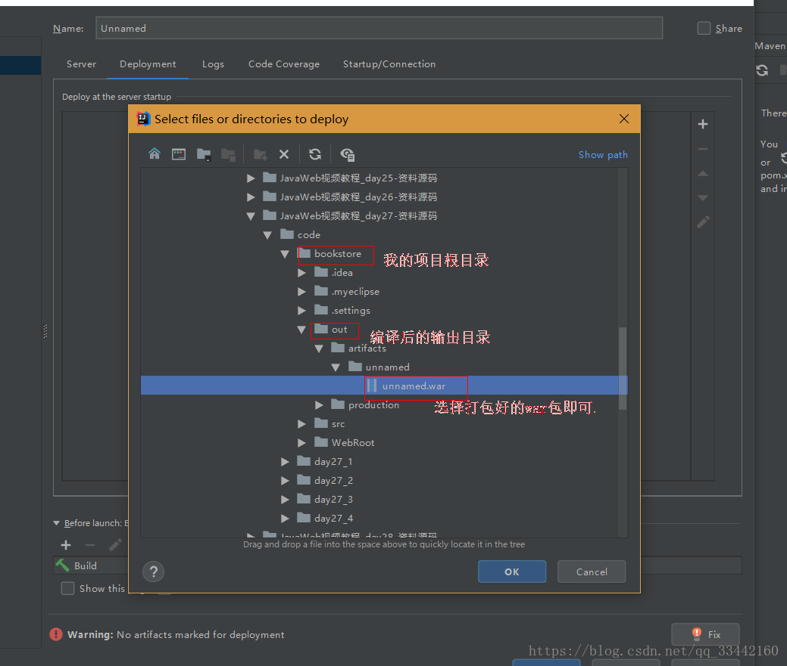

此时你的整个web项目部署已经完成，可能会疑问为什么在Tomcat的webapps目录里面为什么找不到我刚部署的项目？

其实intellij idea使用Tomcat部署项目后并不会把编译后的项目复制到tomcat的webapps目录下，但是它会把编译好的项目路径告诉Tomcat，让Tomcat来找到这个项目，其它的项目比如Tomcat的主页项目ROOT是打不开的，因为intellij idea 只让Tomcat运行了一个项目。

> **5、项目虽然部署完成了，点击run按钮就可以启动服务器了，但是还可以根据需要进行热部署，我看了网上很多关于热部署的方式，但是都没有将全面或者是方法不可行。**

确保三件事情：

1. 确保勾选了这两个选项

    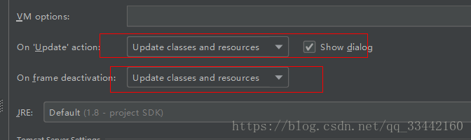

2. 确保你的war包后缀名有加上exploded

    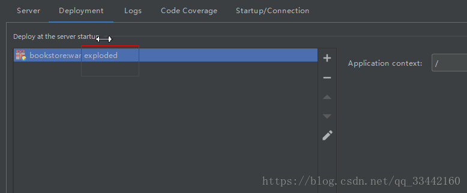

3. 确保选择了图片上的按钮：（这里的选项与Tomcat服务器的选项相同，也就是可以热部署的按钮）

   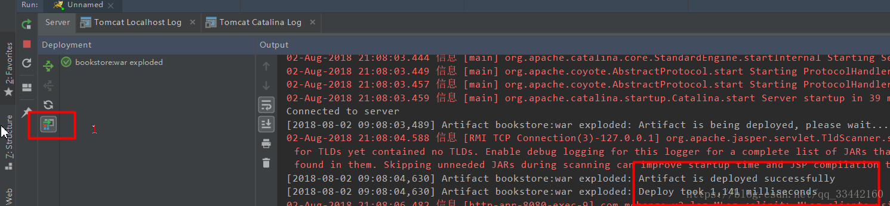

> **6、项目路径解释**

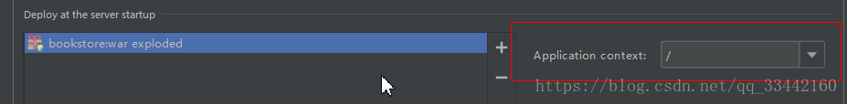

启动项目后如果一直按照原来的方式(本地地址+项目名称)去打开项目，但是一直报错404。默认设置是 / ，意思是你的项目根路径为localhost:8080/，但是这个不是Tomcat的主页吗？实际上Tomcat根本没有加载这个ROOT项目(Tomcat的主页项目名称)，只加载了一个自己部署的项目，如果不习惯可以自己加上项目名称，比如：

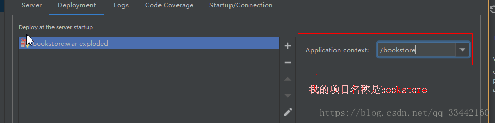

# 有关tomcat的部署

> **1、利用Tomcat自动部署**

项目放到webapps目录下，启动tomcat，就回自动部署

> **2、利用控制台进行部署**

控制台不是说cmd，而是tomcat启动后进入root页面（主页面），有个manager管理部署项目，进入tomcat的manager控制台的deploy区域进行设置就可以部署

上面这两种都是自己用的，就是平时别人发包过来，然后丢进去，启动tomcat就部署，但是开发工具没有用上面两种。

> **3、在IntelliJ idea中使用，增加自定义的Web部署文件(`%Tomcat_Home%\conf\Catalina\localhost\platform-zwml-admin.xml`)**

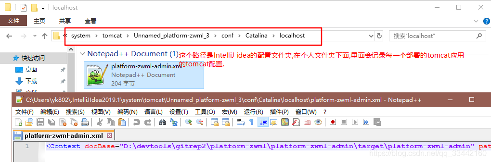

platform-zwml-admin 是项目名

所以web项目不是必须放在webapps文件夹里面才能部署的，放在其它位置为也可以部署，idea是配置到out文件夹（maven是target文件夹），就是输出目录

# SpringBoot项目的打包部署

jar包方式启动，也就是使用spring boot内置的tomcat运行（**也是官方推荐的，打成jar包**）。服务器上面只要你配置了jdk1.8及以上，就ok。不需要外置tomcat。

用`java -jar xxx.jar`命令执行即可

> **1、pom文件引入插件**

```xml
<build>
    <plugins>
        <plugin>
            <groupId>org.springframework.boot</groupId>
            <artifactId>spring-boot-maven-plugin</artifactId>
        </plugin>
    </plugins>
</build>
```

boot使用这个maven插件可以将项目打包成一个可运行的jar，无需在目标服务器安装tomcat等

> **2、idea中快速打包**

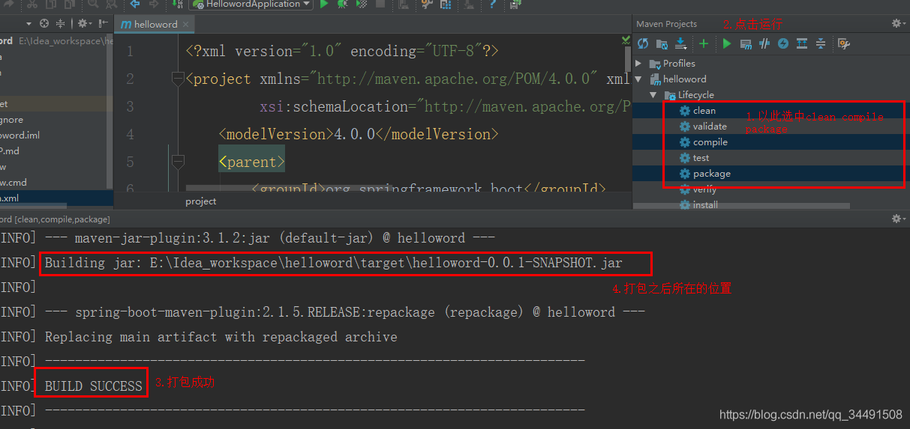

> **3、java –jar运行项目**

我们打开刚才打包之后的所在的位置，确实有一个jar包

 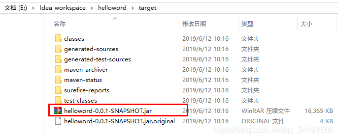

在当前文件路径直接使用cmd通过`java -jar xxx.jar`运行项目

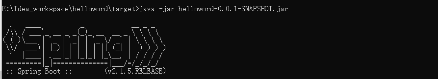

# 部署到服务器

发布之前服务器需要已经安装了jdk环境，数据库（项目数据库服务器如果是本服务器）

通过类似xshell等上传文件将上面的jar文件上传到服务器某个文件夹下，在当前路径下运行下面命令即可在后台启动项目，其中hellword-0.0.1-SNAPSHOT.jar是我的项目

```shel
nohup java -jar hellword-0.0.1-SNAPSHOT.jar > hellword-0.0.1-SNAPSHOT.log  2>&1 &
```

补充：其他相关命令

```shell
nohup java -jar xxx.jar &
```

这样执行后，nohup会把执行结果中的日志输出到当前文件夹下面的nohup.out文件中，通常情况下我们使用以上命令即可。 也可手动指定一个参数来规定日志文件的输出地点

```shell
nohup java -jar xxx.jar > catalina.out  2>&1 &
```

如果不需要输出日志，可以使用如下命令

```shell
nohup java -jar xxx.jar >/dev/null &
```

为了方便管理，我们还可以通过Shell来编写一些用于启动应用的脚本，比如关闭应用的脚本：stop.sh

```shell
#!/bin/bash
 
PID=$(ps -ef | grep yourapp.jar | grep -v grep | awk '{ print $2 }')
 
if [ -z "$PID" ]
 
then
 
echo Application is already stopped
 
else
 
echo kill $PID
 
kill $PID
 
fi
```

启动应用的脚本：start.sh

```shell
#!/bin/bash
 
nohup java -jar yourapp.jar --server.port=8888 &
```

整合了关闭和启动的脚本：run.sh，由于会先执行关闭应用，然后再启动应用，这样不会引起端口冲突等问题，适合在持续集成系统中进行反复调用。

```shell
#!/bin/bash
 
echo stop application
 
source stop.sh
 
echo start application
 
source start.sh
```

在Spring Boot的Maven插件中，还提供了构建完整可执行程序的功能，什么意思呢？就是说，我们可以不用java -jar，而是直接运行jar来执行程序。这样我们就可以方便的将其创建成系统服务在后台运行了。主要步骤如下：在pom.xml中添加Spring Boot的插件，并注意设置executable配置

```xml
<build>
    <plugins>
        <plugin>
            <groupId>org.springframework.boot</groupId>
            <artifactId>spring-boot-maven-plugin</artifactId>
            <configuration>
                <executable>true</executable>
            </configuration>
        </plugin>
    </plugins>
</build>
```

在完成上述配置后，使用mvn install进行打包，构建一个可执行的jar包，创建软连接到/etc/init.d/目录下

```shell
sudo ln -s /var/yourapp/yourapp.jar /etc/init.d/yourapp
```

在完成软连接创建之后，我们就可以通过如下命令对yourapp.jar应用来控制启动、停止、重启操作了

```shell
/etc/init.d/yourapp start|stop|restart
```

