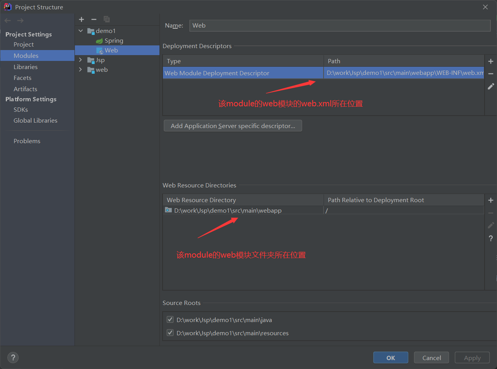

# SpringMVC配置说明

## 1、如何添加(标识)web模块

?>来到项目管理的模块管理中



## 2、SpringMVC配置

### pom.xml

```xml
    <dependencies>
        <dependency>
            <groupId>org.springframework</groupId>
            <artifactId>spring-core</artifactId>
            <version>5.3.1</version>
        </dependency>
        <!-- SpringMVC -->
        <dependency>
            <groupId>org.springframework</groupId>
            <artifactId>spring-webmvc</artifactId>
            <version>5.3.1</version>
        </dependency>
        <dependency>
            <groupId>org.springframework</groupId>
            <artifactId>spring-web</artifactId>
            <version>5.3.1</version>
        </dependency>
        <!-- ServletAPI -->
        <dependency>
            <groupId>javax.servlet</groupId>
            <artifactId>javax.servlet-api</artifactId>
            <version>3.1.0</version>
            <scope>provided</scope>
        </dependency>
        <dependency>
            <groupId>javax.servlet.jsp</groupId>
            <artifactId>jsp-api</artifactId>
            <version>2.2</version>
        </dependency>

        <dependency>
            <groupId>junit</groupId>
            <artifactId>junit</artifactId>
            <version>4.11</version>
            <scope>test</scope>
        </dependency>
    </dependencies>
```

### web.xml

```xml
<?xml version="1.0" encoding="UTF-8"?>
<web-app xmlns="http://xmlns.jcp.org/xml/ns/javaee"
         xmlns:xsi="http://www.w3.org/2001/XMLSchema-instance"
         xsi:schemaLocation="http://xmlns.jcp.org/xml/ns/javaee http://xmlns.jcp.org/xml/ns/javaee/web-app_3_1.xsd"
         version="3.1">

    <display-name>Archetype Created Web Application</display-name>

    <!-- 配置SpringMVC的前端控制器，对浏览器发送的请求统一进行处理 -->
    <servlet>
        <servlet-name>SpringMVC</servlet-name>
        <servlet-class>org.springframework.web.servlet.DispatcherServlet</servlet-class>
        <!-- 通过初始化参数指定SpringMVC配置文件的位置和名称 -->
        <init-param>
            <param-name>contextConfigLocation</param-name>
            <!-- 使用classpath:表示从类路径查找配置文件，例如maven工程中的src/main/resources -->
            <param-value>classpath:spring-mvc.xml</param-value>
        </init-param>
        <!-- 
 			作为框架的核心组件，在启动过程中有大量的初始化操作要做
			而这些操作放在第一次请求时才执行会严重影响访问速度
			因此需要通过此标签将启动控制DispatcherServlet的初始化时间提前到服务器启动时
		-->
        <load-on-startup>1</load-on-startup>
    </servlet>
    <servlet-mapping>
        <servlet-name>SpringMVC</servlet-name>
        <url-pattern>/</url-pattern>
    </servlet-mapping>
    <!--把applicationContext.xml加入到配置文件中-->
    <context-param>
        <param-name>contextConfigLocation</param-name>
        <param-value>classpath:applicationContext.xml</param-value>
    </context-param>

</web-app>
```

> `<url-pattern>`标签中使用/和/*的区别：
>
> - `/`所匹配的请求可以是`/login`或`.html`或`.js`或`.css`方式的请求路径，但是`/`不能匹配`.jsp`请求路径的请求，因此就可以避免在访问jsp页面时，该请求被DispatcherServlet处理，从而找不到相应的页面
>
> - `/*`则能够匹配所有请求，例如在使用过滤器时，若需要对所有请求进行过滤，就需要使用`/*`的写法

### dispatcher-servlet.xml，负责mvc的配置

```xml
<?xml version="1.0" encoding="UTF-8"?>
<beans xmlns="http://www.springframework.org/schema/beans"
       xmlns:xsi="http://www.w3.org/2001/XMLSchema-instance" xmlns:mvc="http://www.springframework.org/schema/mvc"
       xmlns:context="http://www.springframework.org/schema/context"
       xsi:schemaLocation="http://www.springframework.org/schema/beans http://www.springframework.org/schema/beans/spring-beans.xsd http://www.springframework.org/schema/mvc http://www.springframework.org/schema/mvc/spring-mvc.xsd http://www.springframework.org/schema/context http://www.springframework.org/schema/context/spring-context.xsd">


    <!--启用spring的一些annotation -->
    <context:annotation-config/>

    <!--静态资源映射-->
    <!--本项目把静态资源放在了webapp的statics目录下，资源映射如下-->
    <!--    <mvc:resources mapping="/css/**" location="/static/css/"/>-->
    <!--    <mvc:resources mapping="/js/**" location="/static/js/"/>-->
    <!--    <mvc:resources mapping="/image/**" location="/static/images/"/>-->

    <!--
        处理静态资源，例如html、js、css、jpg
        若只设置该标签，则只能访问静态资源，其他请求则无法访问
        此时必须设置<mvc:annotation-driven/>解决问题
    -->
    <mvc:default-servlet-handler/>

    <!-- 对模型视图名称的解析，即在模型视图名称添加前后缀(如果最后一个还是表示文件夹,则最后的斜杠不要漏了) 使用JSP-->
    <!-- 默认的视图解析器 在上边的解析错误时使用 (默认使用html)- -->
    <bean id="defaultViewResolver" class="org.springframework.web.servlet.view.InternalResourceViewResolver">
        <property name="viewClass" value="org.springframework.web.servlet.view.JstlView"/>
        <property name="prefix" value="/views/"/><!--设置JSP文件的目录位置-->
        <property name="suffix" value=".jsp"/>
        <property name="exposeContextBeansAsAttributes" value="true"/>
    </bean>

    <!-- 开启mvc注解驱动 -->
    <mvc:annotation-driven>
        <mvc:message-converters>
            <!-- 处理响应中文内容乱码 -->
            <bean class="org.springframework.http.converter.StringHttpMessageConverter">
                <property name="defaultCharset" value="UTF-8"/>
                <property name="supportedMediaTypes">
                    <list>
                        <value>text/html</value>
                        <value>application/json</value>
                    </list>
                </property>
            </bean>
        </mvc:message-converters>
    </mvc:annotation-driven>

    <!-- 自动扫描装配 -->
    <context:component-scan base-package="com.llh.controller"/>
</beans>
```

**视图解析器为Thymeleaf的版本**

```xml
<!-- 配置Thymeleaf视图解析器 -->
<bean id="viewResolver" class="org.thymeleaf.spring5.view.ThymeleafViewResolver">
    <property name="order" value="1"/>
    <property name="characterEncoding" value="UTF-8"/>
    <property name="templateEngine">
        <bean class="org.thymeleaf.spring5.SpringTemplateEngine">
            <property name="templateResolver">
                <bean class="org.thymeleaf.spring5.templateresolver.SpringResourceTemplateResolver">
    
                    <!-- 视图前缀 -->
                    <property name="prefix" value="/WEB-INF/templates/"/>
    
                    <!-- 视图后缀 -->
                    <property name="suffix" value=".html"/>
                    <property name="templateMode" value="HTML5"/>
                    <property name="characterEncoding" value="UTF-8" />
                </bean>
            </property>
        </bean>
    </property>
</bean>
```

### applicationContext.xml，负责非MVC组件的配置

spring的一些配置可以在这里，暂时没有所以是空的，但也可以扫描一下

```xml
<?xml version="1.0" encoding="UTF-8"?>
<beans xmlns="http://www.springframework.org/schema/beans"
       xmlns:xsi="http://www.w3.org/2001/XMLSchema-instance"
       xmlns:context="http://www.springframework.org/schema/context"
       xsi:schemaLocation="http://www.springframework.org/schema/beans http://www.springframework.org/schema/beans/spring-beans.xsd http://www.springframework.org/schema/context http://www.springframework.org/schema/context/spring-context.xsd">

    <context:component-scan base-package="com.llh"/>

</beans>
```

!>未完待续...
