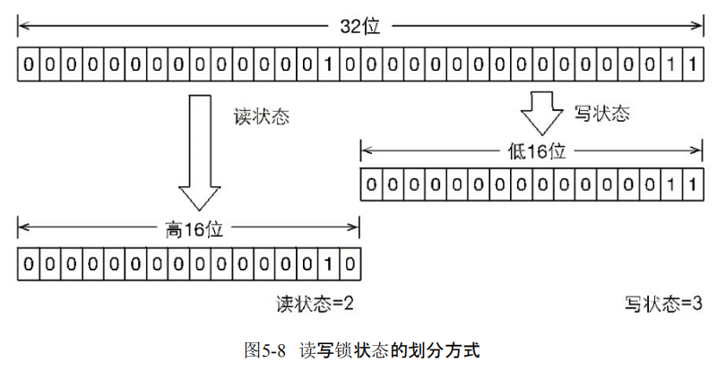

# 深入理解读写锁ReentrantReadWriteLock

## 1、读写锁的介绍

在并发场景中用于解决线程安全的问题，我们几乎会高频率的使用到独占式锁，通常使用java提供的关键字synchronized或者concurrents包中实现了Lock接口的ReentrantLock。它们都是独占式获取锁，也就是在同一时刻只有一个线程能够获取锁。而在一些业务场景中，大部分只是读数据，写数据很少，如果仅仅是读数据的话并不会影响数据正确性（出现脏读），而如果在这种业务场景下，依然使用独占锁的话，很显然这将是出现性能瓶颈的地方。

针对这种读多写少的情况，java还提供了另外一个实现Lock接口的ReentrantReadWriteLock(读写锁)：**读写锁允许同一时刻被多个读线程访问，但是在写线程访问时，所有的读线程和其他的写线程都会被阻塞**。Java并发包提供读写锁的实现是ReentrantReadWriteLock，它提供的特性如下所示：

1. **公平性选择**：支持非公平性（默认）和公平的锁获取方式，吞吐量还是非公平优于公平；
2. **重入性**：支持重入，读锁获取后能再次获取，写锁获取之后能够再次获取写锁，同时也能够获取读锁；
3. **锁降级**：遵循获取写锁，获取读锁再释放写锁的次序，写锁能够降级成为读锁

要想能够彻底的理解读写锁必须能够理解这样几个问题：

1. 读写锁是怎样实现分别记录读写状态的？
2. 写锁是怎样获取和释放的？
3. 读锁是怎样获取和释放的？

## 2、读写状态的设计

读写锁同样依赖自定义同步器来实现同步功能，而读写状态就是其同步器的同步状态。回想ReentrantLock中自定义同步器的实现，同步状态表示锁被一个线程重复获取的次数，而读写锁的自定义同步器需要在同步状态（一个整型变量）上维护多个读线程和一个写线程的状 态，使得该状态的设计成为读写锁实现的关键。

如果在一个整型变量上维护多种状态，就一定需要**“按位切割使用”**这个变量，读写锁将变量切分成了两个部分，高16位表示读，低16位表示写，划分方式如图所示：

 

当前同步状态表示一个线程已经获取了写锁，且重进入了两次，同时也连续获取了两次读锁。读写锁是如何迅速确定读和写各自的状态呢？答案是通过位运算。假设当前同步状态值为S，写状态等于S&0x0000FFFF（将高16位全部抹去），读状态等于S>>>16（无符号补0右移16位）。当写状态增加1时，等于S+1，当读状态增加1时，等于S+(1<<16)，也就是S+0x00010000。

根据状态的划分能得出一个推论：S不等于0时，当写状态（S&0x0000FFFF）等于0时，则读状态（S>>>16）大于0，即读锁已被获取。 

## 3、写锁详解

### 写锁的获取

同步组件的实现聚合了同步器（AQS），并通过重写重写同步器（AQS）中的方法实现同步组件的同步语义。因此，写锁的实现依然也是采用这种方式。在同一时刻写锁是不能被多个线程所获取，很显然写锁是独占式锁，而实现写锁的同步语义是通过重写AQS中的tryAcquire方法实现的。源码为:

```java
protected final boolean tryAcquire(int acquires) {
    /*
     * Walkthrough:
     * 1. If read count nonzero or write count nonzero
     *    and owner is a different thread, fail.
     * 2. If count would saturate, fail. (This can only
     *    happen if count is already nonzero.)
     * 3. Otherwise, this thread is eligible for lock if
     *    it is either a reentrant acquire or
     *    queue policy allows it. If so, update state
     *    and set owner.
     */
    Thread current = Thread.currentThread();
    // 1. 获取写锁当前的同步状态
    int c = getState();
    // 2. 获取写锁获取的次数
    int w = exclusiveCount(c);
    if (c != 0) {
        // (Note: if c != 0 and w == 0 then shared count != 0)
        // 3.1 当读锁已被读线程获取或者当前线程不是已经获取写锁的线程的话
        // 当前线程获取写锁失败
        if (w == 0 || current != getExclusiveOwnerThread())
            return false;
        if (w + exclusiveCount(acquires) > MAX_COUNT)
            throw new Error("Maximum lock count exceeded");
        // Reentrant acquire
        // 3.2 当前线程获取写锁，支持可重复加锁
        setState(c + acquires);
        return true;
    }
    // 3.3 写锁未被任何线程获取，当前线程可获取写锁
    if (writerShouldBlock() ||
        !compareAndSetState(c, c + acquires))
        return false;
    setExclusiveOwnerThread(current);
    return true;
}
```

这段代码的逻辑请看注释，这里有一个地方需要重点关注，exclusiveCount(c)方法，该方法源码为：

```java
static int exclusiveCount(int c) { 
    return c & EXCLUSIVE_MASK; 
}
```

其中**EXCLUSIVE_MASK**为: `static final int EXCLUSIVE_MASK = (1 << SHARED_SHIFT) - 1;` EXCLUSIVE _MASK为1左移16位然后减1，即为0x0000FFFF。而exclusiveCount方法是将同步状态（state为int类型）与0x0000FFFF相与，即取同步状态的低16位。根据exclusiveCount方法的注释为独占式获取的次数即写锁被获取的次数，现在就可以得出来一个结论**同步状态的低16位用来表示写锁的获取次数**。同时还有一个方法值得我们注意：

```java
static int sharedCount(int c) { 
    return c >>> SHARED_SHIFT; 
}
```

该方法是获取读锁被获取的次数，是将同步状态（int c）右移16次，即取同步状态的高16位，现在我们可以得出另外一个结论**同步状态的高16位用来表示读锁被获取的次数**。

其实这里也就对应了上面读写状态的设计的说明，反映了这种设计方式的巧妙。

现在我们回过头来看写锁获取方法tryAcquire，其主要逻辑为：**当读锁已经被读线程获取或者写锁已经被其他写线程获取，则写锁获取失败；否则，获取成功并支持重入，增加写状态。**

### 写锁的释放

写锁释放通过重写AQS的tryRelease方法，源码为：

```java
protected final boolean tryRelease(int releases) {
    if (!isHeldExclusively())
        throw new IllegalMonitorStateException();
    //1. 同步状态减去写状态
    int nextc = getState() - releases;
    //2. 当前写状态是否为0，为0则释放写锁
    boolean free = exclusiveCount(nextc) == 0;
    if (free)
        setExclusiveOwnerThread(null);
    //3. 不为0则更新同步状态
    setState(nextc);
    return free;
}
```

源码的实现逻辑请看注释，不难理解与ReentrantLock基本一致，这里需要注意的是，减少写状态` int nextc = getState() - releases;`只需要用**当前同步状态直接减去写状态的原因正是我们刚才所说的写状态是由同步状态的低16位表示的**。

## 4、读锁详解

### 读锁的获取

看完了写锁，现在来看看读锁，读锁不是独占式锁，即同一时刻该锁可以被多个读线程获取也就是一种共享式锁。按照之前对AQS介绍，实现共享式同步组件的同步语义需要通过重写AQS的tryAcquireShared方法和tryReleaseShared方法。读锁的获取实现方法为：

```java
protected final int tryAcquireShared(int unused) {
    /*
     * Walkthrough:
     * 1. If write lock held by another thread, fail.
     * 2. Otherwise, this thread is eligible for
     *    lock wrt state, so ask if it should block
     *    because of queue policy. If not, try
     *    to grant by CASing state and updating count.
     *    Note that step does not check for reentrant
     *    acquires, which is postponed to full version
     *    to avoid having to check hold count in
     *    the more typical non-reentrant case.
     * 3. If step 2 fails either because thread
     *    apparently not eligible or CAS fails or count
     *    saturated, chain to version with full retry loop.
     */
    Thread current = Thread.currentThread();
    int c = getState();
    //1. 如果写锁已经被获取并且获取写锁的线程不是当前线程的话，当前
    // 线程获取读锁失败返回-1
    if (exclusiveCount(c) != 0 &&
        getExclusiveOwnerThread() != current)
        return -1;
    int r = sharedCount(c);
    if (!readerShouldBlock() &&
        r < MAX_COUNT &&
        //2. 当前线程获取读锁
        compareAndSetState(c, c + SHARED_UNIT)) {
        //3. 下面的代码主要是新增的一些功能，比如getReadHoldCount()方法
        //返回当前获取读锁的次数
        if (r == 0) {
            firstReader = current;
            firstReaderHoldCount = 1;
        } else if (firstReader == current) {
            firstReaderHoldCount++;
        } else {
            HoldCounter rh = cachedHoldCounter;
            if (rh == null || rh.tid != getThreadId(current))
                cachedHoldCounter = rh = readHolds.get();
            else if (rh.count == 0)
                readHolds.set(rh);
            rh.count++;
        }
        return 1;
    }
    //4. 处理在第二步中CAS操作失败的自旋已经实现重入性
    return fullTryAcquireShared(current);
}
```

代码的逻辑请看注释，需要注意的是 **当写锁被其他线程获取后，读锁获取失败**，否则获取成功利用CAS更新同步状态。另外，当前同步状态需要加上SHARED_UNIT（`(1 << SHARED_SHIFT)`即0x00010000）的原因就是我们在上面所说的同步状态的高16位用来表示读锁被获取的次数。如果CAS失败或者已经获取读锁的线程再次获取读锁时，是靠fullTryAcquireShared方法实现的，这段代码就不展开说了，有兴趣可以看看。

### 读锁的释放

读锁释放的实现主要通过方法tryReleaseShared，源码如下，主要逻辑请看注释：

```java
protected final boolean tryReleaseShared(int unused) {
    Thread current = Thread.currentThread();
    // 前面还是为了实现getReadHoldCount等新功能
    if (firstReader == current) {
        // assert firstReaderHoldCount > 0;
        if (firstReaderHoldCount == 1)
            firstReader = null;
        else
            firstReaderHoldCount--;
    } else {
        HoldCounter rh = cachedHoldCounter;
        if (rh == null || rh.tid != getThreadId(current))
            rh = readHolds.get();
        int count = rh.count;
        if (count <= 1) {
            readHolds.remove();
            if (count <= 0)
                throw unmatchedUnlockException();
        }
        --rh.count;
    }
    for (;;) {
        int c = getState();
        // 读锁释放 将同步状态减去读状态即可
        int nextc = c - SHARED_UNIT;
        if (compareAndSetState(c, nextc))
            // Releasing the read lock has no effect on readers,
            // but it may allow waiting writers to proceed if
            // both read and write locks are now free.
            return nextc == 0;
    }
}
```

## 5、降级锁

锁降级指的是**写锁降级成为读锁**。如果当前线程拥有写锁，然后将其释放，最后再获取读锁，这种分段完成的过程不能称之为锁降级。锁降级是指把持住（当前拥有的）写锁，再获取到读锁，随后释放（先前拥有的）写锁的过程。 

接下来看一个锁降级的示例。因为数据不常变化，所以多个线程可以并发地进行数据处理，当数据变更后，如果当前线程感知到数据变化，则进行数据的准备工作，同时其他处理线程被阻塞，直到当前线程完成数据的准备工作，如代码如下所示：

```java
public void processData() { 
    readLock.lock(); 
    if (!update) { 
        // 必须先释放读锁 
        readLock.unlock(); 
        // 锁降级从写锁获取到开始 
        writeLock.lock(); 
        try { 
            if (!update) { 
                ...
                // 准备数据的流程（略） 
                update = true; 
            }
            readLock.lock(); 
        } finally { 
            writeLock.unlock(); 
        }
        // 锁降级完成，写锁降级为读锁 
    }try {
        ...
        // 使用数据的流程（略） 
    } finally { 
        readLock.unlock(); 
    } 
}
```

上述示例中，当数据发生变更后，update变量（布尔类型且volatile修饰）被设置为false，此时所有访问processData()方法的线程都能够感知到变化，但只有一个线程能够获取到写锁，其他线程会被阻塞在读锁和写锁的lock()方法上。当前线程获取写锁完成数据准备之后，再获取读锁，随后释放写锁，完成锁降级。 

**锁降级中读锁的获取是否必要呢？**答案是必要的。主要是为了保证数据的可见性，如果当前线程不获取读锁而是直接释放写锁，假设此刻另一个线程（记作线程T）获取了写锁并修改了数据，那么当前线程无法感知线程T的数据更新。如果当前线程获取读锁，即遵循锁降级的步骤，则线程T将会被阻塞，直到当前线程使用数据并释放读锁之后，线程T才能获取写锁进行数据更新。 

RentrantReadWriteLock不支持锁升级（把持读锁、获取写锁，最后释放读锁的过程 ）。目的也是保证数据可见性，如果读锁已被多个线程获取，其中任意线程成功获取了写锁并更新了数据，则其更新对其他获取到读锁的线程是不可见的。