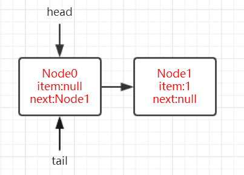
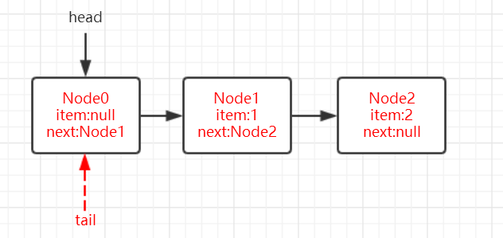

# 并发容器之ConcurrentLinkedQueue

## 1、ConcurrentLinkedQueue简介

在单线程编程中我们会经常用到一些集合类，比如ArrayList,HashMap等，但是这些类都不是线程安全的类。在面试中也经常会有一些考点，比如ArrayList不是线程安全的，Vector是线程安全。而保障Vector线程安全的方式，是非常粗暴的在方法上用synchronized独占锁，将多线程执行变成串行化。要想将ArrayList变成线程安全的也可以使用`Collections.synchronizedList(List<T> list)`方法ArrayList转换成线程安全的，但这种转换方式依然是通过synchronized修饰方法实现的，很显然这不是一种高效的方式，同时，队列也是我们常用的一种数据结构，为了解决线程安全的问题，Doug Lea大师为我们准备了ConcurrentLinkedQueue这个线程安全的队列。从类名就可以看的出来实现队列的数据结构是链式。

ConcurrentLinkedQueue是一个基于链接节点的无界线程安全队列，它采用先进先出的规则对节点进行排序，当我们添加一个元素的时候，它会添加到队列的尾部；当我们获取一个元素时，它会返回队列头部的元素。它采用了“wait-free”算法（即CAS算法）来实现，该算法在 Michael&Scott 算法上进行了一些修改。

## 2、ConcurrentLinkedQueue的结构

通过ConcurrentLinkedQueue的类图来分析一下它的结构，如图所示：

 

ConcurrentLinkedQueue由head节点和tail节点组成，每个节点（Node）由数据域（item）和指向下一个节点（next）的引用组成，节点与节点之间就是通过这个next关联起来，从而组成一张链表结构的队列。默认情况下head节点存储的元素为空，tail节点等于head节点，当我们调用无参构造器时，其源码为：

```java
public ConcurrentLinkedQueue() {
    head = tail = new Node<E>(null);
}
```

## 3、操作Node的几个CAS操作

在队列进行出队入队的时候免不了对节点需要进行操作，在多线程就很容易出现线程安全的问题。可以看出在处理器指令集能够支持**CMPXCHG**指令后，在java源码中涉及到并发处理都会使用CAS操作，那么在ConcurrentLinkedQueue对Node的CAS操作有这样几个：

```java
//更改Node中的数据域item	
boolean casItem(E cmp, E val) {
    return UNSAFE.compareAndSwapObject(this, itemOffset, cmp, val);
}
//更改Node中的指针域next
void lazySetNext(Node<E> val) {
    UNSAFE.putOrderedObject(this, nextOffset, val);
}
//更改Node中的指针域next
boolean casNext(Node<E> cmp, Node<E> val) {
    return UNSAFE.compareAndSwapObject(this, nextOffset, cmp, val);
}
```

可以看出这些方法实际上是通过调用UNSAFE实例的方法，UNSAFE为**sun.misc.Unsafe**类，该类是hotspot底层方法，目前为止了解即可，知道CAS的操作归根结底是由该类提供就好。

## 2、offer方法

对一个队列来说，插入满足FIFO特性，插入元素总是在队列最末尾的地方进行插入，而取（移除）元素总是从队列的队头。所有要想能够彻底弄懂ConcurrentLinkedQueue自然而然是从offer方法和poll方法开始。另外，在看多线程的代码时，可采用这样的思维方式：

> **单个线程offer**
>
> **多个线程offer**
>
> **部分线程offer，部分线程poll**
>
> - 当offer的速度快于poll：队列长度会越来越长，由于offer节点总是在对队列队尾，而poll节点总是在队列对头，也就是说offer线程和poll线程两者并无“交集”，也就是说两类线程间并不会相互影响，这种情况站在相对速率的角度来看，也就是一个"单线程offer"
> - 当offer的速度慢于poll：poll的相对速率快于offer，也就是队头删的速度要快于队尾添加节点的速度，导致的结果就是队列长度会越来越短，而offer线程和poll线程就会出现“交集”，即那一时刻就可以称之为offer线程和poll线程同时操作的节点为 **临界点** ，且在该节点offer线程和poll线程必定相互影响。根据在临界点时offer和poll发生的相对顺序又可从两个角度去思考：**1. 执行顺序为offer-->poll-->offer**，即表现为当offer线程在Node1后插入Node2时，此时poll线程已经将Node1删除，这种情况很显然需要在offer方法中考虑； **2.执行顺序可能为：poll-->offer-->poll**，即表现为当poll线程准备删除的节点为null时（队列为空队列），此时offer线程插入一个节点使得队列变为非空队列。

先给出offer的源码：

```java
public boolean offer(E var1) {
    //1、对是否为null进行判断，为null的话就直接抛出空指针异常
    checkNotNull(var1);
    //2、把数据E包装成Node类
    ConcurrentLinkedQueue.Node var2 = new ConcurrentLinkedQueue.Node(var1);
    //3、将当前尾结点引用为两个变量（这里将var4认为是真正的尾结点）
    ConcurrentLinkedQueue.Node var3 = this.tail;
    ConcurrentLinkedQueue.Node var4 = var3;

    do {
        //4、死循环，符合CAS的套路
        while(true) {
            //5、将var4的next节点引用为var5
            ConcurrentLinkedQueue.Node var5 = var4.next;
            if (var5 == null) {
                break;
            }

            if (var4 == var5) {
                var4 = var3 != (var3 = this.tail) ? var3 : this.head;
            } else {
                //6、定位真正的尾结点
                var4 = var4 != var3 && var3 != (var3 = this.tail) ? var3 : var5;
            }
        }
    } while(!var4.casNext((ConcurrentLinkedQueue.Node)null, var2));

    //7、设置新的tail
    if (var4 != var3) {
        this.casTail(var3, var2);
    }

    return true;
}
```

再执行这么一段代码，创建一个ConcurrentLinkedQueue实例，先offer 1，然后再offer 2，然后从源码的角度来逐步分析。

```java
ConcurrentLinkedQueue<Integer> queue = new ConcurrentLinkedQueue<>();
queue.offer(1);
queue.offer(2);
```

### 单线程角度执行分析

先从**单线程执行的角度**看起，分析offer 1的过程。注释1代码会对是否为null进行判断，为null的话就直接抛出空指针异常，注释2代码将var1包装成一个Node类，这里实例变量var3被初始化为tail，var4被初始化为var3即tail。为了方便下面的理解，**var4被认为队列真正的尾节点，tail不一定指向对象真正的尾节点，因为在ConcurrentLinkedQueue中tail是被延迟更新的**，具体原因我们慢慢来看。下面进入do循环，注释4死循环，符合CAS的套路：先将var4的next节点引用为var5并看是否为null，这里明显为null，至此跳出注释4的死循环。紧接着while判断`!var4.casNext((ConcurrentLinkedQueue.Node)null, var2)`，将var4（当前真正的尾结点）的next节点变为var2，返回true取反为false，退出do while循环。执行最后的if，判断`var4 != var3`，明显是相等的，因为刚才上面根本就没动过这两个变量。至此`offer(1);`完成。此时ConcurrentLinkedQueue的状态如下图所示：

 

如图，此时队列的尾节点应该为Node1，而tail指向的节点依然还是Node0，因此可以说明tail是延迟更新的。那么我们继续来看offer 2的时候的情况，很显然此时注释5代码var5指向的节点不为null了，而是指向Node1，注释5代码if判断为false，紧接着if判断`var4 == var5`，为啥要这么判断呢，其实他们俩相等只有一种可能就是var4节点和var4的next节点都等于空，表示这个队列刚初始化，正准备添加节点，所以将head节点赋予var4（真正的尾结点）这里肯定是不相等的，于是走else代码，明显var3是等于var4的，至此var4（真正的尾结点）变为var5（也就是我们新插入的item为2的Node2节点），到这就可以彻底理解"tail是被延迟更新的"这句话，而其实**注释6代码的作用就是定位真正的尾结点**：

```java
var4 = var4 != var3 && var3 != (var3 = this.tail) ? var3 : var5;
```

然后while里通过casNext方法设置var4节点的next为当前新增的Node2，跳出do while循环。这个时候var4 != var3（上面重新定位到了tail），注释7代码if判断为true，会通过`casTail(t, newNode)`将当前节点Node2设置为队列的队尾节点，此时的队列状态示意图如下图所示：

 

**tail指向的节点由Node0改变为Node2**，如果这里的casTail失败，是不需要重试的，原因是：offer代码中主要是通过var4的next节点var5`ConcurrentLinkedQueue.Node var5 = var4.next;`决定后面的逻辑走向的，当casTail失败时状态示意图如下：

 

如图，**如果这里casTail设置tail失败即tail还是指向Node0节点的话，无非就是多循环几次通过13行代码定位到队尾节点**。

通过对单线程执行角度进行分析，我们可以了解到offer的执行逻辑为：

1. **如果tail指向的节点的下一个节点（next域）为null的话，说明tail指向的节点即为队列真正的队尾节点，因此可以通过casNext插入当前待插入的节点，但此时tail并未变化，如图2;**
2. **如果tail指向的节点的下一个节点（next域）不为null的话，说明tail指向的节点不是队列的真正队尾节点。通过var5 `ConcurrentLinkedQueue.Node var5 = var4.next;`指针往前递进去找到队尾节点，然后通过casNext插入当前待插入的节点，并通过casTail方式更改tail，如图3**。

不得不赞叹这个do while循环的巧妙，将原本臃肿的代码写的如此优美！

我们回过头再来看`var4 = var4 != var3 && var3 != (var3 = this.tail) ? var3 : var5;`这行代码在单线程中，这段代码永远不会将var4赋值为var3，那么这么写就不会有任何作用，那我们试着在**多线程**的情况下进行分析。

### 多线程角度执行分析

> **多个线程offer**

很显然这么写另有深意，其实在**多线程环境**下这行代码很有意思的。 `var3 != (var3 = this.tail)`这个操作**并非一个原子操作**，有这样一种情况：

 

如图，假设线程A此时读取了变量t，线程B刚好在这个时候offer一个Node后，此时会修改tail指针，那么这个时候线程A再次执行var4=this.tail时var4会指向另外一个节点，很显然线程A前后两次读取的变量var4指向的节点不相同，即`var4 != (var4 = this.tail)`为true，并且由于var4指向节点的变化`var4 != var3`也为true，此时该三目表达式会将var3赋给var4（其实也就是发现了多线程改动，导致这次的tail先不动），然后下面的if也不会成立，其实跟上面casTail设置tail失败的情况一样，等到下次再设置tail。

> **offer->poll->offer**

那么还剩下第11行的代码我们没有分析，大致可以猜想到应该就是回答**一部分线程offer，一部分poll**的这种情况。当`if (var4 == var5)`为true时，说明p指向的节点的next也指向它自己，这种节点称之为**哨兵节点**，**这种节点在队列中存在的价值不大，一般表示为要删除的节点或者是空节点**。为了能够很好的理解这种情况，我们先看看poll方法的执行过程后，再回过头来看，总之这是一个很有意思的事情。

