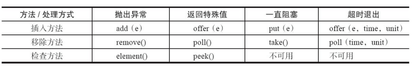
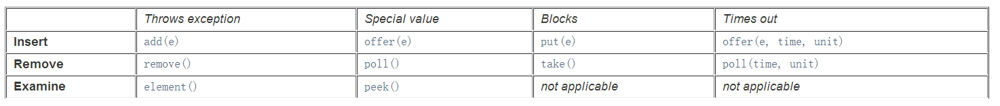

# 并发容器之BlockingQueue

## 1、BlockingQueue简介

在实际编程中，会经常使用到JDK中Collection集合框架中的各种容器类如实现List,Map,Queue接口的容器类，但是这些容器类基本上不是线程安全的，除了使用Collections可以将其转换为线程安全的容器，Doug Lea大师为我们都准备了对应的线程安全的容器，如实现List接口的CopyOnWriteArrayList，实现Map接口的ConcurrentHashMap，实现Queue接口的ConcurrentLinkedQueue。

最常用的"**生产者-消费者**"问题中，队列通常被视作线程间操作的数据容器，这样，可以对各个模块的业务功能进行解耦，生产者将“生产”出来的数据放置在数据容器中，而消费者仅仅只需要在“数据容器”中进行获取数据即可，这样生产者线程和消费者线程就能够进行解耦，只专注于自己的业务功能即可。阻塞队列（BlockingQueue）被广泛使用在“生产者-消费者”问题中，其原因是BlockingQueue提供了可阻塞的插入和移除的方法。**当队列容器已满，生产者线程会被阻塞，直到队列未满；当队列容器为空时，消费者线程会被阻塞，直至队列非空时为止。**

## 2、基本操作

插入和移除操作的4种处理方式：

 

- 抛出异常：当队列满时，如果再往队列里插入元素，会抛出IllegalStateException（"Queue full"）异常。当队列空时，从队列里获取元素会抛出NoSuchElementException异常。 
- 返回特殊值：当往队列插入元素时，会返回元素是否插入成功，成功返回true。如果是移除方法，则是从队列里取出一个元素，如果没有则返回null。 
- 一直阻塞：当阻塞队列满时，如果生产者线程往队列里put元素，队列会一直阻塞生产者线程，直到队列可用或者响应中断退出。当队列空时，如果消费者线程从队列里take元素，队列会阻塞住消费者线程，直到队列不为空。
- 超时退出：当阻塞队列满时，如果生产者线程往队列里插入元素，队列会阻塞生产者线程一段时间，如果超过了指定的时间，生产者线程就会退出。 

## 3、常用的BlockingQueue

实现BlockingQueue接口的有`ArrayBlockingQueue, DelayQueue, LinkedBlockingDeque, LinkedBlockingQueue, LinkedTransferQueue, PriorityBlockingQueue, SynchronousQueue`，而这几种常见的阻塞队列也是在实际编程中会常用的，下面对这几种常见的阻塞队列进行说明：

> **ArrayBlockingQueue**

**ArrayBlockingQueue**是由数组实现的有界阻塞队列。该队列命令元素FIFO（先进先出）。因此，队头元素是队列中存在时间最长的数据元素，而对尾数据则是当前队列最新的数据元素。ArrayBlockingQueue可作为“有界数据缓冲区”，生产者插入数据到队列容器中，并由消费者提取。ArrayBlockingQueue一旦创建，容量不能改变。

当队列容量满时，尝试将元素放入队列将导致操作阻塞；尝试从一个空队列中取一个元素也会同样阻塞。

ArrayBlockingQueue默认情况下不能保证线程访问队列的公平性，所谓公平性是指严格按照线程等待的绝对时间顺序，即最先等待的线程能够最先访问到ArrayBlockingQueue。而非公平性则是指访问ArrayBlockingQueue的顺序不是遵守严格的时间顺序，有可能存在，一旦ArrayBlockingQueue可以被访问时，长时间阻塞的线程依然无法访问到ArrayBlockingQueue。**如果保证公平性，通常会降低吞吐量**。如果需要获得公平性的ArrayBlockingQueue，可采用如下代码：

```java
private static ArrayBlockingQueue<Integer> blockingQueue = new ArrayBlockingQueue<Integer>(10,true);
```

访问者的公平性是使用可重入锁实现的，代码如下：

```java
public ArrayBlockingQueue(int capacity, boolean fair) { 
    if (capacity <= 0) 
        throw new IllegalArgumentException(); 
    this.items = new Object[capacity]; 
    lock = new ReentrantLock(fair);
    notEmpty = lock.newCondition();
    notFull = lock.newCondition(); 
}
```

关于ArrayBlockingQueue的实现原理，可以[看这篇文章](https://juejin.im/post/5aeebdb26fb9a07aa83ea17e)。

> **LinkedBlockingQueue**

LinkedBlockingQueue是用链表实现的有界阻塞队列，同样满足FIFO的特性，与ArrayBlockingQueue相比起来具有更高的吞吐量，为了防止LinkedBlockingQueue容量迅速增，损耗大量内存。通常在创建LinkedBlockingQueue对象时，会指定其大小，如果未指定，容量等于Integer.MAX_VALUE

> **PriorityBlockingQueue**

PriorityBlockingQueue是一个支持优先级的无界阻塞队列。默认情况下元素采用自然顺序进行排序，也可以通过自定义类实现compareTo()方法来指定元素排序规则，或者初始化时通过构造器参数Comparator来指定排序规则。

> **SynchronousQueue**

SynchronousQueue每个插入操作必须等待另一个线程进行相应的删除操作，因此，SynchronousQueue实际上没有存储任何数据元素，因为只有线程在删除数据时，其他线程才能插入数据，同样的，如果当前有线程在插入数据时，线程才能删除数据。SynchronousQueue也可以通过构造器参数来为其指定公平性。

> **LinkedTransferQueue**

LinkedTransferQueue是一个由链表数据结构构成的无界阻塞队列，由于该队列实现了TransferQueue接口，与其他阻塞队列相比主要有以下不同的方法：

- **transfer(E e)**：如果当前有线程（消费者）正在调用take()方法或者可延时的poll()方法进行消费数据时，生产者线程可以调用transfer方法将数据传递给消费者线程。如果当前没有消费者线程的话，生产者线程就会将数据插入到队尾，直到有消费者能够进行消费才能退出；
- **tryTransfer(E e)**：tryTransfer方法如果当前有消费者线程（调用take方法或者具有超时特性的poll方法）正在消费数据的话，该方法可以将数据立即传送给消费者线程，如果当前没有消费者线程消费数据的话，就立即返回`false`。因此，与transfer方法相比，transfer方法是必须等到有消费者线程消费数据时，生产者线程才能够返回。而tryTransfer方法能够立即返回结果退出。
- **tryTransfer(E e,long timeout,imeUnit unit)**：与transfer基本功能一样，只是增加了超时特性，如果数据才规定的超时时间内没有消费者进行消费的话，就返回`false`。

> **LinkedBlockingDeque**

LinkedBlockingDeque是基于链表数据结构的有界阻塞双端队列，如果在创建对象时为指定大小时，其默认大小为Integer.MAX_VALUE。与LinkedBlockingQueue相比，主要的不同点在于，LinkedBlockingDeque具有双端队列的特性。LinkedBlockingDeque基本操作如下图所示：



如上图所示，LinkedBlockingDeque的基本操作可以分为四种类型：1.特殊情况，抛出异常；2.特殊情况，返回特殊值如null或者false；3.当线程不满足操作条件时，线程会被阻塞直至条件满足；4. 操作具有超时特性。

另外，LinkedBlockingDeque实现了BlockingDueue接口而LinkedBlockingQueue实现的是BlockingQueue，这两个接口的主要区别如下图所示：

 

从上图可以看出，两个接口的功能是可以等价使用的，比如BlockingQueue的add方法和BlockingDeque的addLast方法的功能是一样的。

> **DelayQueue**

DelayQueue是一个存放实现Delayed接口的数据的无界阻塞队列，只有当数据对象的延时时间达到时才能插入到队列进行存储。如果当前所有的数据都还没有达到创建时所指定的延时期，则队列没有队头，并且线程通过poll等方法获取数据元素则返回null。所谓数据延时期满时，则是通过Delayed接口的`getDelay(TimeUnit.NANOSECONDS)`来进行判定，如果该方法返回的是小于等于0则说明该数据元素的延时期已满。

> 参考文献

《Java并发编程的艺术》