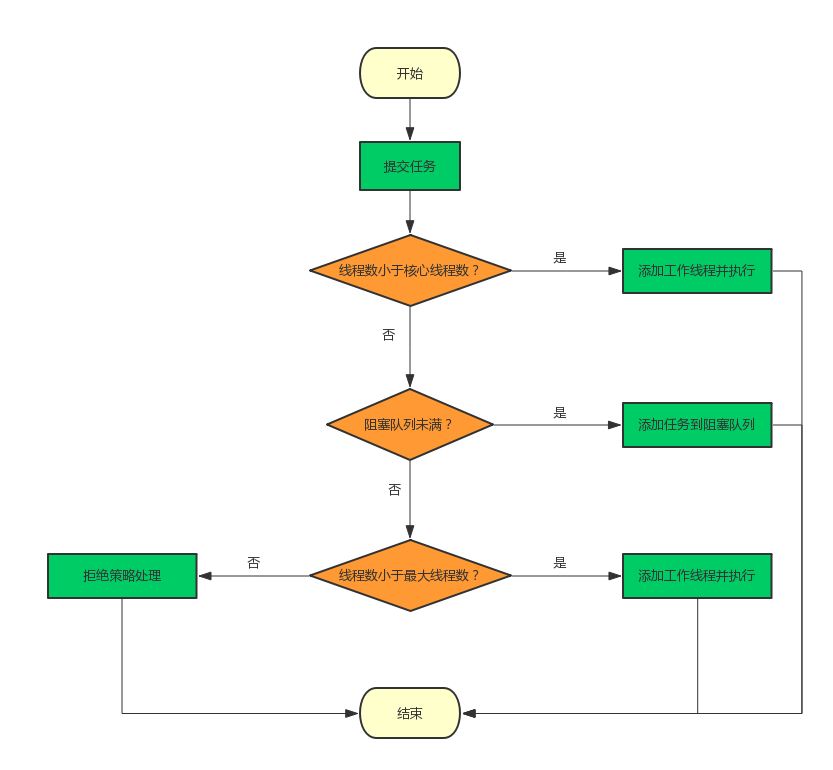

# 线程池ThreadPoolExecutor实现原理

# 1、为什么要使用线程池

在实际使用中，线程是很占用系统资源的，如果对线程管理不善很容易导致系统问题。因此，在大多数并发框架中都会使用**线程池**来管理线程，使用线程池管理线程主要有如下好处：

- 第一：降低资源消耗。通过重复利用已创建的线程降低线程创建和销毁造成的消耗。
- 第二：提高响应速度。当任务到达时，任务可以不需要等到线程创建就能立即执行。
- 第三：提高线程的可管理性。线程是稀缺资源，如果无限制地创建，不仅会消耗系统资源，还会降低系统的稳定性，使用线程池可以进行统一分配、调优和监控。

# 2、几个重要的字段

```java
private final AtomicInteger ctl = new AtomicInteger(ctlOf(RUNNING, 0));
private static final int COUNT_BITS = Integer.SIZE - 3;
private static final int CAPACITY   = (1 << COUNT_BITS) - 1;

// runState is stored in the high-order bits
private static final int RUNNING    = -1 << COUNT_BITS;
private static final int SHUTDOWN   =  0 << COUNT_BITS;
private static final int STOP       =  1 << COUNT_BITS;
private static final int TIDYING    =  2 << COUNT_BITS;
private static final int TERMINATED =  3 << COUNT_BITS;
```

`ctl`是对线程池的运行状态和线程池中有效线程的数量进行控制的一个字段， 它包含两部分的信息：线程池的运行状态 (runState) 和线程池内有效线程的数量 (workerCount)，这里可以看到，使用了Integer类型来保存，高3位保存runState，低29位保存workerCount。COUNT_BITS 就是29，CAPACITY就是1左移29位减1（29个1），这个常量表示workerCount的上限值，大约是5亿。

下面再介绍下线程池的运行状态，线程池一共有五种状态, 分别是：

1. **RUNNING** ：能接受新提交的任务，并且也能处理阻塞队列中的任务；
2. **SHUTDOWN**：关闭状态，不再接受新提交的任务，但却可以继续处理阻塞队列中已保存的任务。在线程池处于 RUNNING 状态时，调用 shutdown()方法会使线程池进入到该状态。（finalize() 方法在执行过程中也会调用shutdown()方法进入该状态）；
3. **STOP**：不能接受新任务，也不处理队列中的任务，会中断正在处理任务的线程。在线程池处于 RUNNING 或 SHUTDOWN 状态时，调用 shutdownNow() 方法会使线程池进入到该状态；
4. **TIDYING**：如果所有的任务都已终止了，workerCount (有效线程数) 为0，线程池进入该状态后会调用 terminated() 方法进入TERMINATED 状态。
5. **TERMINATED**：在terminated() 方法执行完后进入该状态，默认terminated()方法中什么也没有做。
   进入TERMINATED的条件如下：
   - 线程池不是RUNNING状态；
   - 线程池状态不是TIDYING状态或TERMINATED状态；
   - 如果线程池状态是SHUTDOWN并且workerQueue为空；
   - workerCount为0；
   - 设置TIDYING状态成功。

下图为线程池的状态转换过程：


# 3、ctl相关方法

这里还有几个对ctl进行计算的方法：

```java
private static int runStateOf(int c)     { return c & ~CAPACITY; }
private static int workerCountOf(int c)  { return c & CAPACITY; }
private static int ctlOf(int rs, int wc) { return rs | wc; }
```

- **runStateOf**：获取运行状态；
- **workerCountOf**：获取活动线程数；
- **ctlOf**：获取运行状态和活动线程数的值。

# 4、ThreadPoolExecutor构造方法

创建线程池主要是**ThreadPoolExecutor**类来完成，ThreadPoolExecutor的有许多重载的构造方法，通过参数最多的构造方法来理解创建线程池有哪些需要配置的参数。ThreadPoolExecutor的构造方法为：

```java
ThreadPoolExecutor(int corePoolSize,
                              int maximumPoolSize,
                              long keepAliveTime,
                              TimeUnit unit,
                              BlockingQueue<Runnable> workQueue,
                              ThreadFactory threadFactory,
                              RejectedExecutionHandler handler)
```

下面对参数进行说明：

1. **corePoolSize**：表示核心线程池的大小。当提交一个任务时，如果当前核心线程池的线程个数没有达到corePoolSize，则会创建新的线程来执行所提交的任务，**即使当前核心线程池有空闲的线程**。如果当前核心线程池的线程个数已经达到了corePoolSize，则不再重新创建线程。如果调用了`prestartCoreThread()`或者 `prestartAllCoreThreads()`，线程池创建的时候所有的核心线程都会被创建并且启动。
2. **maximumPoolSize**：表示线程池能创建线程的最大个数。如果当阻塞队列已满时，并且当前线程池线程个数没有超过maximumPoolSize的话，就会创建新的线程来执行任务。
3. **keepAliveTime**：空闲线程存活时间。如果当前线程池的线程个数已经超过了corePoolSize，并且线程空闲时间超过了keepAliveTime的话，就会将这些空闲线程销毁，这样可以尽可能降低系统资源消耗。
4. **unit**：时间单位。为keepAliveTime指定时间单位。
5. **workQueue**：阻塞队列。用于保存任务的阻塞队列，关于阻塞队列可以看上面的文章。可以使用**ArrayBlockingQueue, LinkedBlockingQueue, SynchronousQueue, PriorityBlockingQueue**。
6. **threadFactory**：创建线程的工程类。可以通过指定线程工厂为每个创建出来的线程设置更有意义的名字，如果出现并发问题，也方便查找问题原因。
7. **handler**：饱和策略。当线程池的阻塞队列已满和指定的线程都已经开启，说明当前线程池已经处于饱和状态了，那么就需要采用一种策略来处理这种情况。采用的策略有这几种：
   1. **AbortPolicy**： 直接拒绝所提交的任务，并抛出**RejectedExecutionException**异常；
   2. **CallerRunsPolicy**：只用调用者所在的线程来执行任务；
   3. **DiscardPolicy**：不处理直接丢弃掉任务；
   4. **DiscardOldestPolicy**：丢弃掉阻塞队列中存放时间最久的任务，执行当前任务。

# 5、execute方法

execute()方法用来提交任务，代码如下：

```java
public void execute(Runnable command) {
    if (command == null)
        throw new NullPointerException();
    /*
     * clt记录着runState和workerCount
     */
    int c = ctl.get();
    /*
     * workerCountOf方法取出低29位的值，表示当前活动的线程数；
     * 如果当前活动线程数小于corePoolSize，则新建一个线程放入线程池中；
     * 并把任务添加到该线程中。
     */
    if (workerCountOf(c) < corePoolSize) {
        /*
         * addWorker中的第二个参数表示限制添加线程的数量是根据corePoolSize来判断还是maximumPoolSize来判断；
         * 如果为true，根据corePoolSize来判断；
         * 如果为false，则根据maximumPoolSize来判断
         */
        if (addWorker(command, true))
            return;
        /*
         * 如果添加失败，则重新获取ctl值
         */
        c = ctl.get();
    }
    /*
     * 如果当前线程池是运行状态并且任务添加到队列成功
     */
    if (isRunning(c) && workQueue.offer(command)) {
        // 重新获取ctl值
        int recheck = ctl.get();
        // 再次判断线程池的运行状态，如果不是运行状态，由于之前已经把command添加到workQueue中了，
        // 这时需要移除该command
        // 执行过后通过handler使用拒绝策略对该任务进行处理，整个方法返回
        if (! isRunning(recheck) && remove(command))
            reject(command);
        /*
         * 获取线程池中的有效线程数，如果数量是0，则执行addWorker方法
         * 这里传入的参数表示：
         * 1. 第一个参数为null，表示在线程池中创建一个线程，但不去启动；
         * 2. 第二个参数为false，将线程池的有限线程数量的上限设置为maximumPoolSize，添加线程时根据maximumPoolSize来判断；
         * 如果判断workerCount大于0，则直接返回，在workQueue中新增的command会在将来的某个时刻被执行。
         */
        else if (workerCountOf(recheck) == 0)
            addWorker(null, false);
    }
    /*
     * 如果执行到这里，有两种情况：
     * 1. 线程池已经不是RUNNING状态；
     * 2. 线程池是RUNNING状态，但workerCount >= corePoolSize并且workQueue已满。
     * 这时，再次调用addWorker方法，但第二个参数传入为false，将线程池的有限线程数量的上限设置为maximumPoolSize；
     * 如果失败则拒绝该任务
     */
    else if (!addWorker(command, false))
        reject(command);
}
```

简单来说，在执行execute()方法时如果状态一直是RUNNING时，的执行过程如下：

1. 如果`workerCount < corePoolSize`，则创建并启动一个线程来执行新提交的任务；
2. 如果`workerCount >= corePoolSize`，且线程池内的阻塞队列未满，则将任务添加到该阻塞队列中；
3. 如果`workerCount >= corePoolSize && workerCount < maximumPoolSize`，且线程池内的阻塞队列已满，则创建并启动一个线程来执行新提交的任务；
4. 如果`workerCount >= maximumPoolSize`，并且线程池内的阻塞队列已满，则根据拒绝策略来处理该任务，默认的处理方式是直接抛异常。

这里要注意一下`addWorker(null, false);`，也就是创建一个线程，但并没有传入任务，因为任务已经被添加到workQueue中了，所以worker在执行的时候，会直接从workQueue中获取任务。所以，在`workerCountOf(recheck) == 0`时执行`addWorker(null, false);`也是为了保证线程池在RUNNING状态下必须要有一个线程来执行任务。

execute方法执行流程如下：

 

线程池的设计思想就是使用了**核心线程池corePoolSize，阻塞队列workQueue和线程池maximumPoolSize**，这样的缓存策略来处理任务，实际上这样的设计思想在需要框架中都会使用。

# 6、线程池的关闭

关闭线程池，可以通过`shutdown`和`shutdownNow`这两个方法。它们的原理都是遍历线程池中所有的线程，然后依次中断线程。`shutdown`和`shutdownNow`还是有不一样的地方：

1. `shutdownNow`首先将线程池的状态设置为**STOP**，然后尝试**停止所有的正在执行和未执行任务**的线程，并返回等待执行任务的列表；
2. `shutdown`只是将线程池的状态设置为**SHUTDOWN**状态，然后中断所有没有正在执行任务的线程

可以看出shutdown方法会将正在执行的任务继续执行完，而shutdownNow会直接中断正在执行的任务。调用了这两个方法的任意一个，`isShutdown`方法都会返回true，当所有的线程都关闭成功，才表示线程池成功关闭，这时调用`isTerminated`方法才会返回true。

# 7、如何合理配置线程池参数？

要想合理的配置线程池，就必须首先分析任务特性，可以从以下几个角度来进行分析：

1. 任务的性质：CPU密集型任务，IO密集型任务和混合型任务。
2. 任务的优先级：高，中和低。
3. 任务的执行时间：长，中和短。
4. 任务的依赖性：是否依赖其他系统资源，如数据库连接。

任务性质不同的任务可以用不同规模的线程池分开处理。CPU密集型任务配置尽可能少的线程数量，如配置**Ncpu+1**个线程的线程池。IO密集型任务则由于需要等待IO操作，线程并不是一直在执行任务，则配置尽可能多的线程，如**2xNcpu**。混合型的任务，如果可以拆分，则将其拆分成一个CPU密集型任务和一个IO密集型任务，只要这两个任务执行的时间相差不是太大，那么分解后执行的吞吐率要高于串行执行的吞吐率，如果这两个任务执行时间相差太大，则没必要进行分解。我们可以通过`Runtime.getRuntime().availableProcessors()`方法获得当前设备的CPU个数。

优先级不同的任务可以使用优先级队列PriorityBlockingQueue来处理。它可以让优先级高的任务先得到执行，需要注意的是如果一直有优先级高的任务提交到队列里，那么优先级低的任务可能永远不能执行。

执行时间不同的任务可以交给不同规模的线程池来处理，或者也可以使用优先级队列，让执行时间短的任务先执行。

依赖数据库连接池的任务，因为线程提交SQL后需要等待数据库返回结果，如果等待的时间越长CPU空闲时间就越长，那么线程数应该设置越大，这样才能更好的利用CPU。

并且，阻塞队列**最好是使用有界队列**，如果采用无界队列的话，一旦任务积压在阻塞队列中的话就会占用过多的内存资源，甚至会使得系统崩溃。

> 参考文献

《Java并发编程的艺术》

[超全面的线程池分析](http://www.ideabuffer.cn/2017/04/04/%E6%B7%B1%E5%85%A5%E7%90%86%E8%A7%A3Java%E7%BA%BF%E7%A8%8B%E6%B1%A0%EF%BC%9AThreadPoolExecutor/#)

