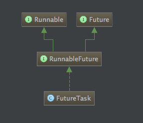
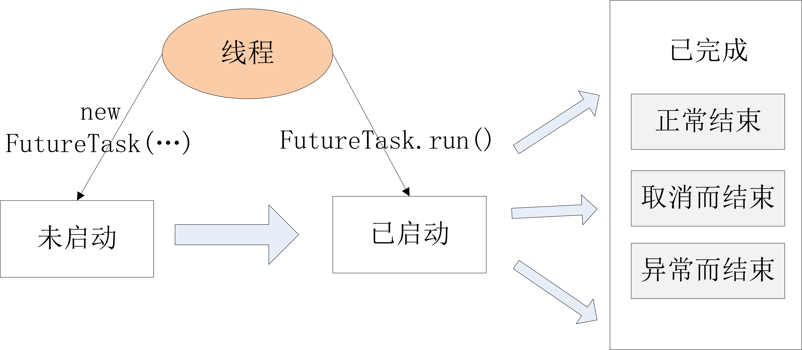
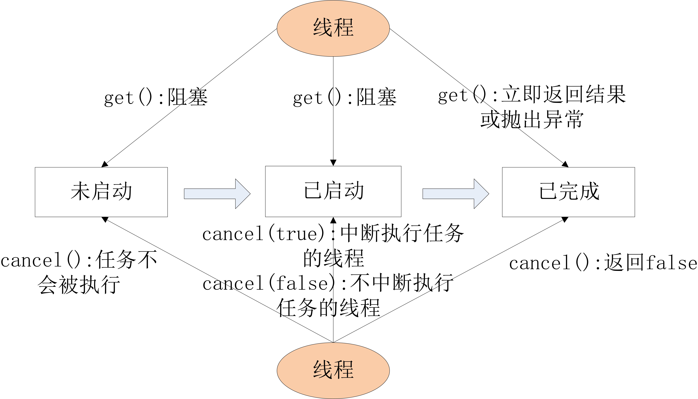

# FutureTask源码解析

# 1、FutureTask介绍

FutureTask是一种可以取消的异步的计算任务。它的计算是通过Callable实现的，可以把它理解为是可以返回结果的Runnable。

使用FutureTask的优势有：

1. 可以获取线程执行后的返回结果；
2. 提供了超时控制功能。

它实现了Runnable接口和Future接口：

 

什么是异步计算呢？也就是说，在让该任务执行时，不需要一直等待其运行结束返回结果，而是可以先去处理其他的事情，然后再获取返回结果。例如你想下载一个很大的文件，这时很耗时的操作，没必要一直等待着文件下载完，你可以先去吃个饭，然后再回来看下文件是否下载完成，如果下载完成就可以使用了，否则还需要继续等待。

# 2、FutureTask的实现

## FutureTask的状态

FutureTask内部有这样几种状态：

```java
private static final int NEW          = 0;
private static final int COMPLETING   = 1;
private static final int NORMAL       = 2;
private static final int EXCEPTIONAL  = 3;
private static final int CANCELLED    = 4;
private static final int INTERRUPTING = 5;
private static final int INTERRUPTED  = 6;
```

看名字应该很好理解了，当创建一个FutureTask对象是，初始的状态是NEW，在运行时状态会转换，有4中状态的转换过程：

- **NEW -> COMPLETING -> NORMAL**：正常执行并返回；
- **NEW -> COMPLETING -> EXCEPTIONAL**：执行过程中出现了异常；
- **NEW -> CANCELLED**；执行前被取消；
- **NEW -> INTERRUPTING -> INTERRUPTED**：取消时被中断。

另外，在《java并发编程的艺术》一书，作者根据FutureTask.run()方法的执行的时机，将FutureTask分为了3种状态：

1. **未启动**。FutureTask.run()方法还没有被执行之前，FutureTask处于未启动状态。当创建一个FutureTask，还没有执行FutureTask.run()方法之前，FutureTask处于未启动状态。
2. **已启动**。FutureTask.run()方法被执行的过程中，FutureTask处于已启动状态。
3. **已完成**。FutureTask.run()方法执行结束，或者调用FutureTask.cancel(...)方法取消任务，或者在执行任务期间抛出异常，这些情况都称之为FutureTask的已完成状态。

下图总结了FutureTask的状态变化的过程：

 

由于FutureTask具有这三种状态，因此执行FutureTask的get方法和cancel方法，当前处于不同的状态对应的结果也是大不相同。这里对get方法和cancel方法先做个总结：

> get方法

当FutureTask处于未启动或已启动状态时，执行FutureTask.get()方法将导致调用线程阻塞。如果FutureTask处于已完成状态，调用FutureTask.get()方法将导致调用线程立即返回结果或者抛出异常。

> cancel方法

当FutureTask处于**未启动状态**时，执行FutureTask.cancel()方法将此任务永远不会执行；

当FutureTask处于**已启动状态**时，执行FutureTask.cancel(true)方法将以中断线程的方式来阻止任务继续进行，如果执行FutureTask.cancel(false)将不会对正在执行任务的线程有任何影响；

当**FutureTask**处于已完成状态时，执行FutureTask.cancel(...)方法将返回false。

对Future的get()方法和cancel()方法用下图进行总结：



## FutureTask使用过程

下面看一下具体的使用过程：

```java
public class FutureTaskTest {

    public static void main(String[] args) throws ExecutionException, InterruptedException {
        ExecutorService executor = Executors.newSingleThreadExecutor();
        FutureTask<Integer> future = new FutureTask<>(new Callable<Integer>() {
            @Override
            public Integer call() throws Exception {
                int result = 0;
                for (int i = 0; i < 100; i++) {
                    result += i;
                }
                return result;
            }
        });

        executor.execute(future);

        System.out.println(future.get());
    }

}
```

## FutureTask内部结构

```java
public class FutureTask<V> implements RunnableFuture<V> {
    
    private volatile int state;
    private static final int NEW          = 0;
    private static final int COMPLETING   = 1;
    private static final int NORMAL       = 2;
    private static final int EXCEPTIONAL  = 3;
    private static final int CANCELLED    = 4;
    private static final int INTERRUPTING = 5;
    private static final int INTERRUPTED  = 6;

    /** The underlying callable; nulled out after running */
    private Callable<V> callable;
    /** The result to return or exception to throw from get() */
    private Object outcome; // non-volatile, protected by state reads/writes
    /** 执行callable的线程 **/
    private volatile Thread runner;
    /**
     * Treiber stack of waiting threads
     * 使用Treiber算法实现的无阻塞的Stack，
     * 用于存放等待的线程
     */
    private volatile WaitNode waiters;
    
    static final class WaitNode {
        volatile Thread thread;
        volatile WaitNode next;
        WaitNode() { thread = Thread.currentThread(); }
    }
    
    public V get() throws InterruptedException, ExecutionException {
        ...
    }
    
    public V get(long timeout, TimeUnit unit)
        throws InterruptedException, ExecutionException, TimeoutException {
        ...
    }
    
    ...
```

这里的waiters理解为一个stack，因为在调用get方法时任务可能还没有执行完，这时需要将调用get方法的线程放入waiters中。

最重要的两个get方法，用于获取返回结果，第二种提供了超时控制功能。

## FutureTask构造方法

FutureTask有两个构造方法：

```java
public FutureTask(Callable<V> callable) {
    if (callable == null)
        throw new NullPointerException();
    this.callable = callable;
    this.state = NEW;       // ensure visibility of callable
}

public FutureTask(Runnable runnable, V result) {
    this.callable = Executors.callable(runnable, result);
    this.state = NEW;       // ensure visibility of callable
}
```

第二种构造方法传入一个Runnable对象和一个返回值对象，因为Runnable是没有返回值的，所以要通过result参数在执行完之后返回结果。

## run方法

FutureTask实现了Runnable接口，所以需要实现run方法，代码如下：

```java
public void run() {
    /*
     * 首先判断状态，如果不是初始状态，说明任务已经被执行或取消；
     * runner是FutureTask的一个属性，用于保存执行任务的线程，
     * 如果不为空则表示已经有线程正在执行，这里用CAS来设置，失败则返回。
     */
    if (state != NEW ||
        !UNSAFE.compareAndSwapObject(this, runnerOffset,
                                     null, Thread.currentThread()))
        return;
    try {
        Callable<V> c = callable;
        // 只有初始状态才会执行
        if (c != null && state == NEW) {
            V result;
            boolean ran;
            try {
                // 执行任务
                result = c.call();
                // 如果没出现异常，则说明执行成功了
                ran = true;
            } catch (Throwable ex) {
                result = null;
                ran = false;
                // 设置异常
                setException(ex);
            }
            // 如果执行成功，则设置返回结果
            if (ran)
                set(result);
        }
    } finally {
        // runner must be non-null until state is settled to
        // prevent concurrent calls to run()
        // 无论是否执行成功，把runner设置为null
        runner = null;
        // state must be re-read after nulling runner to prevent
        // leaked interrupts
        int s = state;
        // 如果被中断，则说明调用的cancel(true)，
        // 这里要保证在cancel方法中把state设置为INTERRUPTED
        // 否则可能在cancel方法中还没执行中断，造成中断的泄露
        if (s >= INTERRUPTING)
            handlePossibleCancellationInterrupt(s);
    }
}
```

总结一下run方法的执行过程：

1. 只有state为NEW的时候才执行任务；
2. 执行前要设置runner为当前线程，使用CAS来设置是为了防止竞争；
3. 如果任务执行成功，任务状态从NEW转换为COMPLETING，如果执行正常，设置最终状态为NORMAL；如果执行中出现了异常，设置最终状态为EXCEPTIONAL；
4. 唤醒并删除Treiber Stack中的所有节点；
5. 如果调用了cancel(true)方法进行了中断，要确保在run方法执行结束前的状态是INTERRUPTED。

这里涉及到3个比较重要的方法：setException，set和handlePossibleCancellationInterrupt。

## setException方法

```java
protected void setException(Throwable t) {
    if (UNSAFE.compareAndSwapInt(this, stateOffset, NEW, COMPLETING)) {
        outcome = t;
        UNSAFE.putOrderedInt(this, stateOffset, EXCEPTIONAL); // final state
        finishCompletion();
    }
}
```

如果在执行过程中（也就是调用call方法时）出现了异常，则要把状态先设置为COMPLETING，如果成功，设置`outcome = t`，outcome对象是Object类型的，用来保存异常或者返回结果对象，也就是说，在正常的执行过程中（没有异常，没有调用cancel方法），outcome保存着返回结果对象，会被返回，如果出现了异常或者中断，则不会返回并抛出异常，这个在介绍report方法时会讲到。

接着设置状态为EXCEPTIONAL，这也是最终的状态。

finishCompletion方法稍后再分析。

## set方法

```java
protected void set(V v) {
    if (UNSAFE.compareAndSwapInt(this, stateOffset, NEW, COMPLETING)) {
        outcome = v;
        UNSAFE.putOrderedInt(this, stateOffset, NORMAL); // final state
        finishCompletion();
    }
}
```

很简单，与setException类似，只不过这里的outcome是返回结果对象，状态先设置为COMPLETING，然后再设置为MORMAL。

## handlePossibleCancellationInterrupt方法

```java
private void handlePossibleCancellationInterrupt(int s) {
    // It is possible for our interrupter to stall before getting a
    // chance to interrupt us.  Let's spin-wait patiently.
    if (s == INTERRUPTING)
        while (state == INTERRUPTING)
            Thread.yield(); // wait out pending interrupt

    // assert state == INTERRUPTED;

    // We want to clear any interrupt we may have received from
    // cancel(true).  However, it is permissible to use interrupts
    // as an independent mechanism for a task to communicate with
    // its caller, and there is no way to clear only the
    // cancellation interrupt.
    //
    // Thread.interrupted();
}
```

handlePossibleCancellationInterrupt方法要确保cancel(true)产生的中断发生在run或runAndReset方法执行的过程中。这里会循环的调用Thread.yield()来确保状态在cancel方法中被设置为INTERRUPTED。

这里不能够清除中断标记，因为不能确定中断一定来自于cancel方法。

## finishCompletion方法

```java
private void finishCompletion() {
    // assert state > COMPLETING;
    // 执行该方法时state必须大于COMPLETING
    // 逐个唤醒waiters中的线程
    for (WaitNode q; (q = waiters) != null;) {
        // 设置栈顶节点为null
        if (UNSAFE.compareAndSwapObject(this, waitersOffset, q, null)) {
            for (;;) {
                Thread t = q.thread;
                // 唤醒线程
                if (t != null) {
                    q.thread = null;
                    LockSupport.unpark(t);
                }
                // 如果next为空，说明栈空了，跳出循环
                WaitNode next = q.next;
                if (next == null)
                    break;
                // 方便gc回收
                q.next = null; // unlink to help gc
                // 重新设置栈顶node
                q = next;
            }
            break;
        }
    }
    // 钩子方法
    done();

    callable = null;        // to reduce footprint
}
```

在调用get方法时，如果任务还没有执行结束，则会阻塞调用的线程，然后把调用的线程放入waiters中，这时，如果任务执行完毕，也就是调用了finishCompletion方法，waiters会依次出栈并逐个唤醒对应的线程。

由此可以想到，WaitNode一定是在get方法中被添加到栈中的，下面来看下get方法的实现。

## get方法

```java
public V get() throws InterruptedException, ExecutionException {
    int s = state;
    if (s <= COMPLETING)
        s = awaitDone(false, 0L);
    return report(s);
}

public V get(long timeout, TimeUnit unit)
    throws InterruptedException, ExecutionException, TimeoutException {
    if (unit == null)
        throw new NullPointerException();
    int s = state;
    if (s <= COMPLETING &&
        (s = awaitDone(true, unit.toNanos(timeout))) <= COMPLETING)
        throw new TimeoutException();
    return report(s);
}
```

这两个方法类似，首先判断状态，如果`s <= COMPLETING`，说明任务已经执行完毕，但set方法或setException方法还未执行结束（还未设置状态为NORMAL或EXCEPTIONAL），这时需要将当前线程添加到waiters中并阻塞。

第二种get提供了超时功能，如果在规定时间内任务还未执行完毕或者状态还是COMPLETING，则获取结果超时，抛出TimeoutException。而第一种get会一直阻塞直到`state > COMPLETING`。

## awaitDone方法

awaitDone方法的工作是根据状态来判断是否能够返回结果，如果任务还未执行完毕，要添加到waiters中并阻塞，否则返回状态。代码如下：

```java
private int awaitDone(boolean timed, long nanos)
    throws InterruptedException {
    // 计算到期时间
    final long deadline = timed ? System.nanoTime() + nanos : 0L;
    WaitNode q = null;
    boolean queued = false;
    for (;;) {
        // 如果被中断，删除节点，抛出异常
        if (Thread.interrupted()) {
            removeWaiter(q);
            throw new InterruptedException();
        }

        int s = state;
        // 如果任务执行完毕并且设置了最终状态或者被取消，则返回
        if (s > COMPLETING) {
            if (q != null)
                q.thread = null;
            return s;
        }
        // s == COMPLETING时通过Thread.yield();让步其他线程执行，
        // 主要是为了让状态改变
        else if (s == COMPLETING) // cannot time out yet
            Thread.yield();
        // 创建一个WaitNode
        else if (q == null)
            q = new WaitNode();
        // CAS设置栈顶节点
        else if (!queued)
            queued = UNSAFE.compareAndSwapObject(this, waitersOffset,
                                                 q.next = waiters, q);
        // 如果设置了超时，则计算是否已经到了开始设置的到期时间
        else if (timed) {
            nanos = deadline - System.nanoTime();
            // 如果已经到了到期时间，删除节点，返回状态
            if (nanos <= 0L) {
                removeWaiter(q);
                return state;
            }
            // 阻塞到到期时间
            LockSupport.parkNanos(this, nanos);
        }
        // 如果没有设置超时，会一直阻塞，直到被中断或者被唤醒
        else
            LockSupport.park(this);
    }
}
```

## removeWaiter方法

```java
private void removeWaiter(WaitNode node) {
    if (node != null) {
        // 将thread设置为null是因为下面要根据thread是否为null判断是否要把node移出
        node.thread = null;
        // 这里自旋保证删除成功
        retry:
        for (;;) {          // restart on removeWaiter race
            for (WaitNode pred = null, q = waiters, s; q != null; q = s) {
                s = q.next;
                // q.thread != null说明该q节点不需要移除
                if (q.thread != null)
                    pred = q;
                // 如果q.thread == null，且pred != null，需要删除q节点
                else if (pred != null) {
                    // 删除q节点
                    pred.next = s;
                    // pred.thread == null时说明在并发情况下被其他线程修改了；
                    // 返回第一个for循环重试
                    if (pred.thread == null) // check for race
                        continue retry;
                }
                // 如果q.thread != null且pred == null，说明q是栈顶节点
                // 设置栈顶元素为s节点，如果失败则返回重试
                else if (!UNSAFE.compareAndSwapObject(this, waitersOffset,
                                                      q, s))
                    continue retry;
            }
            break;
        }
    }
}
```

## cancel方法

cancel方法用于取消任务，这里可能有两种情况，一种是任务已经执行了，另一种是还未执行，代码如下：

```java
public boolean cancel(boolean mayInterruptIfRunning) {
    if (!(state == NEW &&
          UNSAFE.compareAndSwapInt(this, stateOffset, NEW,
              mayInterruptIfRunning ? INTERRUPTING : CANCELLED)))
        return false;
    try {    // in case call to interrupt throws exception
        // mayInterruptIfRunning参数表示是否要进行中断
        if (mayInterruptIfRunning) {
            try {
                // runner保存着当前执行任务的线程
                Thread t = runner;
                // 中断线程
                if (t != null)
                    t.interrupt();
            } finally { // final state
                // 设置最终状态为INTERRUPTED
                UNSAFE.putOrderedInt(this, stateOffset, INTERRUPTED);
            }
        }
    } finally {
        finishCompletion();
    }
    return true;
}
```

第一个if判断可能有些不好理解，其实等价于如下代码：

```java
if (!state == NEW ||
          !UNSAFE.compareAndSwapInt(this, stateOffset, NEW,
              mayInterruptIfRunning ? INTERRUPTING : CANCELLED))
```

如果状态不是NEW，或者设置状态为INTERRUPTING或CANCELLED失败，则取消失败，返回false。

简单来说有一下两种情况：

- 如果当前任务还没有执行，那么state == NEW，那么会尝试设置状态，如果设置状态失败会返回false，表示取消失败；
- 如果当前任务已经被执行了，那么state > NEW，也就是!state == NEW为true，直接返回false。

也就是说，如果任务一旦开始执行了（state != NEW），那么就不能被取消。

如果mayInterruptIfRunning为true，要中断当前执行任务的线程。

## report方法

get方法在调用awaitDone方法后，会调用report方法进行返回：

```java
private V report(int s) throws ExecutionException {
    Object x = outcome;
    if (s == NORMAL)
        return (V)x;
    if (s >= CANCELLED)
        throw new CancellationException();
    throw new ExecutionException((Throwable)x);
}
```

很简单，可以看到有3中执行情况：

1. 如果`s == NORMAL`为true，说明是正常执行结束，那么根据上述的分析，在正常执行结束时outcome存放的是返回结果，把outcome返回；
2. 如果`s >= CANCELLED`为true，说明是被取消了，抛出CancellationException；
3. 如果`s < CANCELLED`，那么状态只能是是EXCEPTIONAL，表示在执行过程中出现了异常，抛出ExecutionException。

## runAndReset方法

该方法和run方法类似，区别在于这个方法不会设置任务的执行结果值，所以在正常执行时，不会修改state，除非发生了异常或者中断，最后返回是否正确的执行并复位：

```java
protected boolean runAndReset() {
    if (state != NEW ||
        !UNSAFE.compareAndSwapObject(this, runnerOffset,
                                     null, Thread.currentThread()))
        return false;
    boolean ran = false;
    int s = state;
    try {
        Callable<V> c = callable;
        if (c != null && s == NEW) {
            try {
                // 不获取和设置返回值
                c.call(); // don't set result
                ran = true;
            } catch (Throwable ex) {
                setException(ex);
            }
        }
    } finally {
        // runner must be non-null until state is settled to
        // prevent concurrent calls to run()
        runner = null;
        // state must be re-read after nulling runner to prevent
        // leaked interrupts
        s = state;
        if (s >= INTERRUPTING)
            handlePossibleCancellationInterrupt(s);
    }
    // 是否正确的执行并复位
    return ran && s == NEW;
}
```

# 3、总结

本文分析了FutureTask的执行过程和获取返回值的过程，要注意以下几个地方：

- FutureTask是线程安全的，在多线程下任务也只会被执行一次；
- 注意在执行时各种状态的切换；
- get方法调用时，如果任务没有结束，要阻塞当前线程，法阻塞的线程会保存在一个Treiber Stack中；
- get方法超时功能如果超时未获取成功，会抛出TimeoutException；
- 注意在取消时的线程中断，在run方法中一定要保证结束时的状态是INTERRUPTED，否则在cancel方法中可能没有执行interrupt，造成中断的泄露。

> 参考文献

[FutureTask源码解析](http://www.ideabuffer.cn/2017/04/06/FutureTask%E6%BA%90%E7%A0%81%E8%A7%A3%E6%9E%90/)