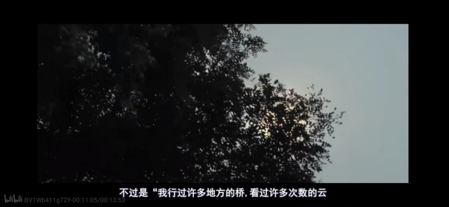
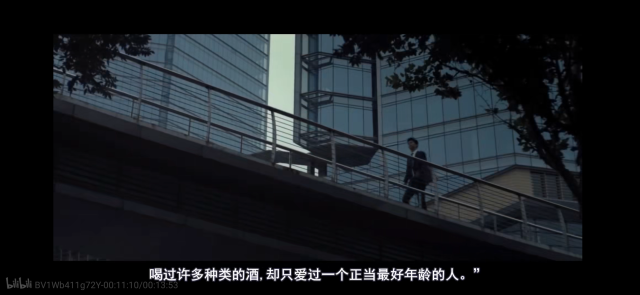

> [!tip]
> “不必太纠结于当下，也不必太忧虑未来，当你亲身经历过一些事情的时候，当下眼前的风景已经和从前不一样了。”

> **[<embed src="/_media/文章-写感想.svg" type="image/svg+xml" /> 一些感想...](/感想/)**

---

    <embed src="/_media/访问量.svg" type="image/svg+xml" /> 本站总访问量： 次

    | <embed src="/_media/访客足迹.svg" type="image/svg+xml" /> 本站总访客数： 人

 

  

> [!TIP]想你了，森哥

