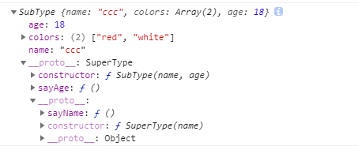
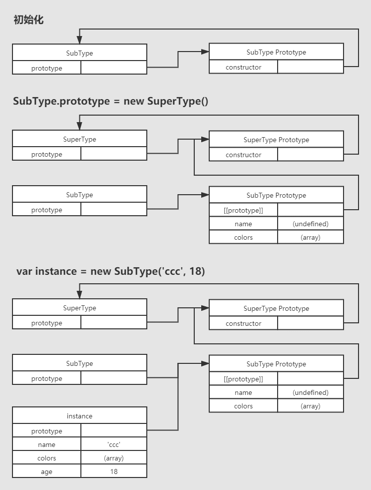

# js中如何实现继承

# 借用构造函数

这种技术的基本思想很简单，就是在子类型构造函数的内部调用超类型的构造函数。另外，**函数只不过是在特定环境中执行代码的对象**，因此通过使用apply()和call()方法也可以在新创建的对象上执行构造函数。

```js
function Box(name){
  this.name = name
}
Box.prototype.age = 18

function Desk(name){
  Box.call(this, name)  // 对象冒充，对象冒充只能继承构造里的信息
}

var desk = new Desk('ccc')
console.log(desk.name)      // --> ccc
console.log(desk.age)       // --> undefined
```

从中可以看到，**继承来的只有实例属性，而原型上的属性是访问不到的**。这种模式解决了两个问题，就是可以传参，可以继承，但是没有原型，就没有办法复用。

# 组合继承

```js
function Box(name){
  this.name = name
}
Box.prototype.run = function (){
  console.log(this.name + '正在运行...')
}

function Desk(name){
  Box.call(this, name)  // 对象冒充
}

Desk.prototype = new Box()  // 原型链

var desk = new Desk('ccc')
console.log(desk.name)      // --> ccc
desk.run()                  // --> ccc正在运行...
```

这种继承方式的思路是：用使用原型链的方式来实现对原型属性和方法的继承，而通过借用构造函数来实现对实例属性的继承。

# 原型式继承

原型式继承：是借助原型可以基于已有的对象创建新对象，同时还不必因此创建自定义类型。讲到这里必须得提到一个人，道格拉斯·克罗克福德在2006年写的一篇文章《Prototype inheritance in Javascript》(Javascript中的原型式继承)中给出了一个方法：

```js
function object(o) {      //传递一个字面量函数
  function F(){}          //创建一个构造函数
  F.prototype = o;        //把字面量函数赋值给构造函数的原型
  return new F()          //最终返回出实例化的构造函数
}
```

看如下的例子：

```js
function obj(o) {
  function F (){}
  F.prototype = o;
  return new F()
}

var box = {
  name: 'ccc',
  age: 18,
  family: ['哥哥','姐姐']
}

var box1 = obj(box)
console.log(box1.name)      // --> ccc
box1.family.push('妹妹')
console.log(box1.family)    // --> ["哥哥", "姐姐", "妹妹"]

var box2 = obj(box)
console.log(box2.family)    // --> ["哥哥", "姐姐", "妹妹"]
```

因为上述的代码的实现逻辑跟原型链继承很类似，所以里面的引用数组，即family属性被共享了。

# 寄生式继承

```js
function obj(o) {
  function F (){}
  F.prototype = o;
  return new F()
}
function create(o){
  var clone = obj(o)      // 通过调用函数创建一个新对象
  clone.sayName = function(){      // 以某种方式来增强这个对象
    console.log('hi')
  }
  return clone      // 返回这个对象
}

var person = {
  name: 'ccc',
  friends: ['aa','bb']
}

var anotherPerson = create(person)
anotherPerson.sayName()      // --> hi
```

这个例子中的代码基于person返回一个新对象——anotherPerson。新对象不仅具有person的所有属性和方法，而且还有自己的sayName()方法。在主要考虑对象而不是自定义类型和构造函数的情况下，寄生式继承也是一种有用的模式。使用寄生式继承来为对象添加函数，会由于不能做到函数复用而降低效率，这一点与构造函数模式类似。

# 寄生组合式继承

前面说过，组合继承是Javascript最常用的继承模式，不过，它也有自己的不足。组合继承最大的问题就是无论什么情况下，都会调用过两次超类型构造函数：一次是在创建子类型原型的时候，另一次是在子类型构造函数内部。没错，子类型最终会包含超类型对象的全部实例属性，但我们不得不在调用子类型构造函数时重写这些属性，再来看一下下面的例子：

```js
function SuperType(name){
  this.name = name;
  this.colors = ['red','black']
}
SuperType.prototype.sayName = function (){
  console.log(this.name)
}
function SubType(name, age){
  SuperType.call(this, name)  // 第二次调用SuperType
  this.age = age
}

SubType.prototype = new SuperType() // 第一次调用SuperType
SubType.prototype.constructor = SubType
SubType.prototype.sayAge = function (){
  console.log(this.age)
}
```

第一次调用SuperType构造函数时，SubType.prototype会得到两个属性：name和colors。他们都是SuperType的实例属性，只不过现在位于SubType的原型中。当调用SubType构造函数时，又会调用一次SuperType构造函数，这个一次又在新对象上创建了实例属性name和colors。于是，这两个属性就屏蔽了原型中的两个同名属性。即有两组name和colors属性：一组在实例上，一组在原型上。这就是调用两次SuperType构造函数的结果。解决这个问题的方法就是————寄生组合式继承。
所谓寄生组合式继承，即通过借用构造函数来继承属性，通过原型链的混成形式来继承方法。其背后的基本思路是：不必为了制定子类型的原型而调用超类型的构造函数，我们所需要的无非就是超类型原型的一个副本而已。本质上，就是使用寄生式继承来继承超类型的原型，然后再将结果指定给子类型的原型。寄生组合式继承的基本模式如下：

```js
function object(o) {
  function F (){}
  F.prototype = o;
  return new F()
}
function inheritPtototype(subType, superType){
  var prototype = object(superType.prototype) // 创建对象
  prototype.constructor = subType             // 增强对象
  subType.prototype = prototype               // 指定对象
}

function SuperType(name){
  this.name = name
  this.colors = ['red', 'white']
}

SuperType.prototype.sayName = function(){
  console.log(this.name)
}

function SubType(name,age){
  SuperType.call(this,name)
  this.age = age
}

inheritPtototype(SubType, SuperType)

SubType.prototype.sayAge = function(){
  console.log(this.age)
}

var instance = new SubType('ccc', 18)

instance.sayName()      // --> ccc
instance.sayAge()       // --> 18
console.log(instance)
```

控制台打印出的结构：

 

详细的图解：

 

这个例子的高效率提现在它值调用了一次SuperType构造函数，并且因此避免了在SubType.prototype上面创建不必要的、多余的属性。与此同时，原型链还能保持不变；因此，还能够正常使用instanceof和isPrototypeOf()。这也是很多大厂用的继承方式。