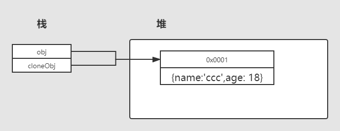

# js中实现深拷贝(深度克隆)

# 浅克隆（浅拷贝）

在数据类型为引用类型的时候，当你给这个变量赋值，其实是引用这个变量在内存中的地址。如下：

```js
var obj = {name: 'ccc', age: 18}    // 定义一个变量为对象，引用类型
var cloneObj = obj      // 创建一个新变量，并赋值
console.log(cloneObj)   // {name: 'ccc', age: 18}  
console.log(cloneObj === obj)   // true
```

浅克隆带来的问题：

```js
var obj = {name: 'ccc', age: 18}    // 定义一个变量为对象，引用类型
var cloneObj = obj      // 创建一个新变量，并赋值
console.log(cloneObj)   // {name: 'ccc', age: 18}  
console.log(cloneObj === obj)   // true

obj.name = 'www'
console.log(cloneObj)   // { name: 'www', age: 18 }
```

我们可以发现，我们修改了obj变量的属性值的时候，cloneObj的属性值也跟着发生了变化。原因是他们虽然是两个变量，但是引用的变量是同一个变量。看下图分析：

 

# 深度克隆（深拷贝）

深度克隆，就是解决浅度克隆带来的问题的。直接上代码：

```js
function deepClone(o) {
    // 判断如果不是引用类型，直接返回数据即可
    if (typeof o === 'string' || typeof o === 'number' || 
        typeof o === 'boolean' || typeof o === 'undefined') {
        return o
    } else if (Array.isArray(o)) { // 如果是数组，则定义一个新数组，完成复制后返回
        // 注意，这里判断数组不能用typeof，因为typeof Array 返回的是object
        console.log(typeof [])  // --> object
        var _arr = []
        o.forEach(item => { _arr.push(item) })
        return _arr
    } else if (typeof o === 'object') {
        var _o = {}
        for (let key in o) {
            _o[key] = deepClone(o[key])
        }
        return _o
    }
}

var arr = [1, 2, 3, 5]
var cloneArr = deepClone(arr)
console.log(cloneArr)   // --> [ 1, 2, 3, 5 ]
console.log(arr === cloneArr)   // --> false

var obj = { name: 'ccc', age: 18 }
var cloneObj = deepClone(obj)
console.log(cloneObj)   // --> { name: 'ccc', age: 18 }
console.log(obj === cloneObj)   // false
obj.name = 'www'
console.log(obj)    // --> { name: 'www', age: 18 }
console.log(cloneObj)   // --> { name: 'ccc', age: 18 }
```

obj和cloneObj分别指向自己所存的变量地址，互不影响，代码注释挺详细了，看下图:

 

**注意**：上图深度克隆代码只供参考了解，还有很多细节没有考虑，比如数组和对象的嵌套拷贝等等，具体使用请查看Lodash中的`cloneDeep()`方法。