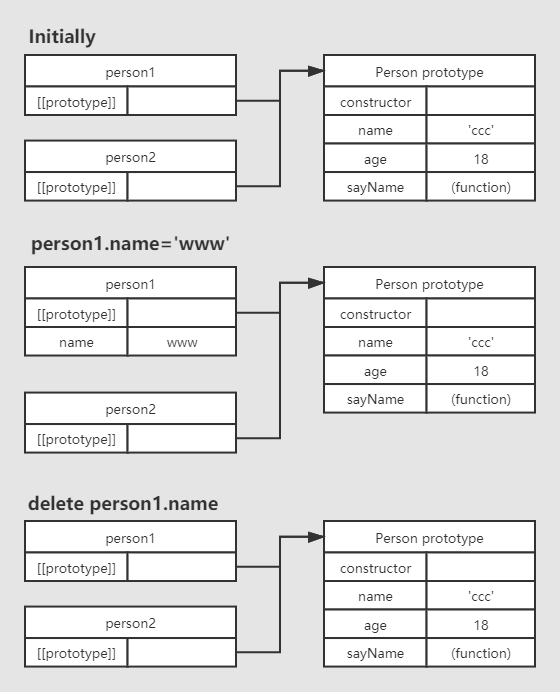

# 深入理解js中的原型对象，原型链

# 理解原型

我们创建的每一个函数都有一个prototype(原型)属性，这个属性是一个指针，指向一个对象，而这个对象的用途是包含可以由特定类型的所有实例共享的属性和方法。看如下例子：

```js
function Person(){
}
Person.prototype.name = 'ccc'
Person.prototype.age = 18
Person.prototype.sayName = function (){
  console.log(this.name);
}

var person1 = new Person()
person1.sayName()      // --> ccc

var person2 = new Person()
person2.sayName()      // --> ccc

console.log(person1.sayName === person2.sayName)      // --> true
```

# 理解原型对象

根据上面代码，看下图：

 

**需要理解三点：**

1. 我们只要创建了一个新的函数，就会根据一组特定的规则为该函数创建一个prototype属性，指向函数的原型对象。即Person（构造函数）有一个prototype指针，指向Person.prototype
2. 默认情况下，每个原型对象上都会创建一个constructor(构造函数)属性，这个属性是一个指向prototype属性所在函数的指针
3. 每个实例的内部都有一个指针(内部属性) ，指向构造函数的原型对象。即 person1 和person2 身上都有一个内部属性`__proto__`（在ECMAscript中管这个指针叫[[prototype]]，虽然在脚本中没有标准的方式访问[[prototype]]，但是firefox，ie，chrome都支持一个属性叫`__proto__`） 指向Person.prototype

**注意：**person1 和person2 实例与构造函数之间没有直接的关系。

在之前我们提到，所有实现中无法访问到[[prototype]]，那我们如何知道实例和原型对象之间是否存在关系呢？这里可以通过两个方法来判断：

- 原型对线上的方法：isPrototypeOf()，如：`console.log(Person.prototype.isPrototypeOf(person1)) // --> true`
- ECMAscript5中新增的一个方法：Object.getPrototypeOf()，这个方法返回[[prototype]]的值。如：`console.log(Object.getPrototypeOf(person1) === Person.prototype) // --> true`

## 实例属性与原型属性的关系

前面我们提到过，原型最初只包含constructor属性，而该属性也是共享的，因此可以通过对象实例访问。虽然可以通过对象实例访问保存在原型中的值，但却不能通过对象实例重写原型中的值。如果我们在实例中添加了一个属性，而改的属性与实例原型中的一个属性同名，那就会在实例上创建该属性并屏蔽原型中的那个属性。如下：

```js
function Person() {}
Person.prototype.name = "ccc";
Person.prototype.age = 18;
Person.prototype.sayName = function() {
  console.log(this.name);
};

var person1 = new Person();
var person2 = new Person();

person1.name = 'www'      // 在person1中添加一个name属性
person1.sayName()      // --> 'www'————'来自实例'
person2.sayName()      // --> 'ccc'————'来自原型'

console.log(person1.hasOwnProperty('name'))      // --> true
console.log(person2.hasOwnProperty('name'))      // --> false

delete person1.name      // --> 删除person1中新添加的name属性
person1.sayName()      // -->'ccc'————'来自原型'
```

我们如何判断一个属性，到底是实例上的属性还是原型上的属性？这里可以通过`hasOwnProperty()`方法来检测一个属性是存在于实例中还是存在于原型中。(此方法继承于Object)

下图详细分析了上面例子在不同情况下的实现与原型的关系：（省略了Person构造函数的的关系）

 

## 更简单的原型语法

我们不可能总像之前的例子一样，每添加一个属性和方法就要敲一遍 `Person.prototype`。为了减少不必要的输入，更常见的方法是像下面这样：

```js
function Person(){}
Person.prototype ={
  name: 'ccc',
  age: 18,
  sayName: function () {
    console.log(this.name)
  }
}
```

在上面代码中，我们将Person.prototype设置为等于一个以对象字面量形式创建的新对象。最终结果相同，但有一个例外，constructor属性不再指向Person了。前面我们介绍过，每创建一个函数，就会同时创建它的prototype对象，这个对象也会自动获得constructor属性。**但是在我们使用的新语法中，本质上完全重写了默认的prototype对象，因此constructor属性也就变成了新对象的constructor属性（指向Object构造函数），不再指向Person函数了**。此时，尽管instanceof操作符还能返回正确的结果，但通过constructor已经无法确定对象的类型了。如下：

```js
var person1 = new Person()
console.log(person1 instanceof Object)      // --> true
console.log(person1 instanceof Person)      // --> true
console.log(person1.constructor === Person)      // --> false
console.log(person1.constructor === Object)      // --> true
```

这里用instanceof操作符测试Object和Person仍然返回true，constructor属性却等于Object，不等于Person了，如果constructor真的很重要可以像下面这样写:

```js
function Person(){}
Person.prototype ={
  constructor: Person,      // --> 重设
  name: 'ccc',
  age: 18,
  sayName: function () {
    console.log(this.name)
  }
}
```

但是这会引起一个新问题，用上述方式重置constructor属性会导致它的[[Enumerable]]特性被设置为true。而默认情况下，原生的constructor属性是不可枚举的。因此如果你要使用兼容ECMAscript5的JavaScript引擎，可以试一试`Object.defineProperty()`。

```js
function Person(){}
Person.constructor = {
  name: 'ccc', 
  age: 18,
  sayName: function(){
    console.log(this.name)
  }
}
// 重设构造函数，只适用于ECMAscript5兼容的浏览器
Object.defineProperty(Person.constructor, "constructor", {
  enumerable: false, 
  value: Person
})
```

## 原型的动态性

由于原型中查找值的过程是一次搜索，因此我们对原型对象所做的任何修改都能立即从实例上反映出来。比如：

```js
function Person(){}
var person1 = new Person()
Person.prototype.sayHi= function(){
  console.log('hi')
}
person1.sayHi()
```

上述代码我们先创建了一个Person实例，并将其保存在person1中，然后在Person.prototype中添加了sayHi()方法。即使person1是添加新方法之前创建的，但它仍然可以访问这个方法。原因是实例与原型之间的松散的连接关系。
尽管可以随时为原型添加属性和方法，并立即能够在实例中反映出来。**但是如果重写整个原型对象，那么情况就不一样了**。看如下代码：

```js
function Person(){}
var person1 = new Person()

Person.prototype = {
  name: 'ccc',
  age: 18,
  sayName: function(){
    console.log(this.name)
  }
}

person1.sayName()      // --> error
```

看下图分析：

 

调用构造函数时为实例添加了一个指向最初原型的[[prototype]]指针，而把原型修改为另外一个对象就等于切断了构造函数与最初原型之间的联系。**请记住：实例中的指针仅指向原型，而不指向构造函数。**

# 理解原型链

原型链是实现继承的主要方法。其基本思想是让一个引用类型继承另一个引用类型的属性和方法。在理解原型链之前，我们首先得捋一下，原型，原型对象，实例之间的关系：**每一个构造函数都有一个原型对象，原型对象都包含一个指向构造函数的指针，而实例都包含一个指向原型对象的内部指针。**假如我们让原型对象等于另一个类型的实例会怎么样？显然，这个原型对象将会包含一个指向另一个原型的指针。先看代码再看图：

```js
function SuperType(){
  this.property = true
}

SuperType.prototype.getSuperValue = function(){
  return this.property
}

function SubType(){
  this.subProperty = false
}

// 继承了SuperType
SubType.prototype = new SuperType()

SubType.prototype.getSubValue = function (){
  return this.subProperty
}

var instance = new SubType()
console.log(instance.getSuperValue())      // --> true
```

上述代码定义了两个类型：SuperType和SubType。每个类型分别有一个属性和一个方法。

 

分析上图：instance 指向SubType原型，SubType的原型又指向SuperType的原型。getSuperValue()方法仍然还在SuperType.prototype中，但property则位于SubType.prototype中。这是因为property是一个实例属性，而getSuperValue()则是一个原型方法。既然SubType.prototype现在是SuperType的实例，那么property当然就位于该实例中。此外要注意，instance.constructor现在指向的是SuperType，这是因为原来的SubType.prototype中的constructor被重写了的缘故。
为什么会返回true？
分析：调用instance.getSuperValue()方法会经历三个搜索步骤：

1. 搜索实例
2. 搜索SubType.prototype
3. 搜索SuperType.prototype，直到这里才找到方法。在找不到属性或方法的情况下，搜索过程总是要一环一环地前行到原型链末端才会停下来。

## 别忘记默认的原型

要知道，所有的引用类型默认都继承了Object，而这个继承也是通过原型链实现的。所有函数的默认原型都是Object的实例，因此默认原型都会包含一个内部指针，指向Object.prototype，这也正是所有自定义类型都会有toString()，valueOf()方法的原因。所以完整的原型链应该如下，看下图，subType的内部：

 

上图详解：

 

总之一句话，SubType继承了SuperType，而SuperType继承了Object。当调用instanct.toString()的时候，实际上调用的是保存在Object.prototype中的那个方法。

## 确定原型和实例的关系

当一个原型链很长的时候，想要确定原型和实例的关系，总共有两种方法：

1. 使用instanceof 操作符，只要用这个操作符来测试实例与原型链中出现过的构造函数，结果就会返回true。

```js
console.log(instance instanceof Object)      // --> true
console.log(instance instanceof SuperType)   // --> true
console.log(instance instanceof SubType)     // --> true
```

2. 使用isPrototypeOf()方法，跟instanctof判别方法类似，只要原型链中出现过的原型，都会返回true。

```js
console.log(Object.prototype.isPrototypeOf(instance))      // --> true
console.log(SuperType.prototype.isPrototypeOf(instance))   // --> true
console.log(SubType.prototype.isPrototypeOf(instance))     // --> true
```

## 谨慎地定义方法

子类型有时候需要覆盖超类型中的某个方法，或者需要添加超类型中不存在的某个方法。但不管怎样，给原型添加方法的代码一定要放在替换原型的语句之后。如下：

```js
function SuperType(){
  this.property = true;
}
SuperType.prototype.getSuperValue = function(){
  return this.property
}

function SubType(){
  this.subProperty = false;
}

// 继承了 SuperType
SubType.prototype = new SuperType()

// 添加新方法
SubType.prototype.getSubValue = function(){
  return this.subProperty
}
// 重写超类型中的方法
SubType.prototype.getSuperValue = function(){
  return false
}

var instance = new SubType()
console.log(instance.getSuperValue())      // --> false
var instanceSuper = new SuperType()
console.log(instanceSuper.getSuperValue()) // -> true
```

上述代码中，第一个方法getSubValue()被添加到了SubType中。第二个方法getSuperValue()是原型链中已经存在的一个方法，但重写这个方法将会屏蔽原来的那个方法。即当通过SubType的实例调用getSuperValue()时，调用的就是这个重新定义的方法，但通过SuperType的实例调用getSuperValue()时，还会继续调用原来的那个方法。还有一点，在通过原型链实现继承的时候，不能使用对象自变量创建原型方法，因为这样会重写原型链，导致原型链被切断。

## 原型链的问题

1. 通过原型来实现继承时，原型实际上会变成另一个类型的实例，于是，原先的实例属性就变成了现在的原型属性了，这就会导致属性被共享。看如下代码：

```js
function SuperType(){
  this.colors = ['white', 'blue']
}

function SubType(){
}

// 继承了SuperType
SubType.prototype = new SuperType()
var instance1 = new SubType()
instance1.colors.push('red')

var instance2 = new SubType()
console.log(instance1.colors)      // -->["white", "blue", "red"]
console.log(instance2.colors)      // -->["white", "blue", "red"]
```

2. 在创建子类型的实例时，不能向超类型的构造函数中传递参数。实际上，应该是没有办法在不影响所有对象实例的情况下，给超类型的构造函数传递参数。因此，在实践中很少会单独使用原型链。

想了解实践中会怎样使用原型链，请关注[这篇文章](https://sentinel-22.github.io/#/%E5%89%8D%E7%AB%AF/JavaScript/js中如何实现继承)。如果错误，欢迎指出。

> 参考文献：

[深入理解（图解）js中的原型，原型对象，原型链](https://www.cnblogs.com/cirry/p/13303153.html)

