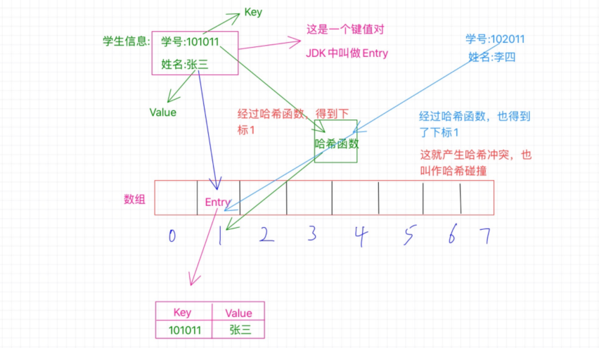
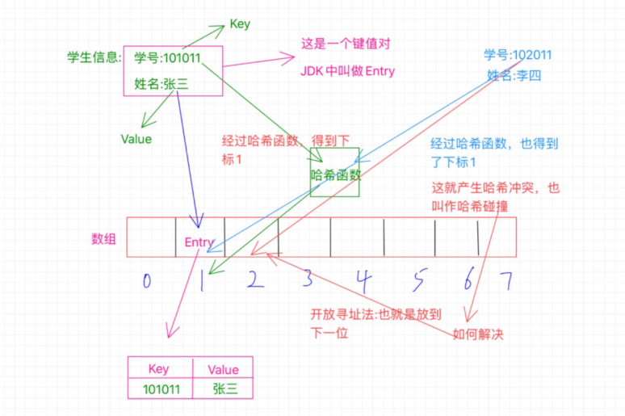
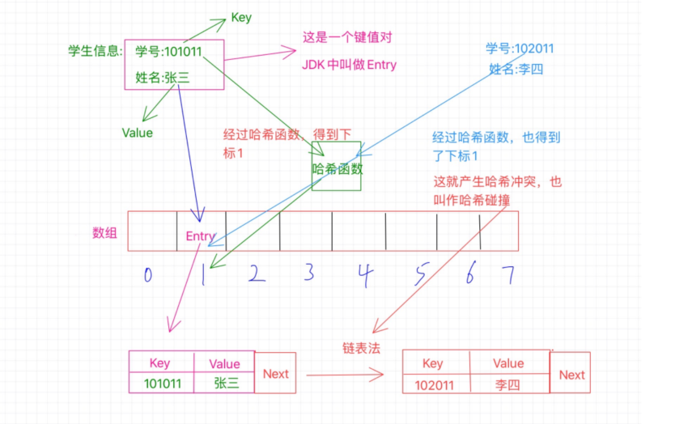

# 哈希表

# 1、什么是哈希表

我们看看百科解释吧：

> **散列表**（**Hash table**，也叫**哈希表**），是根据[键](https://zh.wikipedia.org/wiki/鍵)（Key）而直接访问在内存存储位置的[数据结构](https://zh.wikipedia.org/wiki/数据结构)。也就是说，它通过计算一个关于键值的函数，将所需查询的数据[映射](https://zh.wikipedia.org/wiki/映射)到表中一个位置来访问记录，这加快了查找速度。这个映射函数称做[散列函数](https://zh.wikipedia.org/wiki/散列函数)，存放记录的数组称做**散列表**。

哈希表也叫做散列表，这只不过是叫法而已，英文单词是Hash table，看到这个英文单词基本上就能猜到，哈希表其实就是直接根绝英文单词音译过来的，至此你应该知道了啥是哈希了吧，对于另外一点，那就很重要了，那就是**哈希表其实是一种数据结构**。

要知道数据结构有很多中，每一种都有各自的特点，那么哈希表既然也是一种数据结构，那它有什么特点呢？按照百科的解释，我们大致能知道：**可以根据一个key值来直接访问数据，因此查找速度快**

# 2、哈希表本质是数组？

上面说哈希表查找迅速，结合我们学的为数不多的查找比较迅速的简单的数据结构就容易联想到数组。

确实，哈希表本质上是个数组，只能说它的底层实现是用到了数组，简单点说，在数组的这个基础上再捯饬捯饬，加工加工，变得更加有特色了，然后人家就自立门户，叫**哈希表**😂

为什么说哈希表的本质是个数组呢？那就得看看，哈希表是怎么来实现的了，一般来说啊，实现哈希表我们可以采用两种方法：

1. 数组+链表

2. 数组+二叉树

简单点就有这么两种方式，其实说白了，无论哪个都是必须有数组啊，都是在数组的基础上取搞其他的，而且比如第一种数组+链表的形式，本质上是出现哈希冲突的一种解决办法，使用链表存放，所以综合起来叫做数组+链表的方式来实现一个哈希表，另外数组中一般就是存放的单一的数据，而哈希表中存放的是一个键值对，这是个区别吧！

# 3、哈希表的几个概念

还是先看一下百科的一个例子：

> 一个通俗的例子是，为了查找电话簿中某人的号码，可以创建一个按照人名首字母顺序排列的表 (即建立人名x到首字母F(x)的一个函数关系)， 在首字母为W的表中查找"王”姓的电话号码，显然比直接查找就要快得多。这里使用人名作为关键字，”取首字母" 是这个例子中散列函数的函数法则F(),存放首字母的表对应散列表。关键字和函数法则理论上可以任意确定。

## 3.1 啥是哈希函数

就是方法二字，在上面的例子中就是采用一种方法，什么方法呢？那就是取姓名的首字母做一个排序，那么这是不是就是通过一些特定的方法去得到一个特定的值，比如这里取人名的首字母，那么如果是放到数学中，是不是就是**类似一个函数**似的，**给你一个值，经过某些加工得到另外一个值**，就像这里的给你个人名，经过些许加工我们拿到首字母，那么**这个函数或者是这个方法在哈希表中就叫做散列函数，其中规定的一些操作就叫做函数法则**，这下你知道什么是散列函数了吧😎

## 3.2 关键字key

这个也好理解啊，就像上面的例子，“王”是怎么得出来得，是不是根据未加工之前得“w”得出来得，这个加工过程其实就是个散列函数，而丢给它的这个“w”就是这个关键值啊，为啥叫它关键值嘞，那是因为我们要对它做加工才能得出我们想要的“王”啊，你说它关不关键😂

结合上面的两个概念得到以下理解：
哈希表就是通过将关键值也就是key通过一个散列函数加工处理之后得到一个值，这个值就是数据存放的位置，我们就可以根据这个值快速的找到我们想要的数据。

得到以上理解后，就会容易出现一个问题，那就是，如果两个不一样的key在哈希函数的作用下得出两个一样的东西怎么办，其实这就是哈希冲突，下面再做讨论

# 4、再探哈希表

上面说哈希表本质上是一个数组，那它跟数组类似吗，先来看一张图：

 

## 4.1 键值对和Entry

我们知道哈希表本质上是个数组，难道就跟数组的基本使用那样，存个数值，然后通过下表读取之类的嘛？当然不是啦，对于哈希表，它经常存放的是一些键值对的数据，啥是键值对啊，就是我们经常说的key-value啊，简单点说就是一个值对应另外一个值，比如a对应b，那么a就是key，b是value，哈希表存放的就是这样的键值对，在哈希表中是通过哈希函数将一个值映射到另外一个值的，所以在哈希表中，a映射到b，a就叫做键值，而b呢？就叫做a的哈希值，也就是hash值。

在上面的图中：学生的学号和姓名就是一个键值对啊，根据这个学号就能找到这个学生的姓名，那啥是Entry嘞，我们都知道键值对，在很多语言中也许都有键值对，说白了就是个大众脸啊，咋弄，在咱jdk中可不能那么俗气，不能再叫键值对了，叫啥嘞，那就叫Entry吧😂

## 4.2 哈希表如何存储数据

现在来说说哈希表是如何存放数据的，按照这个图来说，我们已经知道了哈希表本质是个数组，所以这里有个数组，长度是8，现在我们要做的是把这个学生信息存放到哈希表中，也就是这个数组中去，那我们需要考虑怎么去存放呢？

这里的学号是个key，我们之前也知道了，**哈希表就是根据key值来通过哈希函数计算得到一个值，这个值就是用来确定这个Entry要存放在哈希表中的位置的，实际上这个值就是一个下标值，来确定放在数组的哪个位置上**。

比如这里的学号是101011，那么经过哈希函数的计算之后得到了1，这个1就是告诉我们应该把这个Entry放到哪个位置，这个1就是数组的确切位置的下标，也就是需要放在数组中下表为1的位置，如图中所示。

我们之前已经介绍过什么是Entry了，所以这里你要知道，**数组中1的位置存放的是一个Entry，它不是一个简单的单个数值，而是一个键值对，也就是存放了key和value**，key就是学号101011，value就是张三，我们经过哈希函数计算得出的1只是为了确定这个Entry该放在哪个位置而已。

现在我们就成功把这个Entry放到了哈希表中了

## 4.3 哈希冲突

不过看到这里我产生了一个疑问，那就是这个哈希函数，是不是有一个特定的加工过程，比如可以经过某种计算把101011转换成1，那么有没有可能其他的学号经过哈希函数的计算也得出1呢？那这个时候是不是就撞衫啦😂

先来看图：

 

像图中这种情况，学号为102011的李四，他的学号经过哈希函数的计算也得出了1，那么也要放到数组中为1的位置，可是这个位置之前已经被张三占了啊，这怎么办？这种情况就是**哈希冲突**或者也叫**哈希碰撞**。

既然出现了这情况，不能不管李四啊，总得给他找个位置啊，怎么找呢？

## 4.4 处理哈希冲突

这里只介绍两种主要的方法，一个是**开放寻址法**，一个是**拉链法**。

### 开放寻址法

那什么是开放寻址法呢？我们继续来看图：

 

我觉得看图就足以说明问题了，这里所说的开放寻址法其实简单来说就是，既然位置被占了，那就另外再找个位置不就得了，怎么找其他的位置呢？这里其实也有很多的实现，我们说个最基本的就是既然当前位置被占用了，**我们就看看该位置的后一个位置是否可用，也就是1的位置被占用了，我们就看看2的位置，如果没有被占用，那就放到这里呗，当然，也有可能2的位置也被占用了，那咱就继续往下找，看看3的位置，一次类推，直到找到空位置。**

对了，Java中的ThreadLocal就是利用了开放寻址法。

### 拉链法

那什么是拉链法呢？

拉链法也是比较常用的，像之前你说的HashMap就是使用了这种方法，那这个方法是怎么个回事呢？我们继续来看图：  

之前说的开放寻址法采用的方式是在数组上另外找个新位置，而拉链法则不同，还是在该位置，可是，该位置被占用了咋整，总不能打一架，谁赢是谁的吧😂，当然不是这样，这里采用的是链表，什么意思呢？就像图中所示，现在张三和李四都要放在1找个位置上，但是张三先来的，已经占了这个位置，待在了这个位置上了，那李四呢？解决办法就是链表，**这时候这个1的位置存放的不单单是之前的那个Entry了，此时的Entry还额外的保存了一个next指针，这个指针指向数组外的另外一个位置，将李四安排在这里，然后张三那个Entry中的next指针就指向李四的这个位置，也就是保存的这个位置的内存地址，如果还有冲突，那就把又冲突的那个Entry放在一个新位置上，然后李四的Entry中的next指向它，这样就形成了一个链表。**

这就是拉链法。

### 以上方法相关问题说明

首先是这个拉链法啊，如果冲突的很多，那这个增加的链表岂不是很长，这样也不咋好吧😂

的确，如果冲突过多的话，这块的链表会变得比较长，怎么处理呢？这里举个例子吧，拿java集合类中的`HashMap`来说吧，**如果这里的链表长度大于等于8的话，链表就会转换成树结构，当然如果长度小于等于6的话，就会还原链表。以此来解决链表过长导致的性能问题。**

至于为啥是6，而不是7？
这样设计是因为中间有个7作为一个差值，来避免频繁的进行树和链表的转换，因为转换频繁也是影响性能的。

---

关于开放寻址也有个疑问，那就是如果一直找不到空的位置咋整啊？🤣

这个不会的，为啥嘞？你这样想，是因为你考虑了一个前提，那就是位置已经被占光了，没有空位置了，但是实际情况是位置不会被占光的，因为有一定量的位置被占了的时候就会发生扩容。

那这个扩容又是怎么回事呢？

## 4.5 哈希表的扩容

其实这里不仅仅是因为上面说的开放寻址那种情况才会扩容，还有一个很重要的原因就是当哈希表被占的位置比较多的时候，出现哈希冲突的概率也就变高了，所以很有必要进行扩容。

那么这个扩容是怎么扩的呢？这里一般会有一个**增长因子**的概念，也叫作**负载因子**，简单点说就是**已经被占的位置与总位置的一个百分比**，比如一共十个位置，现在已经占了七个位置，就触发了扩容机制，因为它的增长因子是0.7，也就是达到了总位置的百分之七十就需要扩容。

还拿HashMap来说，当它当前的容量占总容量的百分之七十五的时候就需要扩容了。

**而且这个扩容也不是简单的把数组扩大，而是新创建一个数组是原来的2倍，然后把原数组的所有Entry都重新Hash一遍放到新的数组。因为数组扩大了，所以一般哈希函数也会有变化，这里的Hash也就是把之前的数据通过新的哈希函数计算出新的位置来存放。**

## 4.6 哈希表如何读取数据

要知道这个读取操作，我们还来看这个图：

 

比如我们现在要通过学号102011来查找学生的姓名，怎么操作呢？**我们首先通过学号利用哈希函数得出位置1，然后我们就去位置1拿数据啊，拿到这个Entry之后我们得看看这个Entry的key是不是我们的学号102011，一看是101011，这不是我们要的key啊，然后根据这个Entry的next知道下一给位置，在比较key，好成功找到李四。**

对于开放寻址那种也是这个思路，先确定到这个位置，然后再看这个位置上的key是不是我们要的，如过不是那就看看下一个位置的。

# 5、哈希函数是核心

经过上面的讲解，可以看出**哈希函数是核心**，如果一个哈希函数设计的足够好的话，就会减少哈希冲突的概率，如果设计的不好，那就会经常撞衫😂，那就很影响性能了，比如刚开始我们举的那个例子，拿姓名的首字母来确定位置，这个哈希函数的设计就不咋滴，比如王二，王三，王四什么的，这都会冲突啊😂

其实哈希函数也有很多，有比如有直接定址法，数字分析法，折叠法，随机数法和除留余数法等等，有空再说。
