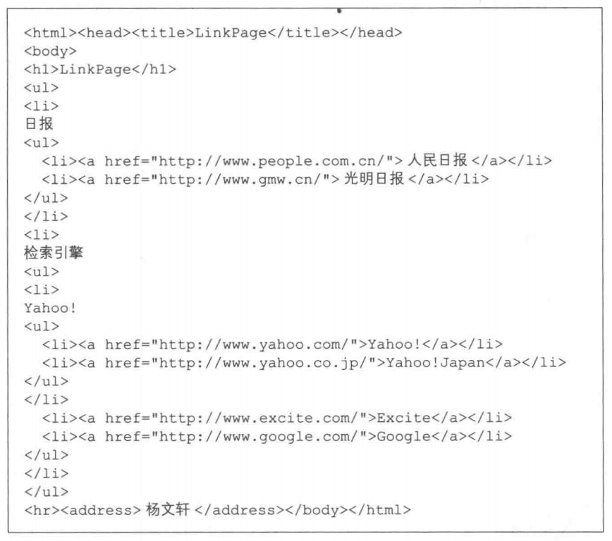
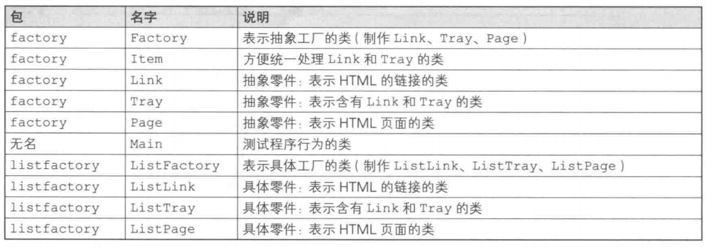
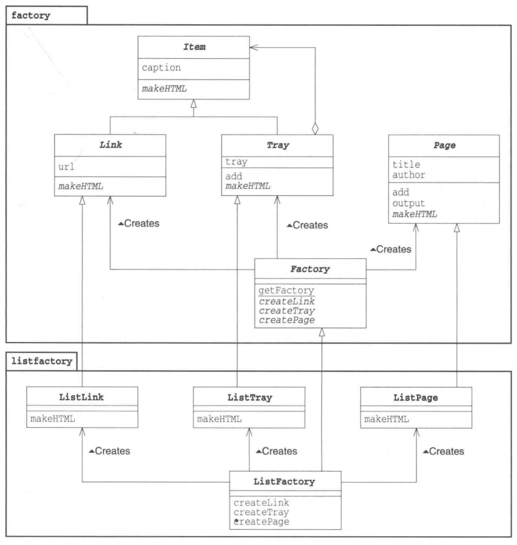
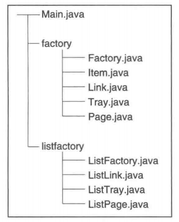

# Abstract Factory 模式

Abstract的意思是“抽象的”，Factory的意思是“工厂”。将它们组合起来我们就可以知道Abstract Factory表示“抽象工厂”的意思。

通常，我们不会将“抽象的”这个词与“工厂”这个词联系到一起。所谓工厂，是将零件组装成产品的地方，这是一项具体的工作。那么“抽象工厂”到底是什么意思呢？

我们大可不必对这个词表示吃惊。因为在Abstract Factory模式中，不仅有“抽象工厂”，还有“抽象零件”和“抽象产品”。**抽象工厂的工作是将“抽象零件”组装为“抽象产品”。**

读到这里，大家可能会想“哎呀哎呀，你到底想说什么啊？”那么请大家先回忆一下面向对象编程中的“抽象”这个词的具体含义。它指的是“不考虑具体怎样实现，而是仅关注接口(API)”的状态。例如，抽象方法（Abstract Method)并不定义方法的具体实现，而是仅仅只确定了方法的名字和签名（参数的类型和个数)。

关于“忘记方法的具体实现（假装忘记），使用抽象方法进行编程”的设计思想，我们在Template Method模式和Builder模式中已经稍微提及了一些。

在Abstract Factory模式中将会出现抽象工厂，它会将抽象零件组装为抽象产品。**也就是说，我们并不关心零件的具体实现，而是只关心接口(API)。我们仅使用该接口(API)将零件组装成为产品。**

在Tempate Method模式和Builder模式中，子类这一层负责方法的具体实现。在AbstractFactory模式中也是一样的。在子类这一层中有具体的工厂，它负责将具体的零件组装成为具体的产品。

# 示例程序

示例程序的功能是将带有层次关系的链接的集合制作成HTML文件。最后制作完成的HTML文件如图所示。



在示例程序中，类被划分为以下3个包。

- **factory包：包含抽象工厂、零件、产品的包**
- **无名包：包含Main类的包**
- **listfactory包：包含具体工厂、零件、产品的包（这里使用`<u>`标签输出为L文件）**

> 类的一览表



> 实例程序类图



> 文件夹中源文件的结构

 

## 抽象的零件：ltem类

Item类是工ink类和Tray类的父类(Item有“项目”的意思)。这样，Link类和Tray类就具有可替换性了。

caption字段表示项目的“标题”。

makeHTML方法是抽象方法，需要子类来实现这个方法。该方法会返回HTML文件的内容（需要子类去实现)。

```java
package factory;

public abstract class Item {
    protected String caption;
    public Item(String caption){
        this.captioncaption;
    }
    public abstract string makeHTML();
}
```

## 抽象的零件：Link类

Link类是抽象地表示HTML的超链接的类。

url字段中保存的是超链接所指向的地址。乍一看，在工ink类中好像一个抽象方法都没有，但实际上并非如此。由于Link类中没有实现父类(Item类)的抽象方法(makeHTML)，因此它也是抽象类。

```java
package factory;

public abstract class Link extends Item {
    protected String url;
    public Link(String caption,String url){
        super(caption);
        this.url url;
    }
}
```

## 抽象的零件：Tray类

Tray类表示的是一个含有多个工ink类和Tray类的容器(Tray有托盘的意思。请想象成在托盘上放置着一个一个项目)。

Tray类使用add方法将Link类和Tray类集合在一起。为了表示集合的对象是“Link类和Tray类”，我们设置add方法的参数为Link类和Tray类的父类Item类。

虽然Tray类也继承了Item类的抽象方法makeHTML,但它并没有实现该方法。因此，Tray类也是抽象类。

```java
package factory;

import java.util.ArrayList;

public abstract class Tray extends Item {
    protected ArrayList tray new ArrayList();
    public Tray(String caption){
        super(caption);
    }
    public void add(Itemitem){
        tray.add(item);
    }
}
```

## 抽象的产品：Page类

Page类是抽象地表示HTML页面的类。如果将工ink和Tray比喻成抽象的“零件”，那么Page类就是抽象的“产品”。title和author分别是表示页面标题和页面作者的字段。作者名字通过参数传递给Page类的构造函数。

可以使用add方法向页面中增加Item(即Link或Tray。增加的Item将会在页面中显示出来。

output方法首先根据页面标题确定文件名，接着调用makeHTML方法将自身保存的HTML内容写人到文件中。

其中，我们可以去掉如下语句(1)中的this，将其写为如下语句(2)那样：

```java
writer.write (this.makeHTML()) //(1)
writer.write (makeHTML()); //(2)
```

为了强调调用的是Page类自己的makeHTML方法，我们显式地加上了this。这里调用的makeHTML方法是一个抽象方法。output方法是一个简单的Template Method模式的方法。

