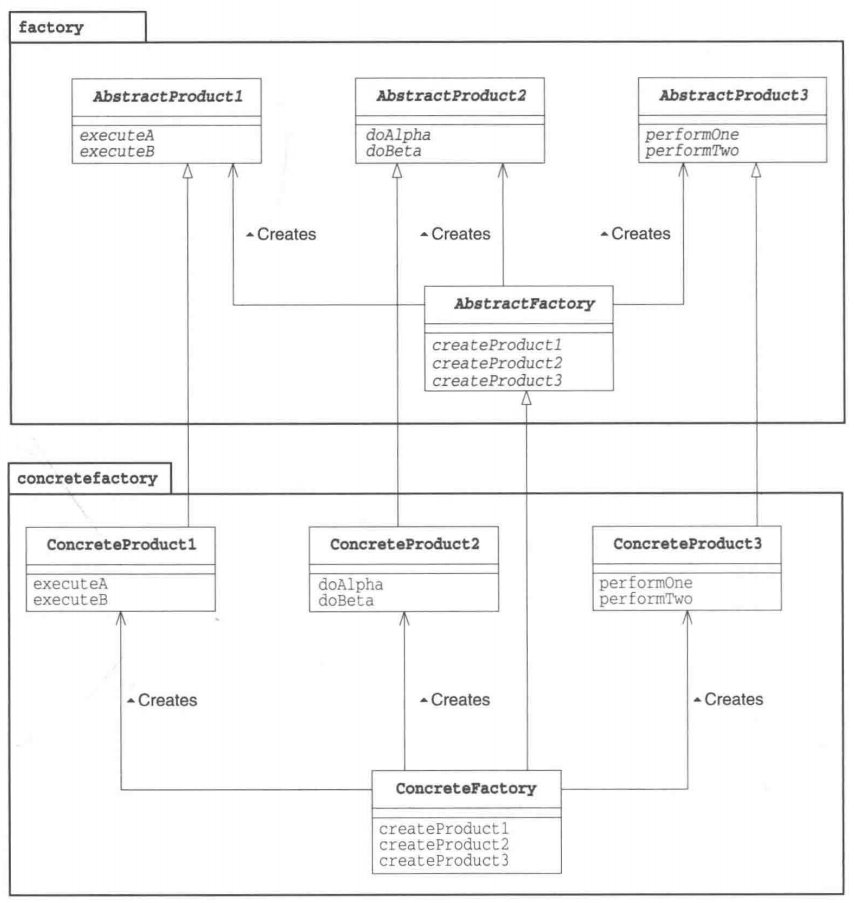

# Abstract Factory 模式

Abstract的意思是“抽象的”，Factory的意思是“工厂”。将它们组合起来我们就可以知道Abstract Factory表示“抽象工厂”的意思。

通常，我们不会将“抽象的”这个词与“工厂”这个词联系到一起。所谓工厂，是将零件组装成产品的地方，这是一项具体的工作。那么“抽象工厂”到底是什么意思呢？

我们大可不必对这个词表示吃惊。因为在Abstract Factory模式中，不仅有“抽象工厂”，还有“抽象零件”和“抽象产品”。**抽象工厂的工作是将“抽象零件”组装为“抽象产品”。**

读到这里，大家可能会想“哎呀哎呀，你到底想说什么啊？”那么请大家先回忆一下面向对象编程中的“抽象”这个词的具体含义。它指的是“不考虑具体怎样实现，而是仅关注接口(API)”的状态。例如，抽象方法（Abstract Method)并不定义方法的具体实现，而是仅仅只确定了方法的名字和签名（参数的类型和个数)。

关于“忘记方法的具体实现（假装忘记），使用抽象方法进行编程”的设计思想，我们在Template Method模式和Builder模式中已经稍微提及了一些。

在Abstract Factory模式中将会出现抽象工厂，它会将抽象零件组装为抽象产品。**也就是说，我们并不关心零件的具体实现，而是只关心接口(API)。我们仅使用该接口(API)将零件组装成为产品。**

在Tempate Method模式和Builder模式中，子类这一层负责方法的具体实现。在AbstractFactory模式中也是一样的。在子类这一层中有具体的工厂，它负责将具体的零件组装成为具体的产品。

# 示例程序

**应用实例：**工作了，为了参加一些聚会，肯定有两套或多套衣服吧，比如说有商务装（成套，一系列具体产品）、时尚装（成套，一系列具体产品），甚至对于一个家庭来说，可能有商务女装、商务男装、时尚女装、时尚男装，这些也都是成套的，即一系列具体产品。假设一种情况（现实中是不存在的，要不然，没法进入共产主义了，但有利于说明抽象工厂模式），在您的家中，某一个衣柜（具体工厂）只能存放某一种这样的衣服（成套，一系列具体产品），每次拿这种成套的衣服时也自然要从这个衣柜中取出了。用 OOP 的思想去理解，所有的衣柜（具体工厂）都是衣柜类的（抽象工厂）某一个，而每一件成套的衣服又包括具体的上衣（某一具体产品），裤子（某一具体产品），这些具体的上衣其实也都是上衣（抽象产品），具体的裤子也都是裤子（另一个抽象产品）。

现在我们将创建 *Shape* 和 *Color* 接口和实现这些接口的实体类。下一步是创建抽象工厂类 *AbstractFactory*。接着定义工厂类 *ShapeFactory* 和 *ColorFactory*，这两个工厂类都是扩展了 *AbstractFactory*。然后创建一个工厂创造器/生成器类 *FactoryProducer*。

*AbstractFactoryPatternDemo* 类使用 *FactoryProducer* 来获取 *AbstractFactory* 对象。它将向 *AbstractFactory* 传递形状信息 *Shape*（*CIRCLE / RECTANGLE / SQUARE*），以便获取它所需对象的类型。同时它还向 *AbstractFactory* 传递颜色信息 *Color*（*RED / GREEN / BLUE*），以便获取它所需对象的类型。

> 示例程序类图

 

## 形状接口

为形状创建一个接口。

```java
public interface Shape {
   void draw();
}
```

## 形状接口的具体类

创建实现形状接口的实体类。

**Rectangle.java**

```java
public class Rectangle implements Shape {
    
   @Override
   public void draw() {
      System.out.println("Inside Rectangle::draw() method.");
   }
}
```

**Square.java**

```java
public class Square implements Shape {
 
   @Override
   public void draw() {
      System.out.println("Inside Square::draw() method.");
   }
}
```

**Circle.java**

```java
public class Circle implements Shape {
 
   @Override
   public void draw() {
      System.out.println("Inside Circle::draw() method.");
   }
}
```

## 颜色接口

为颜色创建接口

```java
public interface Color {
   void fill();
}
```

## 颜色接口的具体类

创建实现颜色接口的实体类。

**Red.java**

```java
public class Red implements Color {
 
   @Override
   public void fill() {
      System.out.println("Inside Red::fill() method.");
   }
}
```

**Green.java**

```java
public class Green implements Color {
 
   @Override
   public void fill() {
      System.out.println("Inside Green::fill() method.");
   }
}
```

**Blue.java**

```java
public class Blue implements Color {
 
   @Override
   public void fill() {
      System.out.println("Inside Blue::fill() method.");
   }
}
```

## 抽象工厂类

为 Color 和 Shape 对象创建抽象类来获取工厂。

```java
public abstract class AbstractFactory {
   public abstract Color getColor(String color);
   public abstract Shape getShape(String shape);
}
```

## 具体工厂类

创建扩展了 AbstractFactory 的工厂类 ShapeFactory 和 ColorFactory ，基于给定的信息生成实体类的对象。

**ShapeFactory.java**

```java
public class ShapeFactory extends AbstractFactory {
    
   @Override
   public Shape getShape(String shapeType){
      if(shapeType == null){
         return null;
      }        
      if(shapeType.equalsIgnoreCase("CIRCLE")){
         return new Circle();
      } else if(shapeType.equalsIgnoreCase("RECTANGLE")){
         return new Rectangle();
      } else if(shapeType.equalsIgnoreCase("SQUARE")){
         return new Square();
      }
      return null;
   }
   
   @Override
   public Color getColor(String color) {
      return null;
   }
}
```

**ColorFactory.java**

```java
public class ColorFactory extends AbstractFactory {
    
   @Override
   public Shape getShape(String shapeType){
      return null;
   }
   
   @Override
   public Color getColor(String color) {
      if(color == null){
         return null;
      }        
      if(color.equalsIgnoreCase("RED")){
         return new Red();
      } else if(color.equalsIgnoreCase("GREEN")){
         return new Green();
      } else if(color.equalsIgnoreCase("BLUE")){
         return new Blue();
      }
      return null;
   }
}
```

## 工厂生成器类

创建一个工厂创造器/生成器类，通过传递形状或颜色信息来获取工厂。

```java
public class FactoryProducer {
   public static AbstractFactory getFactory(String choice){
      if(choice.equalsIgnoreCase("SHAPE")){
         return new ShapeFactory();
      } else if(choice.equalsIgnoreCase("COLOR")){
         return new ColorFactory();
      }
      return null;
   }
}
```

## Main

使用 FactoryProducer 来获取 AbstractFactory，通过传递类型信息来获取实体类的对象。

```java
public class Main {
   public static void main(String[] args) {
 
      //获取形状工厂
      AbstractFactory shapeFactory = FactoryProducer.getFactory("SHAPE");
 
      //获取形状为 Circle 的对象
      Shape shape1 = shapeFactory.getShape("CIRCLE");
 
      //调用 Circle 的 draw 方法
      shape1.draw();
 
      //获取形状为 Rectangle 的对象
      Shape shape2 = shapeFactory.getShape("RECTANGLE");
 
      //调用 Rectangle 的 draw 方法
      shape2.draw();
      
      //获取形状为 Square 的对象
      Shape shape3 = shapeFactory.getShape("SQUARE");
 
      //调用 Square 的 draw 方法
      shape3.draw();
 
      //获取颜色工厂
      AbstractFactory colorFactory = FactoryProducer.getFactory("COLOR");
 
      //获取颜色为 Red 的对象
      Color color1 = colorFactory.getColor("RED");
 
      //调用 Red 的 fill 方法
      color1.fill();
 
      //获取颜色为 Green 的对象
      Color color2 = colorFactory.getColor("GREEN");
 
      //调用 Green 的 fill 方法
      color2.fill();
 
      //获取颜色为 Blue 的对象
      Color color3 = colorFactory.getColor("BLUE");
 
      //调用 Blue 的 fill 方法
      color3.fill();
   }
}

运行结果：

Inside Circle::draw() method.
Inside Rectangle::draw() method.
Inside Square::draw() method.
Inside Red::fill() method.
Inside Green::fill() method.
Inside Blue::fill() method.    
```

# Abstract Factory模式中的登场角色

- **AbstractProduct(抽象产品)**

  AbstractProduct角色负责定义AbstractFactory角色所生成的抽象零件和产品的接口(API)。在示例程序中，由Shape接口、Color接口扮演此角色。

- **AbstractFactory(抽象工厂)**

  AbstractFactory角色负责定义用于生成抽象产品的接口(API)。在示例程序中，由AbstractFactory类扮演此角色。

- **Client(委托者)**

  Client角色仅会调用AbstractFactory角色和AbstractProduct角色的接口(API)来进行工作，对于具体的零件、产品和工厂一无所知。在示例程序中，由Main类扮演此角色。

> **Abstract Factory模式的类图**



- **ConcreteProduct(具体产品)**

  ConcreteProduct角色负责实现AbstractProduct角色的接口(API)。在示例程序中，由以下类扮演此角色：Rectangle类、Square类和Circle类、Red类、Green类和Blue类。

- **ConcreteFactory(具体工厂)**

  ConcreteFactory角色负责实现AbstractFactory角色的接口(API)。在示例程序中，由以下类扮演此角色：ShapeFactory类、ColorFactory类

# 拓展思路的要点

> **易于增加具体的工厂**

在Abstract Factory模式中增加具体的工厂是非常容易的。这里说的“容易”指的是需要编写哪些类和需要实现哪些方法都非常清楚。

假设现在我们要在示例程序中增加新的具体工厂，那么需要做的就是编写Factory、Link、Tray、Page这4个类的子类，并实现它们定义的抽象方法。也就是说将factory包中的抽象部分全部具体化即可。

这样一来，无论要增加多少个具体工厂（或是要修改具体工厂的Bug)，都无需修改抽象工厂和Main部分。

> **难以增加新的零件**

请试想一下要在Abstract Factory模式中增加新的零件时应当如何做。例如，我们要在factory包中增加一个表示图像的Picture零件。这时，我们必须要对所有的具体工厂进行相应的修改才行。例如，在listfactory包中，我们必须要做以下修改。

