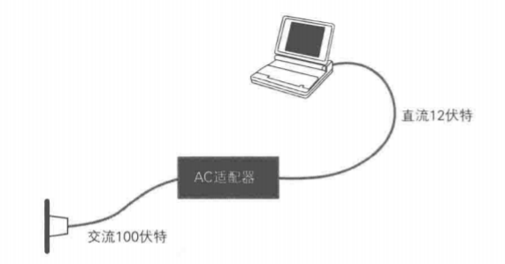
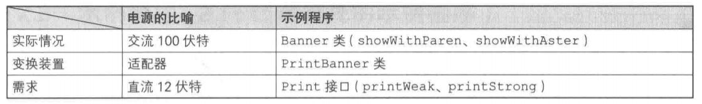
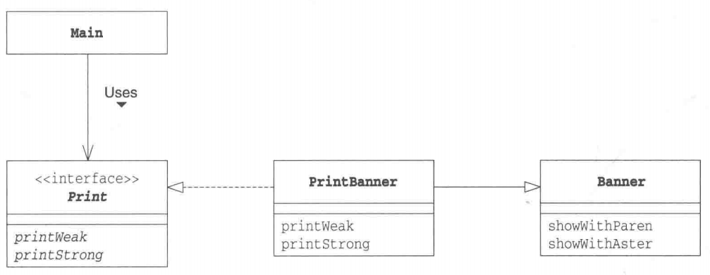
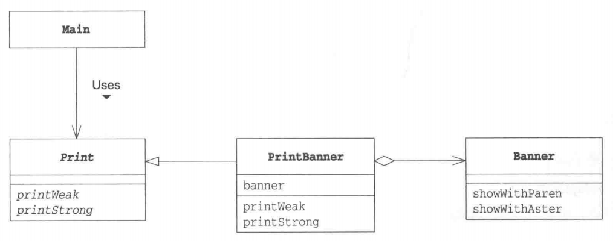
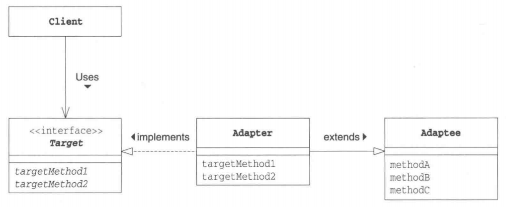
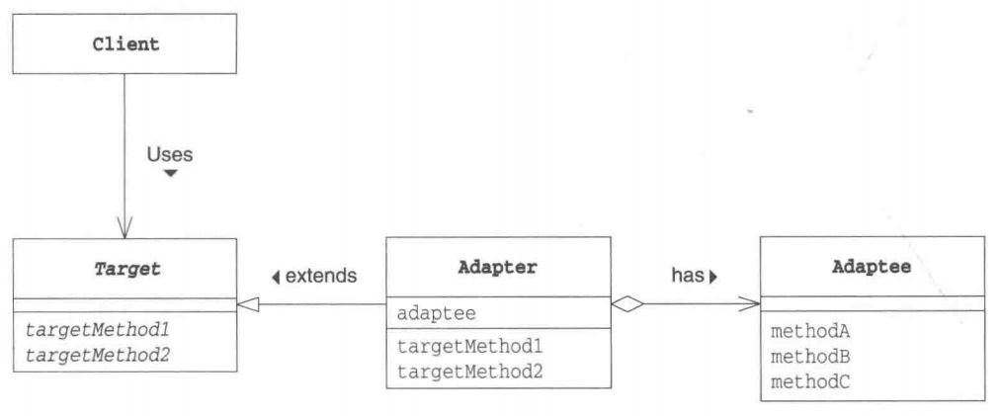
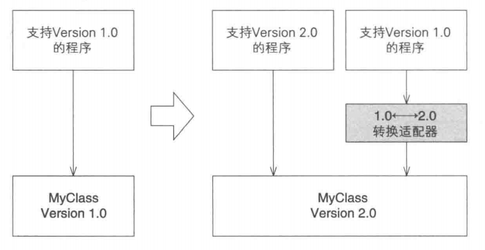

# Adapter 模式（适配器模式）

# 什么是适配器

如果想让额定工作电压是直流12伏特的笔记本电脑在交流220伏特的AC电源下工作，应该怎么做呢？通常，我们会使用AC适配器，将家庭用的交流100伏特电压转换成我们所需要的直流12伏特电压。这就是适配器的工作，它位于实际情况与需求之间，填补两者之间的差异。适配器的英文是Adapter，意思是“使···相互适合的东西”。前面说的AC适配器的作用就是让工作于直流12伏特环境的笔记本电脑适合于交流220伏特的环境。

 

在程序世界中，经常会存在现有的程序无法直接使用，需要做适当的变换之后才能使用的情况。这种用于填补“现有的程序”和“所需的程序”之间差异的设计模式就是**Adapter模式**。Adapter模式也被称为**Wrapper模式**。Wrapper有“包装器”的意思，就像用精美的包装纸将普
通商品包装成礼物那样，替我们把某样东西包起来，使其能够用于其他用途的东西就被称为“包装器”或是“适配器”。

Adapter模式有以下两种：

- **类适配器模式（使用继承的适配器)**
- **对象适配器模式（使用委托的适配器）**

# 在 Java 中使用该模式

> 复杂度：⭐
>
> 流行度：⭐⭐⭐

## 使用继承的适配器

首先，让我们来看一段使用继承的适配器的示例程序。这里的示例程序是一段会将输入的字符串显示为`(He11o)`或是`*He11o*`的简单程序。

目前在Banner类(Banner有广告横幅的意思)中，有将字符串用括号括起来的showwithParen方法，和将字符串用`*`号括起来的showwithAster方法。我们假设这个Banner类是类似前文中的“交流220伏特电压”的“实际情况”。

假设Print接口中声明了两种方法，即弱化字符串显示（加括号）的printWeak(weak有弱化的意思)方法，和强调字符串显示（加`*`号）的printStrong(strong有强化的意思)方法。我们假设这个接口是类似于前文中的“直流12伏特电压”的“需求”。

现在要做的事情是使用Banner类编写一个实现了Print接口的类，也就是说要做一个将“交流220伏特电压”转换成“直流12伏特电压”的适配器。

扮演适配器角色的是PrintBanner类。该类继承了Banner类并实现了“需求”一Print接口。PrintBanner类使用showwithParen方法实现了printWeak，使用showwithAster方法实现了printStrong。这样，PrintBanner类就具有适配器的功能了。

> 电源的比喻和实例程序的关系



> 使用了“类适配器模式”的示例程序的类图（使用继承）



### Banner(Banner.java)

```java
public class Banner {
    private String string;
    public Banner(String string){
        this.string string;
    }
    public void showwithParen (){
        System.out.println("(" + string + ")")
    }
    public void showwithAster(){
        System.out.println("*" + string + "*")
    }
}
```

### Print接口(Print.java)

```java
public interface Print {
    public abstract void printWeak();
    public abstract void printstrong();
}
```

### PrintBanner类(PrintBanner.java)

```java
public class PrintBanner extends Banner implements Print {
    public PrintBanner(String string){
        super(string);
    }
    public void printWeak(){
        showwithParen ();
    }
    public void printstrong(){
        showwithAster();
    }
}
```

PrintBanner类扮演适配器的角色。它继承(extends)了Banner类，继承了showwithParen方法和showwithAster方法。同时，它又实现(implements)了Print接口，实现了printWeak方法和printStrong方法。

### Main类(Main.java)

```java
public class Main {
    public static void main(String[]args){
        Print p new PrintBanner("Hello");
        p.printWeak();
        p.printstrong();
    }
}

运行结果：
(Hello)
*Hello*
```

Main类的作用是通过扮演适配器角色的PrintBanner类来弱化（带括号）或是强化Hello(带`*`号)字符串的显示。

我们是使用Print接口（即调用printweak方法和printstrong方法）来进行编程的。对Main类的代码而言，Banner类、showwithParen方法和showwithAster方法被完全隐藏起来了。这就好像笔记本电脑只要在直流12伏特电压下就能正常工作，但它并不知道这12伏特的电
压是由适配器将220伏特交流电压转换而成的。

Main类并不知道PrintBanner类是如何实现的，这样就可以在不用对Main类进行修改的情况下改变PrintBanner类的具体实现。

## 使用委托的适配器

之前的示例程序展示了类适配器模式。下面我们再来看看对象适配器模式。在之前的示例程序中，我们使用“继承”实现适配，而这次我们要使用“委托”来实现适配。

> [!tip]**关于委托：**
>
> “委托”这个词太过于正式了，说得通俗点就是“交给其他人”。比如，当我们无法出席重要会议时，可以写一份委任书，说明一下“我无法出席会议，安排其他人代替我出席”。委托跟委任的意思是一样的。在Java语言中，委托就是指将某个方法中的实际处理交给其他实例的方法。

Main类和Banner类与上面的示例程序中的内容完全相同，不过这里我们假设Print不是接口而是类。

也就是说，我们打算利用Banner类实现一个类，该类的方法和Print类的方法相同。由于在Java中无法同时继承两个类（只能是单一继承），因此我们无法将PrintBanner类分别定义为Print类和Banner类的子类。

PrintBanner类的banner字段中保存了Banner类的实例。该实例是在PrintBanner类的构造函数中生成的。然后，printWeak方法和printStrong方法会通过banner字段调用Banner类的showwithParen和showWithAster方法。

与之前的示例代码中调用了从父类中继承的showWithParen方法和showWithAster方法不同，这次我们通过字段来调用这两个方法。

这样就形成了一种委托关系。当PrintBanner类的printWeak被调用的时候，并不是PrintBanner类自己进行处理，而是将处理交给了其他实例(Banner类的实例)的showwithParen方法。

> 使用了“对象适配器模式”的示例程序的类图（使用委托）

 

### Print类(Print.java)

```java
public abstract class Print {
    public abstract void printWeak();
    public abstract void printstrong();
}
```

### PrintBanner(PrintBanner.java)

```java
public class PrintBanner extends Print {
    private Banner banner;
    public PrintBanner(Stringstring){
        this.banner new Banner(string);
    }
    public void printweak(){
        banner.showwithParen();
    }
    public void printstrong(){
        banner.showwithAster();
    }
}
```

# Adapter模式中登场的角色

- **Target(对象)**

  该角色负责定义所需的方法。以本章开头的例子来说，即让笔记本电脑正常工作所需的直流12伏特电源。在示例程序中，由Print接口（使用继承时）和Print类（使用委托时）扮演此角色。

- **Client(请求者)**

  该角色负责使用Target角色所定义的方法进行具体处理。以本章开头的例子来说，即直流12伏特电源所驱动的笔记本电脑。在示例程序中，由Main类扮演此角色。

- **Adaptee(被适配)**

  注意不是Adapt-er(适配)角色，而是Adapt-ee(被适配)角色。Adaptee是一个持有既定方法的角色。以本章开头的例子来说，即交流220伏特电源。在示例程序中，由Banner类扮演此角色。如果Adaptee角色中的方法与Target角色的方法相同（也就是说家庭使用的电压就是I2伏特直流电压)，就不需要接下来的Adapter角色了。

- **Adapter(适配)**

  Adapter模式的主人公。使用Adaptee角色的方法来满足Target角色的需求，这是Adapter模式的目的，也是Adapter角色的作用。以本章开头的例子来说，Adapter角色就是将交流220伏特电压转换为直流12伏特电压的适配器。在示例程序中，由PrintBanner类扮演这个角色。

在类适配器模式中，Adapter角色通过继承来使用Adaptee角色，而在对象适配器模式中，Adapter角色通过委托来使用Adaptee角色。

> 类适配器模式的类图（使用继承）



> 对象适配器模式的类图（使用委托）



# Adapter模式中的思路要点

## 什么时候使用Adapter模式

一定会有人认为“如果某个方法就是我们所需要的方法，那么直接在程序中使用不就可以了吗？为什么还要考虑使用Adapter模式呢？”那么，究竟应当在什么时候使用Adapter模式呢？

很多时候，我们并非从零开始编程，经常会用到现有的类。特别是当现有的类已经被充分测试过了，Bug很少，而且已经被用于其他软件之中时，我们更愿意将这些类作为组件重复利用。

Adapter模式会对现有的类进行适配，生成新的类。通过该模式可以很方便地创建我们需要的方法群。当出现Bug时，由于我们很明确地知道Bug不在现有的类（Adaptee角色)中，所以只需调查扮演Adapter角色的类即可。这样一来，代码问题的排查就会变得非常简单。

## 如果没有现成的代码

让现有的类适配新的接口(API)时，使用Adapter模式似乎是理所当然的。不过实际上，我们在让现有的类适配新的接口时，常常会有“只要将这里稍微修改下就可以了”的想法，一不留神就会修改现有的代码。但是需要注意的是，如果要对已经测试完毕的现有代码进行修改，就必须在修改后重新进行测试。

使用Adapter模式可以在完全不改变现有代码的前提下使现有代码适配于新的接口(API)。此外，在Adapter模式中，并非一定需要现成的代码。只要知道现有类的功能，就可以编写出新的类。

## 版本升级与兼容性

软件的生命周期总是伴随着版本的升级，而在版本升级的时候经常会出现“与旧版本的兼容性”问题。如果能够完全抛弃旧版本，那么软件的维护工作将会轻松得多，但是现实中往往无法这样做。这时，可以使用Adapter模式使新I旧版本兼容，帮助我们轻松地同时维护新版本和旧版本。

例如，假设我们今后只想维护新版本。这时可以让新版本扮演Adaptee角色，旧版本扮演Target角色。接着编写一个扮演Adapter角色的类，让它使用新版本的类来实现I旧版本的类中的方法。

**提高与旧版本软件的兼容性的Adapter模式**



## 功能完全不同的类

当然，当Adaptee角色和Target角色的功能完全不同时，Adapter模式是无法使用的。就如同我们无法用交流220伏特电压让自来水管出水一样。