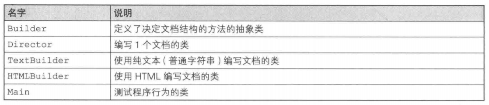
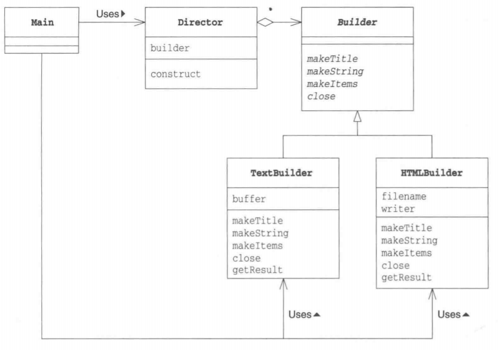
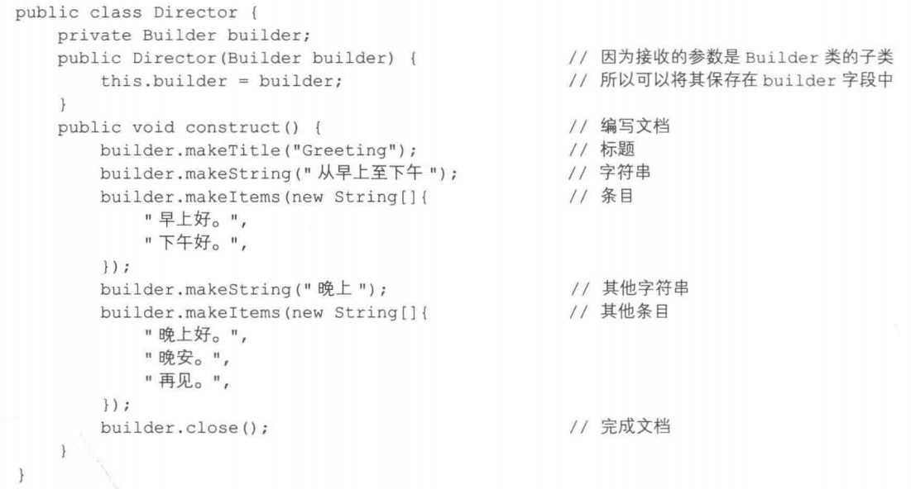
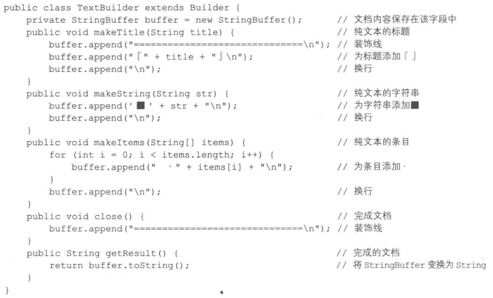
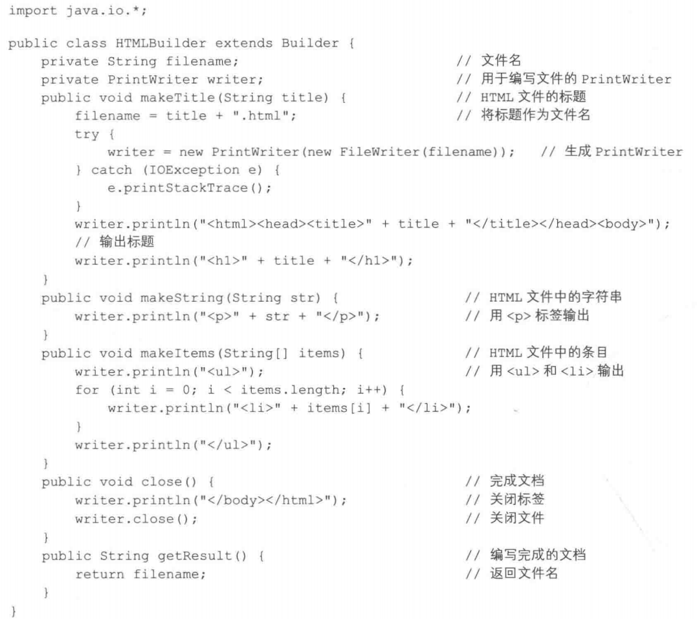
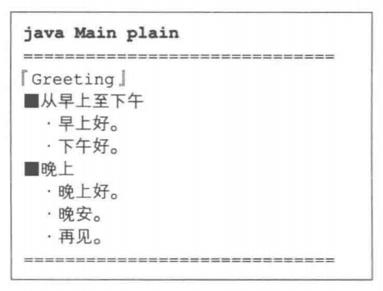
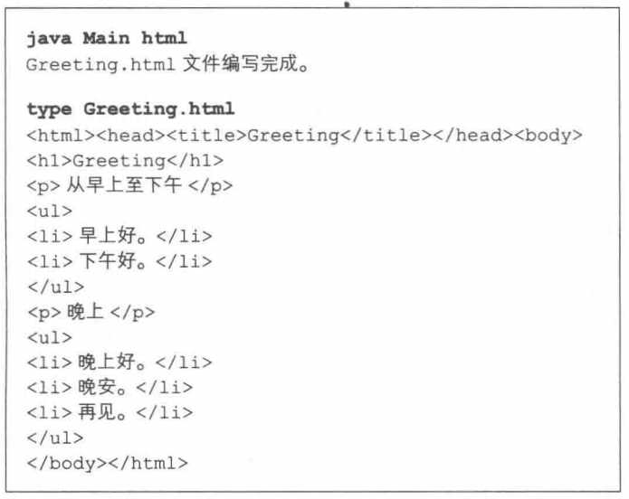
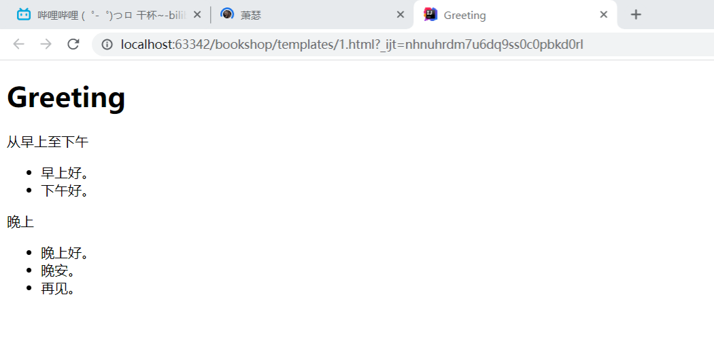
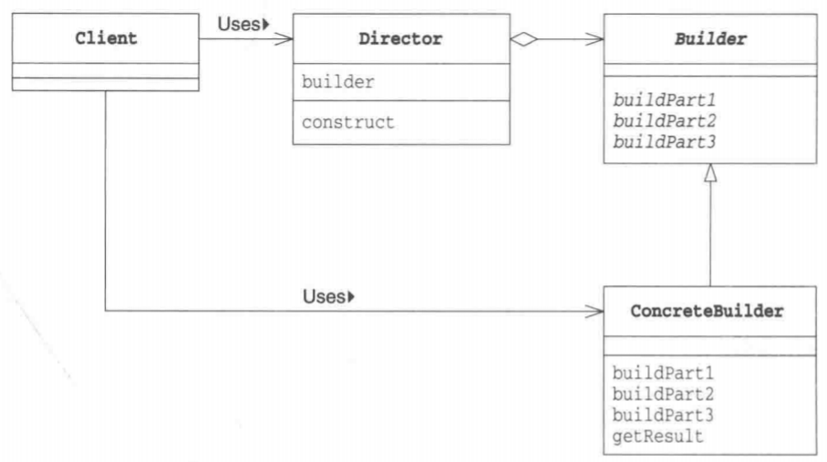
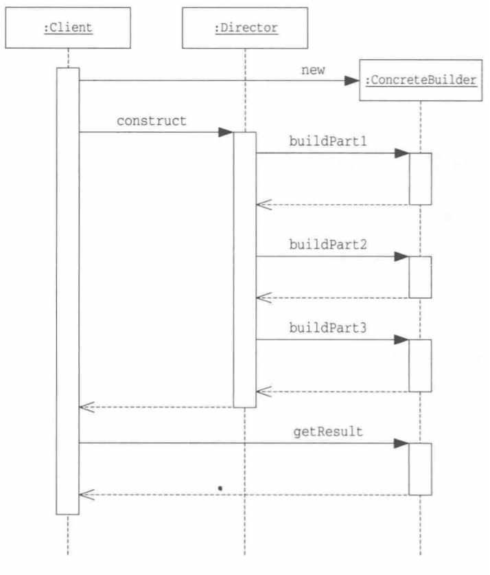

# Builder 模式

大都市中林立着许多高楼大厦，这些高楼大厦都是具有建筑结构的大型建筑。通常，建造和构建这种具有建筑结构的大型物体在英文中称为Build。

在建造大楼时，需要先打牢地基，搭建框架，然后自下而上地一层一层盖起来。通常，在建造这种具有复杂结构的物体时，很难一气呵成。我们需要首先建造组成这个物体的各个部分，然后分阶段将它们组装起来。

在本章中，我们将要学习用于组装具有复杂结构的实例的**Builder模式**。

# 示例程序

作为示例程序，我们来看一段使用Builder模式编写“文档”的程序。这里编写出的文档具有以下结构。

- **含有一个标题**
- **含有几个字符串**
- **含有条目项目**

Builder类中定义了决定文档结构的方法，然后Director类使用该方法编写一个具体的文档。

Builder是抽象类，它并没有进行任何实际的处理，仅仅声明了抽象方法。Builder类的子类决定了用来编写文档的具体处理。

在示例程序中，我们定义了以下Builder类的子类。

- **TextBuilder类：使用纯文本（普通字符串）编写文档**
- **HTMLBuilder类：使用HTML编写文档**

Director使用TextBuilder类时可以编写纯文本文档；使用HTMLBuilder类时可以编写HTML文档。

> 类的一览



> 示例程序类图



## Builder类

Builder类是一个声明了编写文档的方法的抽象类。makeTitle、makeString、makeTimes方法分别是编写标题、字符串、条目的方法。close方法是完成文档编写的方法。

```java
public abstract class Builder {
    public abstract void makeTitle(String title);
    public abstract void makestring(String str);
    public abstract void makeItems(String[] items);
    public abstract void close();
}
```

## Director类

Director类使用Builder类中声明的方法来编写文档。

Director类的构造函数的参数是Builder类型的。但是实际上我们并不会将Builder类的实例作为参数传递给Director类。这是因为Builder类是抽象类，是无法生成其实例的。实际上传递给Director类的是Builder类的子类（即后面会讲到的TextBuilder类和
HTMLBuilder类等)的实例。而正是这些Builder类的子类决定了编写出的文档的形式。

construct方法是编写文档的方法。调用这个方法后就会编写文档。construct方法中所使用的方法都是在Builder类中声明的方法(construct的意思是“构建”)。



## TextBuilder类

TextBuilder类是Builder类的子类，它的功能是使用纯文本编写文档，并以String返回结果。



## HTMLBuilder类

HTMLBuilder类也是Builder类的子类，它的功能是使用HTML编写文档，其返回结果是HTML文件的名字。



## Main类

Main类是Builder模式的测试程序。我们可以使用如下的命令来编写相应格式的文档：

- **java Main plain：编写纯文本文档**
- **java Main html：编写HTML格式的文档**

当我们在命令行中指定参数为plain的时候，会将TextBuilder类的实例作为参数传递至Director类的构造函数中；而若是在命令行中指定参数为html的时候，则会将HTMLBuilder类的实例作为参数传递至Director类的构造函数中。

由于TextBuilder和HTMLBuilder都是Builder的子类，因此Director仅仅使用Builder的方法即可编写文档。也就是说，Director并不关心实际编写文档的到底是TextBuilder还是HTMLBuilder。

正因为如此，我们必须在Builder中声明足够多的方法，以实现编写文档的功能，但并不包括TextBuilder和HTMLBuilder中特有的方法。

```java
public class Main {
    public static void main(String[]args){
        if(args.length != 1){
            usage();
            System.exit(0);
        }
        if (args[0].equals("plain")){
            TextBuilder textbuilder new TextBuilder();
            Directordirector new Director(textbuilder);
            director.construct();
            String result textbuilder.getResult();
            System.out.println(result);
        }else if (args[0].equals("html")){
            HTMLBuilder htmlbuilder new HTMLBuilder();
            Director director new Director(htmlbuilder);
            director.construct();
            String filename htmlbuilder.getResult();
            System.out,println(filename+"文件编写完成。");
        }else{
            usage();
            System.exit(0);
        }
    }
    
    public static void usage(){
        System.out.println("Usage:java Main plain	编写纯文本文档");
        System.out.println("Usage:java Main html	编写HTML文档");
    }
}
```

> 运行结果（纯文本文档）

 

> 运行结果（HTML文档）

 



# Builder模式中的登场角色

- **Builder(建造者)**

  Builder角色负责定义用于生成实例的接口(API)。Builder角色中准备了用于生成实例的方法。在示例程序中，由Builder类扮演此角色。

- **ConcreteBuilder(具体的建造者)**

  ConcreteBuilder角色是负责实现Builder角色的接口的类(API)。这里定义了在生成实例时实际被调用的方法。此外，在ConcreteBuilder角色中还定义了获取最终生成结果的方法。在示例程序中，由TextBuilder类和HTMLBuilder类扮演此角色。

- **Director(监工)**

  Director角色负责使用Builder角色的接口(API)来生成实例。它并不依赖于ConcreteBuilder角色。为了确保不论ConcreteBuilder角色是如何被定义的，Director角色都能正常工作，它**只调用在Builder角色中被定义的方法**。在示例程序中，由Director类扮演此角色。

- **Client(使用者)**

  该角色使用了Builder模式（在GoF的书中，Builder模式并不包含Client角色)。在示例程序中，由Main类扮演此角色。

> Builder模式类图

 

> Builder模式的时序图

 

# Builder模式中的思路要点

## 谁知道什么

在面向对象编程中，“谁知道什么”是非常重要的。也就是说，我们需要在编程时注意哪个类可以使用哪个方法以及使用这个方法到底好不好。

请大家再回忆一下示例程序。

Main类并不知道（没有调用）Builder类，它只是调用了Direct类的construct方法。这样，Director类就会开始工作(Main类对此一无所知)，并完成文档的编写。

另一方面，Director类知道Builder类，它调用Builder类的方法来编写文档，但是它并不知道它“真正”使用的是哪个类。也就是说它并不知道它所使用的类到底是TextBuilder类、HTMLBuilder类还是其他Builder类的子类。不过也没有必要知道，因为Director类只使用了Builder类的方法，而Builder类的子类都已经实现了那些方法。

Director类不知道自己使用的究竟是Builder类的哪个子类也好。这是因为“**只有不知道子类才能替换**”。不论是将TextBuilder的实例传递给Director,还是将HTMLBuilder类的实例传递给Director,它都可以正常工作，原因正是Director类不知道Builder类的具体的子类。

正是因为不知道才能够替换，正是因为可以替换，组件才具有高价值。作为设计人员，我们必须时刻关注这种“可替换性”。

## 设计时能够决定的事情和不能决定的事情

在Builder类中，需要声明编辑文档（实现功能）所必需的所有方法。Director类中使用的方法都是Builder类提供的。因此，在Builder类中应当定义哪些方法是非常重要的。

而且，Builder类还必须能够应对将来子类可能增加的需求。在示例程序中，我们只编写了支持纯文本文档的子类和支持HTML文件的子类。但是将来可能还会希望能够编写其他形式（例如XXXX形式)的文档。那时候，到底能不能编写出支持XXXX形式的XXXXBuilder类呢？应该不需要新的方法吧？

虽然类的设计者并不是神仙，他们无法准确地预测到将来可能发生的变化。但是，我们还是有必要让设计出的类能够尽可能灵活地应对近期可能发生的变化。

## 代码的阅读方法和修改方法

在编程时，虽然有时需要从零开始编写代码，但更多时候我们都是在现有代码的基础上进行增加和修改。

这时，我们需要先阅读现有代码。不过，只是阅读抽象类的代码是无法获取很多信息的（虽然可以从方法名中获得线索)。

让我们再回顾一下示例程序。即使理解了Builder抽象类，也无法理解程序整体。至少必须在阅读了Director的代码后才能理解Builder类的使用方法(Builder类的方法的调用方法)。然后再去看看TextBuilder类和HTMLBuilder类的代码，就可以明白调用Builder类的方法后具体会进行什么样的处理。

如果没有理解各个类的角色就动手增加和修改代码，在判断到底应该修改哪个类时，就会很容易出错。例如，如果修改Builder类，那么就会对Director类中调用Builder类方法的地方和Builder类的子类产生影响。或是如果不小心修改了Director类，在其内部调用了TextBuilder类的特有的方法，则会导致其失去作为可复用组件的独立性，而且当将子类替换为HTMLBuilder时，程序可能会无法正常工作。

