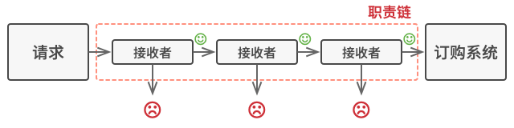
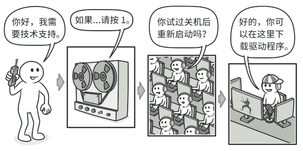

# Chain of Responsibility模式

**责任链模式**是一种行为设计模式， 允许你将请求沿着处理者链进行发送。 收到请求后， 每个处理者均可对请求进行处理， 或将其传递给链上的下个处理者。

 

# 问题

假如你正在开发一个在线订购系统。 你希望对系统访问进行限制， 只允许认证用户创建订单。 此外， 拥有管理权限的用户也拥有所有订单的完全访问权限。

简单规划后， 你会意识到这些检查必须依次进行。 只要接收到包含用户凭据的请求， 应用程序就可尝试对进入系统的用户进行认证。 但如果由于用户凭据不正确而导致认证失败， 那就没有必要进行后续检查了。

 

在接下来的几个月里， 你实现了后续的几个检查步骤。

- 一位同事认为直接将原始数据传递给订购系统存在安全隐患。 因此你新增了额外的验证步骤来清理请求中的数据。
- 过了一段时间， 有人注意到系统无法抵御暴力密码破解方式的攻击。 为了防范这种情况， 你立刻添加了一个检查步骤来过滤来自同一 IP 地址的重复错误请求。
- 又有人提议你可以对包含同样数据的重复请求返回缓存中的结果， 从而提高系统响应速度。 因此， 你新增了一个检查步骤， 确保只有没有满足条件的缓存结果时请求才能通过并被发送给系统。

 

检查代码本来就已经混乱不堪， 而每次新增功能都会使其更加臃肿。 修改某个检查步骤有时会影响其他的检查步骤。 最糟糕的是， 当你希望复用这些检查步骤来保护其他系统组件时， 你只能复制部分代码， 因为这些组件只需部分而非全部的检查步骤。

系统会变得让人非常费解， 而且其维护成本也会激增。 你在艰难地和这些代码共处一段时间后， 有一天终于决定对整个系统进行重构。

# 解决方案

与许多其他行为设计模式一样， **责任链**会将特定行为转换为被称作*处理者*的独立对象。 在上述示例中， 每个检查步骤都可被抽取为仅有单个方法的类， 并执行检查操作。 请求及其数据则会被作为参数传递给该方法。

模式建议你将这些处理者连成一条链。 链上的每个处理者都有一个成员变量来保存对于下一处理者的引用。 除了处理请求外， 处理者还负责沿着链传递请求。 请求会在链上移动， 直至所有处理者都有机会对其进行处理。

最重要的是： 处理者可以决定不再沿着链传递请求， 这可高效地取消所有后续处理步骤。

在我们的订购系统示例中， 处理者会在进行请求处理工作后决定是否继续沿着链传递请求。 如果请求中包含正确的数据， 所有处理者都将执行自己的主要行为， 无论该行为是身份验证还是数据缓存。

 

不过还有一种稍微不同的方式 （也是更经典一种）， 那就是处理者接收到请求后自行决定是否能够对其进行处理。 如果自己能够处理， 处理者就不再继续传递请求。 因此在这种情况下， 每个请求要么最多有一个处理者对其进行处理， 要么没有任何处理者对其进行处理。 在处理图形用户界面元素栈中的事件时， 这种方式非常常见。

例如， 当用户点击按钮时， 按钮产生的事件将沿着 GUI 元素链进行传递， 最开始是按钮的容器 （如窗体或面板）， 直至应用程序主窗口。 链上第一个能处理该事件的元素会对其进行处理。 此外， 该例还有另一个值得我们关注的地方： 它表明我们总能从对象树中抽取出链来。

 

所有处理者类均实现同一接口是关键所在。 每个具体处理者仅关心下一个包含 `execute`执行方法的处理者。 这样一来， 你就可以在运行时使用不同的处理者来创建链， 而无需将相关代码与处理者的具体类进行耦合。

**类比于真实世界：**

 

最近， 你刚为自己的电脑购买并安装了一个新的硬件设备。 身为一名极客， 你显然在电脑上安装了多个操作系统， 所以你会试着启动所有操作系统来确认其是否支持新的硬件设备。 Windows 检测到了该硬件设备并对其进行了自动启用。 但是你喜爱的 Linux 系统并不支持新硬件设备。 抱着最后一点希望， 你决定拨打包装盒上的技术支持电话。

首先你会听到自动回复器的机器合成语音， 它提供了针对各种问题的九个常用解决方案， 但其中没有一个与你遇到的问题相关。 过了一会儿， 机器人将你转接到人工接听人员处。

这位接听人员同样无法提供任何具体的解决方案。 他不断地引用手册中冗长的内容， 并不会仔细聆听你的回应。 在第 10 次听到 “你是否关闭计算机后重新启动呢？” 这句话后， 你要求与一位真正的工程师通话。

最后， 接听人员将你的电话转接给了工程师， 他或许正缩在某幢办公大楼的阴暗地下室中， 坐在他所深爱的服务器机房里， 焦躁不安地期待着同一名真人交流。 工程师告诉了你新硬件设备驱动程序的下载网址， 以及如何在 Linux 系统上进行安装。 问题终于解决了！ 你挂断了电话， 满心欢喜。

# 责任链模式结构

 

1. **处理者** （Handler） 声明了所有具体处理者的通用接口。 该接口通常仅包含单个方法用于请求处理， 但有时其还会包含一个设置链上下个处理者的方法。

2. **基础处理者** （Base Handler） 是一个可选的类， 你可以将所有处理者共用的样本代码放置在其中。

   通常情况下， 该类中定义了一个保存对于下个处理者引用的成员变量。 客户端可通过将处理者传递给上个处理者的构造函数或设定方法来创建链。 该类还可以实现默认的处理行为： 确定下个处理者存在后再将请求传递给它。

3. **具体处理者** （Concrete Handlers） 包含处理请求的实际代码。 每个处理者接收到请求后， 都必须决定是否进行处理， 以及是否沿着链传递请求。

   处理者通常是独立且不可变的， 需要通过构造函数一次性地获得所有必要地数据。

4. **客户端** （Client） 可根据程序逻辑一次性或者动态地生成链。 值得注意的是， 请求可发送给链上的任意一个处理者， 而非必须是第一个处理者。

# Java伪代码

> 复杂度：⭐⭐
>
> 流行度：⭐

**使用示例：** 责任链模式在 Java 程序中并不常见， 因为它仅在代码与对象链打交道时才能发挥作用。

该模式最流行的使用案例之一是在 GUI 类中将事件向上传递给父组件。 另一个值得注意的使用案例是依次访问过滤器。

下面是该模式在核心 Java 程序库中的一些示例：

- [`javax.servlet.Filter#doFilter()`](https://docs.oracle.com/javaee/7/api/javax/servlet/Filter.html#doFilter-javax.servlet.ServletRequest-javax.servlet.ServletResponse-javax.servlet.FilterChain-)
- [`java.util.logging.Logger#log()`](https://docs.oracle.com/javase/8/docs/api/java/util/logging/Logger.html#log-java.util.logging.Level-java.lang.String-)

**识别方法：** 该模式可通过一组对象的行为方法间接调用其他对象的相同方法来识别， 而且所有对象都会遵循相同的接口。

## 过滤访问

本例展示了包含用户数据的请求如何依次通过处理者链来执行各种不同的行为 （例如认证、 授权与验证）。

本例与许多作者给出的该模式的标准版本有些不同。 绝大多数模式示例都会寻找正确的处理者， 并在处理后退出链。 但在这里我们会执行每个处理者， 直至某个处理者**无法处理**请求。 请注意， 尽管流程略有不同， 但这仍是责任链模式。

## middleware/Middleware.java: 基础验证接口

```java
package com.llh.chainofresponsibility.middleware;

/**
 * ClassName: Middleware
 * Author: Maybe
 * Date: 2022/5/29  14:29
 * <p>
 * 基础中间件类。
 */
public abstract class Middleware {
    private Middleware next;

    /**
     * 构建中间件对象链。
     */
    public Middleware linkWith(Middleware next) {
        this.next = next;
        return next;
    }

    /**
     * 子类将通过具体检查来实现此方法。
     */
    public abstract boolean check(String email, String password);

    /**
     * 对链中的下一个对象运行检查，如果我们在链中的最后一个对象中，则结束遍历。
     */
    protected boolean checkNext(String email, String password) {
        if (next == null) {
            return true;
        }
        return next.check(email, password);
    }
}
```

## middleware/ThrottlingMiddleware.java: 检查请求数量限制

```java
package com.llh.chainofresponsibility.middleware;

/**
 * ClassName: ThrottlingMiddleware
 * Author: Maybe
 * Date: 2022/5/29  14:30
 * <p>
 * 具体处理程序。检查是否有太多失败的登录请求。
 */
public class ThrottlingMiddleware extends Middleware {
    private int requestPerMinute;
    private int request;
    private long currentTime;

    public ThrottlingMiddleware(int requestPerMinute) {
        this.requestPerMinute = requestPerMinute;
        this.currentTime = System.currentTimeMillis();
    }

    /**
     * 请不要在此方法的开头和结尾都插入 checkNext() 调用。
     * <p>
     * 这比所有中间件对象的简单循环提供了更多的灵活性。
     * 例如，链中的一个元素可以通过在所有其他检查之后运行其检查来更改检查的顺序。
     */
    @Override
    public boolean check(String email, String password) {
        if (System.currentTimeMillis() > currentTime + 60_000) {
            request = 0;
            currentTime = System.currentTimeMillis();
        }

        request++;

        if (request > requestPerMinute) {
            System.out.println("Request limit exceeded!");
            Thread.currentThread().stop();
        }
        return checkNext(email, password);
    }
}
```

## middleware/UserExistsMiddleware.java: 检查用户登录信息

```java
package com.llh.chainofresponsibility.middleware;

import com.llh.chainofresponsibility.server.Server;

/**
 * ClassName: UserExistsMiddleware
 * Author: Maybe
 * Date: 2022/5/29  14:33
 * <p>
 * 具体处理程序。检查具有给定凭据的用户是否存在。
 */
public class UserExistsMiddleware extends Middleware {
    private Server server;

    public UserExistsMiddleware(Server server) {
        this.server = server;
    }

    @Override
    public boolean check(String email, String password) {
        if (!server.hasEmail(email)) {
            System.out.println("This email is not registered!");
            return false;
        }
        if (!server.isValidPassword(email, password)) {
            System.out.println("Wrong password!");
            return false;
        }
        return checkNext(email, password);
    }
}
```

## middleware/RoleCheckMiddleware.java: 检查用户角色

```java
package com.llh.chainofresponsibility.middleware;

/**
 * ClassName: RoleCheckMiddleware
 * Author: Maybe
 * Date: 2022/5/29  14:35
 * <p>
 * 具体处理程序。检查用户的角色。
 */
public class RoleCheckMiddleware extends Middleware {

    @Override
    public boolean check(String email, String password) {
        if (email.equals("admin@example.com")) {
            System.out.println("Hello, admin!");
            return true;
        }
        System.out.println("Hello, user!");
        return checkNext(email, password);
    }
}
```

## server/Server.java: 授权目标

```java
package com.llh.chainofresponsibility.server;

import com.llh.chainofresponsibility.middleware.Middleware;

import java.util.HashMap;
import java.util.Map;

/**
 * ClassName: Server
 * Author: Maybe
 * Date: 2022/5/29  14:34
 */
public class Server {
    private Map<String, String> users = new HashMap<>();
    private Middleware middleware;

    /**
     * 客户端将对象链传递给服务器。这提高了灵活性并使测试服务器类更容易。
     */
    public void setMiddleware(Middleware middleware) {
        this.middleware = middleware;
    }

    /**
     * 服务器从客户端获取电子邮件和密码，并将授权请求发送到链。
     */
    public boolean logIn(String email, String password) {
        if (middleware.check(email, password)) {
            System.out.println("Authorization have been successful!");

            // Do something useful here for authorized users.

            return true;
        }
        return false;
    }

    public void register(String email, String password) {
        users.put(email, password);
    }

    public boolean hasEmail(String email) {
        return users.containsKey(email);
    }

    public boolean isValidPassword(String email, String password) {
        return users.get(email).equals(password);
    }
}
```

## Main.java: 客户端代码

```java
package com.llh.chainofresponsibility;

import com.llh.chainofresponsibility.middleware.Middleware;
import com.llh.chainofresponsibility.middleware.RoleCheckMiddleware;
import com.llh.chainofresponsibility.middleware.ThrottlingMiddleware;
import com.llh.chainofresponsibility.middleware.UserExistsMiddleware;
import com.llh.chainofresponsibility.server.Server;

import java.io.BufferedReader;
import java.io.IOException;
import java.io.InputStreamReader;

/**
 * ClassName: Main
 * Author: Maybe
 * Date: 2022/5/29  14:37
 */
public class Main {
    private static BufferedReader reader = new BufferedReader(new InputStreamReader(System.in));
    private static Server server;

    private static void init() {
        server = new Server();
        server.register("admin@example.com", "admin_pass");
        server.register("user@example.com", "user_pass");

        // 所有支票都是链接的。客户端可以使用相同的组件构建各种链。
        Middleware middleware = new ThrottlingMiddleware(2);
        middleware.linkWith(new UserExistsMiddleware(server))
                .linkWith(new RoleCheckMiddleware());

        // 服务器从客户端代码中获取一个链。
        server.setMiddleware(middleware);
    }

    public static void main(String[] args) throws IOException {
        init();

        boolean success;
        do {
            System.out.print("Enter email: ");
            String email = reader.readLine();
            System.out.print("Input password: ");
            String password = reader.readLine();
            success = server.logIn(email, password);
        } while (!success);
    }
}
```

**运行结果：**

```
Enter email: admin@example.com
Input password: admin_pass
Hello, admin!
Authorization have been successful!


Enter email: user@example.com
Input password: user_pass
Hello, user!
Authorization have been successful!
```

# 责任链模式适合应用场景

 **当程序需要使用不同方式处理不同种类请求， 而且请求类型和顺序预先未知时， 可以使用责任链模式。**

 该模式能将多个处理者连接成一条链。 接收到请求后， 它会 “询问” 每个处理者是否能够对其进行处理。 这样所有处理者都有机会来处理请求。

---

 **当必须按顺序执行多个处理者时， 可以使用该模式。**

 无论你以何种顺序将处理者连接成一条链， 所有请求都会严格按照顺序通过链上的处理者。

---

 **如果所需处理者及其顺序必须在运行时进行改变， 可以使用责任链模式。**

 如果在处理者类中有对引用成员变量的设定方法， 你将能动态地插入和移除处理者， 或者改变其顺序。

# 实现方式

1. 声明处理者接口并描述请求处理方法的签名。

   确定客户端如何将请求数据传递给方法。 最灵活的方式是将请求转换为对象， 然后将其以参数的形式传递给处理函数。

2. 为了在具体处理者中消除重复的样本代码， 你可以根据处理者接口创建抽象处理者基类。

   该类需要有一个成员变量来存储指向链上下个处理者的引用。 你可以将其设置为不可变类。 但如果你打算在运行时对链进行改变， 则需要定义一个设定方法来修改引用成员变量的值。

   为了使用方便， 你还可以实现处理方法的默认行为。 如果还有剩余对象， 该方法会将请求传递给下个对象。 具体处理者还能够通过调用父对象的方法来使用这一行为。

3. 依次创建具体处理者子类并实现其处理方法。 每个处理者在接收到请求后都必须做出两个决定：

   - 是否自行处理这个请求。
   - 是否将该请求沿着链进行传递。

4. 客户端可以自行组装链， 或者从其他对象处获得预先组装好的链。 在后一种情况下， 你必须实现工厂类以根据配置或环境设置来创建链。

5. 客户端可以触发链中的任意处理者， 而不仅仅是第一个。 请求将通过链进行传递， 直至某个处理者拒绝继续传递， 或者请求到达链尾。

6. 由于链的动态性， 客户端需要准备好处理以下情况：

   - 链中可能只有单个链接。
   - 部分请求可能无法到达链尾。
   - 其他请求可能直到链尾都未被处理。

# 责任链模式优缺点

> [!tip|label:优点]
>
> -  你可以控制请求处理的顺序。
> -  *单一职责原则*。 你可对发起操作和执行操作的类进行解耦。
> -  *开闭原则*。 你可以在不更改现有代码的情况下在程序中新增处理者。

> [!danger|label:缺点]
>
> - 部分请求可能未被处理。

# 与其他模式的关系

- [责任链模式](https://refactoringguru.cn/design-patterns/chain-of-responsibility)、 [命令模式](https://refactoringguru.cn/design-patterns/command)、 [中介者模式](https://refactoringguru.cn/design-patterns/mediator)和[观察者模式](https://refactoringguru.cn/design-patterns/observer)用于处理请求发送者和接收者之间的不同连接方式：

  - *责任链*按照顺序将请求动态传递给一系列的潜在接收者， 直至其中一名接收者对请求进行处理。
  - *命令*在发送者和请求者之间建立单向连接。
  - *中介者*清除了发送者和请求者之间的直接连接， 强制它们通过一个中介对象进行间接沟通。
  - *观察者*允许接收者动态地订阅或取消接收请求。

- [责任链](https://refactoringguru.cn/design-patterns/chain-of-responsibility)通常和[组合模式](https://refactoringguru.cn/design-patterns/composite)结合使用。 在这种情况下， 叶组件接收到请求后， 可以将请求沿包含全体父组件的链一直传递至对象树的底部。

- [责任链](https://refactoringguru.cn/design-patterns/chain-of-responsibility)的管理者可使用[命令模式](https://refactoringguru.cn/design-patterns/command)实现。 在这种情况下， 你可以对由请求代表的同一个上下文对象执行许多不同的操作。

  还有另外一种实现方式， 那就是请求自身就是一个*命令*对象。 在这种情况下， 你可以对由一系列不同上下文连接而成的链执行相同的操作。

- [责任链](https://refactoringguru.cn/design-patterns/chain-of-responsibility)和[装饰模式](https://refactoringguru.cn/design-patterns/decorator)的类结构非常相似。 两者都依赖递归组合将需要执行的操作传递给一系列对象。 但是， 两者有几点重要的不同之处。

  [责任链](https://refactoringguru.cn/design-patterns/chain-of-responsibility)的管理者可以相互独立地执行一切操作， 还可以随时停止传递请求。 另一方面， 各种*装饰*可以在遵循基本接口的情况下扩展对象的行为。 此外， 装饰无法中断请求的传递。