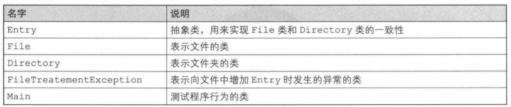
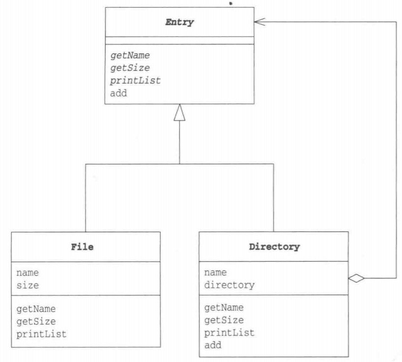
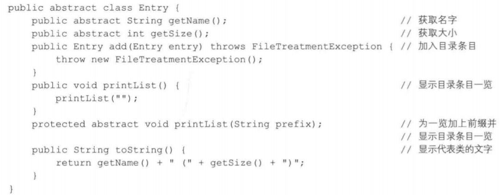
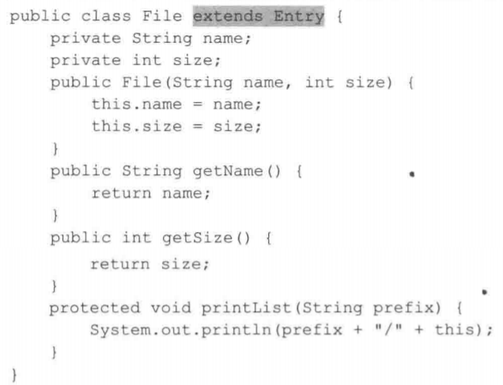
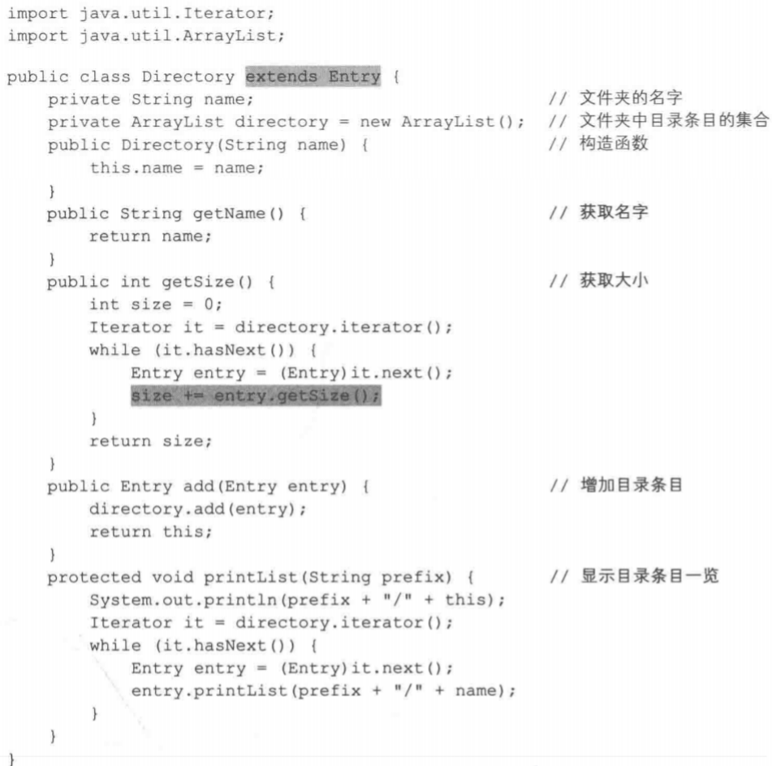
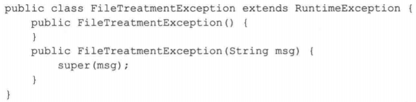
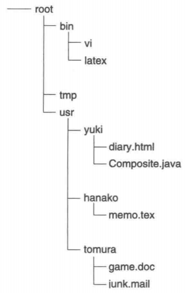
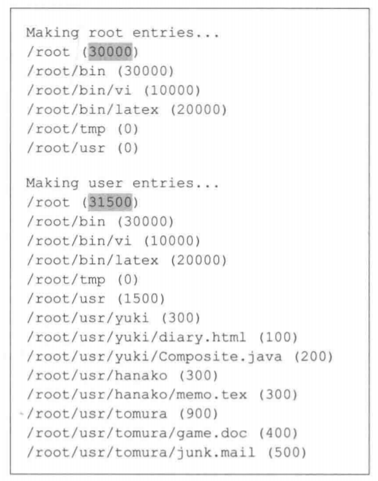
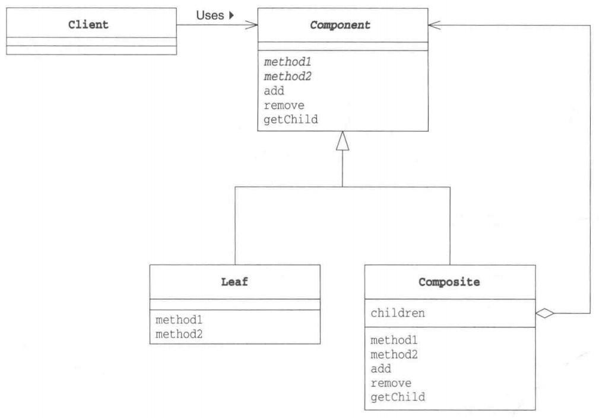

# Composite模式

在计算机的文件系统中，有“文件夹”的概念（在有些操作系统中，也称为“目录”)。文件夹里面既可以放入文件，也可以放人其他文件夹（子文件夹）。在子文件夹中，一样地既可以放入文件，也可以放入子文件夹。可以说，文件夹是形成了一种容器结构、递归结构。

我们接着再想一想。虽然文件夹与文件是不同类型的对象，但是它们都“可以被放人到文件夹中”。文件夹和文件有时也被统称为“目录条目”(directory entry)。在目录条目中，文件夹和文件被当作是同一种对象看待（即一致性）。

例如，想查找某个文件夹中有什么东西时，找到的可能是文件夹，也可能是文件。简单地说，找到的都是目录条目。

有时，与将文件夹和文件都作为目录条目看待一样，将容器和内容作为同一种东西看待，可以帮助我们方便地处理问题。在容器中既可以放入内容，也可以放入小容器，然后在那个小容器中，又可以继续放人更小的容器。这样，就形成了容器结构、递归结构。

在本章中，我们要学习的**Composite模式**就是用于创造出这样的结构的模式。**能够使容器与内容具有一致性，创造出递归结构**的模式就是Composite模式。Composite在英文中是“混合物”、“复合物”的意思。

# Java伪代码

> 复杂度：⭐⭐
>
> 流行度：⭐⭐

下面我们来看一段Composite模式的示例程序。这段示例程序的功能是列出文件和文件夹的一览。在示例程序中，表示文件的是File类，表示文件夹的是Directory类，为了能将它们统一起来，我们为它们设计了父类Entry类。Entry类是表示“目录条目”的类，这样就实现了File类和Directory类的一致性。

> 类的一览表



> 程序类图

 

## Entry类

Entry类是一个表示目录条目的抽象类。File类和Directory类是它的子类。

目录条目有一个名字，我们可以通过getName方法获取这个名字。getName方法的实现由子类负责。

此外，目录条目还有一个大小。我们可以通过getSize方法获得这个大小。getsize方法的实现也由子类负责。

向文件夹中放入文件和文件夹（即目录条目）的方法是add方法。不过实现这个add方法的是目录条目类的子类Directory类。在Entry类中，它只是简单地抛出异常而已。当然，add方法有多种实现方式。

printList方法用于显示文件夹中的内容的“一览”，它有两种形式，一种是不带参数的printList()，另一种是带参数的printList(String)。也就是**重载**(overload)。程序在运行时会根据传递的参数类型选择并执行合适的printList方法。这里，printList()的可见性是public，外部可以直接调用；而printList(String)的可见性是protected，只能被Entry类的子类调用。

toString方法定义了实例的标准的文字显示方式。本例中的实现方式是将文件名和文件大小一起显示出来。getName和getSize都是抽象方法，需要子类去实现这些方法，以供toString调用（即Template Method模式）。



## File类

File类是表示文件的类，它是Entry类的子类。

在File类中有两个字段，一个是表示文件名的name字段，另一个是表示文件大小的size字段。调用File类的构造函数，则会根据传入的文件名和文件大小生成文件实例。例如以下语句就会创建出一个文件名为readme.txt，文件大小为1000的“文件”。当然这里创建出的文件是虚拟的文件，程序并不会在真实的文件系统中创建出任何文件。

```java
new File ("readme.txt", 1000);
```

getName方法和getSize方法分别返回文件的名字和大小。

此外，File类还实现了父类要求它实现的printList(String)方法，具体的显示方式是用"/"分隔prefix和表示实例自身的文字。这里我们使用了表达式"/"+this。像这样用字符串加上对象时，程序会自动地调用对象的toString方法。这是Java语言的特点。也就是说下面这些的表达式是等价的。

```java
prefix + "/" + this;
prefix + "/" + this.toString();
prefix + "/" + tostring();
```

因为File类实现了父类Entry的abstract方法，因此File类自身就不是抽象类了。

 

## Directory类

Directory类是表示文件夹的类。它也是Entry类的子类。

在Directory类中有两个字段，一个是表示文件夹名字的name字段，这一点与File类相同。不过，在Directory类中，我们并没有定义表示文件夹大小的字段，这是因为文件夹大小是自动计算出来的。

另一个字段是directory，它是ArrayList类型的，它的用途是保存文件夹中的目录条目。

getName方法只是简单地返回了name，但在getsize方法中则进行了计算处理。它会遍历directory字段中的所有元素，然后计算出它们的大小的总和。请注意以下语句。

```java
size + entry.getsize();
```

这里，在变量size中加上了entry的大小，但entry可能是File类的实例，也可能是Directory类的实例。不过，不论它是哪个类的实例，我们**都可以通过getsize方法得到它的大小**。这就是Composite模式的特征一**“容器与内容的一致性”**一的表现。不管entry究竟是File类的实例还是Directory类的实例，它都是Entry类的子类的实例，因此可以放心地调用getsize方法。即使将来编写了其他Entry类的子类，它也会实现getsize方法，因此Directory类的这部分代码无需做任何修改。

如果entry是Directory类的实例，调用entry.getSize()时会将该文件夹下的所有目录条目的大小加起来。如果其中还有子文件夹，又会调用子文件夹的getsize方法，形成递归调用。这样一来，大家应该能够看出来，**getsize方法的递归调用与Composite模式的结构是相对应的**。

add方法用于向文件夹中加人文件和子文件夹。该方法并不会判断接收到的entry到底是Directory类的实例还是File类的实例，而是通过如下语句直接将目录条目加入至directory字段中。“加入”的具体处理则被委托给了ArrayList类。

```java
directory.add(entry);
```

printList方法用于显示文件夹的目录条目一览。printList方法也会递归调用，这一点和getSize方法一样。而且，printList方法也没有判断变量entry究竟是File类的实例还是Directory类的实例，这一点也与getSize方法一样。这是因为容器和内容具有一致性。

 

## FileTreatMentException

FileTreatMentException类是对文件调用add方法时抛出的异常。该异常类并非Java类库的自带异常类，而是我们为本示例程序编写的异常类。

 

## Main类

Main类将使用以上的类建成下面这样的文件夹结构。在Main类中，我们首先新建root、bin、tmp、usr这4个文件夹，然后在bin文件夹中放人vi文件和latex文件。

接着，我们在usr文件夹下新建yuki、hanako、tomura这个文件夹，然后将这3个用户各自的文件分别放入到这些文件夹中。

 

请注意，在放人了各用户的文件后，root文件夹变大了。

```java
public class Main {
    public static void main(String[]args){
        try{
            System.out.println("Making root entries...");
            Directory rootdir = new Directory("root");
            Directory bindir = new Directory("bin");
            Directory tmpdir = new Directory("tmp");
            Directory usrdir = new Directory("usr");
            rootdir.add(bindir);
            rootdir.add(tmpdir);
            rootdir.add(usrdir);
            bindir.add(new File("vi",10000));
            bindir.add(new File("latex",20000));
            rootdir.printList();

            System.out.println("");
            System.out.printin("Making user entries...");
            Directory yuki = new Directory("yuki");
            Directory hanako = new Directory("hanako");
            Directory tomura = new Directory("tomura");
            usrdir.add(yuki);
            usrdir.add (hanako);
            usrdir.add(tomura);
            yuki.add(new File("diary.html",100));
            yuki.add(new File("Composite.java",200));
            hanako.add (new File("memo.tex",300));
            tomura.add(new File("game.doc",400));
            tomura.add (new File("junk.mail",500));
            rootdir.printList();
        }catch (FileTreatmentException e){
            e.printstackTrace();
        }
    }
}
```

运行结果：

 

# Composite模式中的登场角色

- **Leaf(树叶)**

  表示“内容”的角色。在该角色中不能放人其他对象。在示例程序中，由Fi1e类扮演此角色。

- **Composite(复合物)**

  表示容器的角色。可以在其中放入Leaf角色和Composite角色。在示例程序中，由Directory类扮演此角色。

- **Component**

  使Leaf角色和Composite角色具有一致性的角色。Composite角色是Leaf角色和Composite角色的父类。在示例程序中，由Entry类扮演此角色。

- **Client**

  使用Composite模式的角色。在示例程序中，由Main类扮演此角色。

  Composite模式的类图如下所示。在该图中，可以将Composite角色与它内部的Component角色（即Leaf角色或Composite角色）看成是父亲与孩子们的关系。getChild方法的作用是从Component角色获取这些“孩子们”。

> Composite模式的类图



# 拓展思路的要点

## 多个和单个的一致性

使用Composite模式可以使容器与内容具有一致性，也可以称其为多个和单个的一致性，即将多个对象结合在一起，当作一个对象进行处理。

例如，让我们试想一下测试程序行为时的场景。现在假设Test1是用来测试输入数据来自键盘输入时的程序的行为，Test2是用来测试输入数据来自文件时的程序的行为，Test3是用来测试输入数据来自网络时的程序的行为。如果我们想将这3种测试统一为“输入测试”，那么Composite模式就有用武之地了。我们可以将这几个测试结合在一起作为“输入测试”，或是将其他几个测试结合在一起作为“输出测试”，甚至可以最后将“输入测试”和“输出测试”结合在一起作为“输入输出测试”。

## Add方法应该放在哪里

在示例程序中，Entry类中定义了add方法，所做的处理是抛出异常，这是因为能使用add方法的只能是Directory类。下面我们学习一下各种add方法的定义位置和实现方法。

- **方法1：定义在Entry类中，报错**

  将add方法定义在Entry类中，让其报错，这是示例程序中的做法。能使用add方法的只有Directory类，它会重写add方法，根据需求实现其处理。

  File类会继承Entry类的add方法，虽然也可以调用它的add方法，不过会抛出异常。

- **方法2：定义在Entry类中，但什么都不做**

  也可以将add方法定义在Entry类中，但什么处理都不做。

- **方法3：声明在Enty类中，但不实现**

  也可以在Entry类中声明add抽象方法。如果子类需要add方法就根据需求实现该方法，如果不需要add方法，则可以简单地报错。该方法的优点是所有子类必须都实现add方法，不需要add方法时的处理也可以交给子类自己去做决定。不过，使用这种实现方法时，在File一方中也必须定义本来完全不需要的add（有时还包括remove和getChild）方法。

- **方法4：只定义在Directory类中**

  因为只有Directory类可以使用add方法，所以可以不在Entry类中定义add方法，而是只将其定义在Directory类中。不过，使用这种方法时，如果要向Entry类型的变量（实际保存的是Directory类的实例）中add时，需要先将它们一个一个地类型转换(cast)为Directory类型。

## 到处都存在递归结构

在示例程序中，我们以文件夹的结构为例进行了学习，但实际上在程序世界中，到处都存在递归结构和Composite模式。例如，在**视窗系统**中，一个窗口可以含有一个子窗口，这就是Composite模式的典型应用。此外，在文章的**列表**中，各列表之间可以相互嵌套，这也是一种递归结构。将多条计算机命令合并为一条**宏命令**时，如果使用递归结构实现宏命令，那么还可以编写出宏命令的宏命令。另外，通常来说，树结构的数据结构都适用Composite模式。

