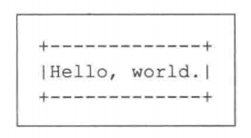
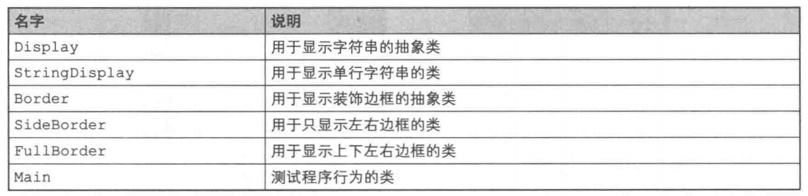
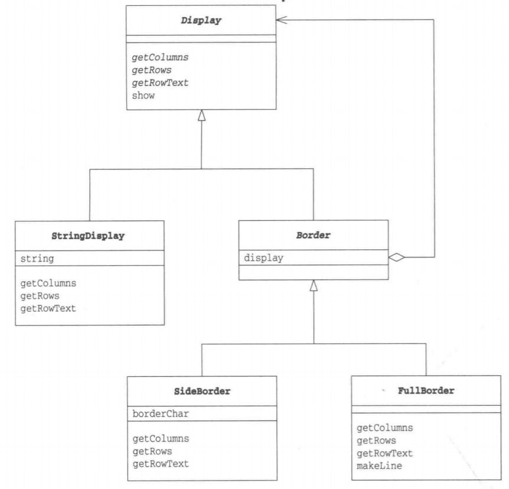
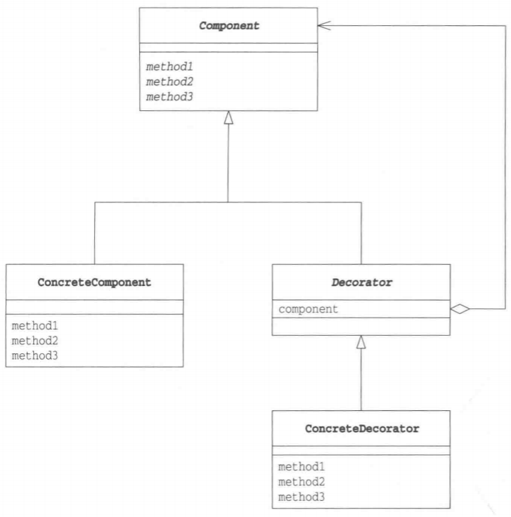
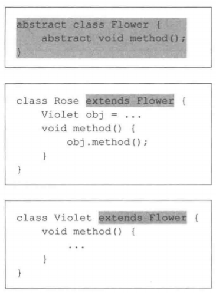
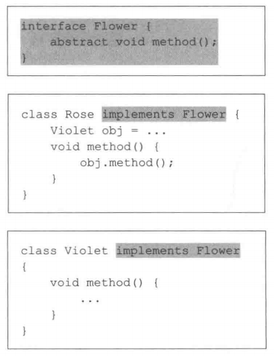

# Decorator模式

假如现在有一块蛋糕，如果只涂上奶油，其他什么都不加，就是奶油蛋糕。如果加上草莓，就是草莓奶油蛋糕。如果再加上一块黑色巧克力板，上面用白色巧克力写上姓名，然后插上代表年龄的蜡烛，就变成了一块生日蛋糕。

不论是蛋糕、奶油蛋糕、草莓蛋糕还是生日蛋糕，它们的核心都是蛋糕。不过，经过涂上奶油，加上草莓等装饰后，蛋糕的味道变得更加甜美了，目的也变得更加明确了。

程序中的对象与蛋糕十分相似。首先有一个相当于蛋糕的对象，然后像不断地装饰蛋糕一样地不断地对其增加功能，它就变成了使用目的更加明确的对象。

像这样不断地为对象添加装饰的设计模式被称为**Decorator模式**。Decorator指的是“装饰物”。本章中，我们将学习Decorator模式的相关知识。

# 在 Java 中使用该模式

> 复杂度：⭐⭐
>
> 流行度：⭐⭐

本章中的示例程序的功能是给文字添加装饰边框。这里所谓的装饰边框是指用“-”、“+”、“|”等字符组成的边框。例如下图：

 

> 类的一览表



> 示例程序类图



## Display类

Display类是可以显示多行字符串的抽象类。

getColumns方法和getRows方法分别用于获取横向字符数和纵向行数。它们都是抽象方法，需要子类去实现。getRowText方法用于获取指定的某一行的字符串。它也是抽象方法，需要子类去实现。

show是显示所有行的字符串的方法。在show方法内部，程序会调用getRows方法获取行数，调用getRowText获取该行需要显示的字符串，然后通过for循环语句将所有的字符串显示出来。show方法使用了getRows和getRowText等抽象方法，这属于Tempate Method模式。

```java
package com.llh.decorator;

/**
 * ClassName: Display
 * Author: Maybe
 * Date: 2022/5/22  14:08
 */
public abstract class Display {
    public abstract int getColumns(); //获取横向字符数

    public abstract int getRows(); //获取纵向字符数

    public abstract String getRowText(int row); //获取第row行的字符串

    public final void show() {
        for (int i = 0; i < getRows(); i++) {
            System.out.println(getRowText(i));
        }
    }
}
```

## StringDisplay类

仅查看Display类的代码是不能明白程序究竟要做什么的。下面我们来看看它的子类StringDisplay类。

StringDisplay类是用于显示单行字符串的类。由于StringDisplay类是Display类的子类，因此它肩负着实现Display类中声明的抽象方法的重任。

string字段中保存的是要显示的字符串。由于StringDisplay类只显示一行字符串，因此getColumns方法返回`string.getBytes().length`的值，getRows方法则返回固定值1。

此外，仅当要获取第0行的内容时getRowText方法才会返回string字段。以本章开头的蛋糕的比喻来说，StringDisplay类就相当于生日蛋糕中的核心蛋糕。

```java
package com.llh.decorator;

/**
 * ClassName: StringDisplay
 * Author: Maybe
 * Date: 2022/5/22  14:15
 */
public class StringDisplay extends Display {
    private String string;

    public StringDisplay(String string) {
        this.string = string;
    }

    @Override
    public int getColumns() {
        return string.getBytes().length;
    }

    @Override
    public int getRows() {
        return 1;
    }

    @Override
    public String getRowText(int row) {
        if (row == 0) //当且仅当row为0时返回值
            return string;
        return null;
    }
}
```

## Border类

Border类是装饰边框的抽象类。虽然它所表示的是装饰边框，但它也是Display类的子类。

也就是说，通过继承，**装饰边框与被装饰物具有了相同的方法**。具体而言，Border类继承了父类的getColumns、getRows、getRowText、show等各方法。从接口(API)角度而言，装饰边框(Border)与被装饰物(Display)具有相同的方法也就意味着它们具有一致性。哎呀，好像把本章后面的内容提前说了。现在大家应该还很难理解吧，不过没关系，我们先继续看下去。

**在装饰边框Border类中有一个Display类型的display字段，它表示被装饰物。不过，display字段所表示的被装饰物并仅不限于StringDisplay的实例。因为，Border也是Display类的子类，display字段所表示的也可能是其他的装饰边框(Border类的子类的实例)，而且那个边框中也有一个display字段。这样，大家应该能大致理解Decorator模式的结构了吧。**

```java
package com.llh.decorator;

/**
 * ClassName: Border
 * Author: Maybe
 * Date: 2022/5/22  14:26
 */
public abstract class Border extends Display {
    protected Display display;

    public Border(Display display) {
        this.display = display;
    }
    
}
```

## SideBorder类

SideBorder类是一种具体的装饰边框，是Border类的子类。

SideBorder类用指定的字符(borderchar)装饰字符串的左右两侧。例如，如果指定borderchar字段的值是“|”，那么我们就可以调用show方法，像下面这样在“被装饰物”的两侧加上“|”。还可以通过构造函数指定borderchar字段。

```
|被装饰物|
```

SideBorder类并非抽象类，这是因为它实现了父类中声明的所有抽象方法。

getColumns方法是用于获取横向字符数的方法。字符数应当如何计算呢？非常简单，只需要在被装饰物的字符数的基础上，再加上两侧边框的字符数即可。那被装饰物的字符数应该如何计算呢？是的，大家应该都想到了，其实只需调用`display.getColumns()`即可得到被装饰物的字符数。display字段的可见性是protected，因此SideBorder类的子类都可以使用该字段。然后我们再像下面这样，分别加上左右边框的字符数。

```java
1 + display.getColumns() + 1
```

这就是getColumns方法的返回值了。当然，写作`display.getColumns()+2`也是可以的。只是在这里，我们为了明确地表示是分别加上左右两侧边框的字符数1，所以采用了上面的表达式。

在理解了getColumns方法的处理方式后，也就可以很快地理解getRows方法的处理了。因为SideBorder类并不会在字符串的上下两侧添加字符，因此getRows方法直接返回`display.getRows()`即可。

那么，getRowText方法应该如何实现呢？调用getRowText方法可以获取参数指定的那一行的字符数。因此，我们会像下面这样，在`display.getRowText(row)`的字符串两侧，加上borderchar这个装饰边框。

```java
borderChar + display.getRowText(row) + borderChar
```

这就是getRowText方法的返回值（也就是SideBorder的装饰效果）。

```java
package com.llh.decorator;

/**
 * ClassName: SideBorder
 * Author: Maybe
 * Date: 2022/5/22  14:53
 */
public class SideBorder extends Border {
    private char borderChar;

    public SideBorder(Display display, char ch) {
        super(display);
        this.borderChar = ch;
    }

    @Override
    public int getColumns() {
        return 1 + display.getColumns() + 1; //字符数为字符串字符数加上两侧边框字符数
    }

    @Override
    public int getRows() {
        return display.getRows();
    }

    @Override
    public String getRowText(int row) { //指定的那一行的字符串为被装饰物的字符串加上两侧的边框的字符
        return borderChar + display.getRowText(row) + borderChar;
    }
}
```

## FullBorder类

FullBorder类与SideBorder类一样，也是Border类的子类。

SideBorder类会在字符串的左右两侧加上装饰边框，而FullBorder类则会在字符串的上下左右都加上装饰边框。不过，在SideBorder类中可以指定边框的字符，而在FullBorder类中，边框的字符是固定的。

makeLine方法可以连续地显示某个指定的字符，它是一个工具方法（为了防止FullBorder类外部使用该方法，我们设置它的可见性为private）。

```java
package com.llh.decorator;

/**
 * ClassName: FullBorder
 * Author: Maybe
 * Date: 2022/5/22  15:02
 */
public class FullBorder extends Border {
    public FullBorder(Display display) {
        super(display);
    }

    @Override
    public int getColumns() {
        return 1 + display.getColumns() + 1;
    }

    @Override
    public int getRows() {
        return 1 + display.getRows() + 1;
    }

    @Override
    public String getRowText(int row) {
        if (row == 0)
            return "+" + makeLine('-', display.getColumns()) + "+";
        else if (row == display.getColumns() + 1)
            return "+" + makeLine('-', display.getColumns()) + "+";
        else
            return "|" + display.getRowText(row - 1) + "|";
    }

    private String makeLine(char ch, int count) {
        StringBuilder stringBuilder = new StringBuilder();
        for (int i = 0; i < count; i++) {
            stringBuilder.append(ch);
        }
        return stringBuilder.toString();
    }
}
```

## Main类

Main类是用于测试程序行为的类。在Main类中一共生成了3个实例，即b1~b3，它们的作用分别如下所示。

- b1：将"Hello wor1d."不加装饰地直接显示出来
- b2：在b1的两侧加上装饰边框“#”
- b3：在b2的上下左右加上装饰边框

```java
package com.llh.decorator;

/**
 * ClassName: Main
 * Author: Maybe
 * Date: 2022/5/22  15:12
 */
public class Main {
    public static void main(String[] args) {
        Display b1 = new StringDisplay("Hello World.");
        Display b2 = new SideBorder(b1, '#');
        Display b3 = new FullBorder(b2);
        b1.show();
        b2.show();
        b3.show();
    }
}
```

运行结果：

 

为了便于大家理解这几个对象之间的关系，看下面的对象图。从图中可以看出，b1的装饰边框是b2，b2的装饰边框是b3。

 

# Decorator模式中的登场角色

- **Component**

  增加功能时的核心角色。以本章开头的例子来说，装饰前的蛋糕就是Component角色。Component角色只是定义了蛋糕的接口(API)。在示例程序中，由Display类扮演此角色。

- **ConcreteComponent**

  该角色是实现了Component角色所定义的接口(API)的具体蛋糕。在示例程序中，由StringDisplay类扮演此角色。

- **Decorator(装饰物)**

  该角色具有与Component角色相同的接口(API)。在它内部保存了被装饰对象——Component角色。Decorator角色知道自己要装饰的对象。在示例程序中，由Border类扮演此角色。

- **ConcreteDecorator(具体的装饰物)**

  该角色是具体的Decorator角色。在示例程序中，由SideBorder类和FullBorder类扮演此角色。

> 该模式类图

 

# 拓展思路的要点

## 接口(API)的透明性

在Decorator模式中，装饰边框与被装饰物具有一致性。具体而言，在示例程序中，表示装饰边框的Border类是表示被装饰物的Display类的子类，这就体现了它们之间的一致性。也就是说，Border类（以及它的子类）与表示被装饰物的Display类具有相同的接口(API)。

这样，即使被装饰物被边框装饰起来了，接口(API)也不会被隐藏起来。其他类依然可以调用getColumns、getRows、getRowText以及show方法。这就是接口(API)的“透明性”。

在示例程序中，实例b4被装饰了多次，但是接口(API)却没有发生任何变化。

得益于接口(API)的透明性，Decorator模式中也形成了类似于Composite模式中的递归结构。也就是说，装饰边框里面的“被装饰物”实际上又是别的物体的“装饰边框”。就像是剥洋葱时以为洋葱心要出来了，结果却发现还是皮。不过，Decorator模式虽然与Composite模式一样，都具有递归结构，但是它们的使用目的不同。Decorator模式的主要目的是通过添加装饰物来增加对象的功能。

## 在不改变被装饰物的前提下增加功能

在Decorator模式中，装饰边框与被装饰物具有相同的接口(API)。虽然接口(API)是相同的，但是越装饰，功能则越多。例如，用SideBorder装饰Display后，就可以在字符串的左右两侧加上装饰字符。如果再用Ful1 Border装饰，那么就可以在字符串的四周加上边框。此时，我们完全不需要对被装饰的类做任何修改。这样，我们就实现了**不修改被装饰的类即可增加功能**。

Decorator模式使用了**委托**。对“装饰边框”提出的要求（调用装饰边框的方法）会被转交（委托)给“被装饰物”去处理。以示例程序来说，就是SideBorder类的getColumns方法调用了display，getColumns()。除此以外，getRows方法也调用了display.getRows()。

## 可以动态地增加功能

Decorator模式中用到了委托，它使类之间形成了弱关联关系。因此，不用改变框架代码，就可以生成一个与其他对象具有不同关系的新对象。

## 只需要一些装饰物即可添加许多功能

使用Decorator模式可以为程序添加许多功能。只要准备一些装饰边框(ConcreteDecorator角色)，即使这些装饰边框都只具有非常简单的功能，也可以将它们自由组合成为新的对象。

这就像我们可以自由选择香草味冰激凌、巧克力冰激凌、草莓冰激凌、猕猴桃冰激凌等各种口味的冰激凌一样。如果冰激凌店要为顾客准备所有的冰激凌成品那真是太麻烦了。因此，冰激凌店只会准备各种香料，当顾客下单后只需要在冰激凌上加上各种香料就可以了。不管是香草味，还是咖啡朗姆和开心果的混合口味，亦或是香草味、草莓味和猕猴桃三重口味，顾客想吃什么口味都可以。Decorator模式就是可以应对这种多功能对象的需求的一种模式。

## 导致增加许多很小的类

Decorator模式的一个缺点是会导致程序中增加许多功能类似的很小的类。

## java.io包与Decorator模式

下面我们来谈谈java.io包中的类。java.io包是用于输人输出(Input/Output，简称I/O)的包。这里，我们使用了Decorator模式。

首先，我们可以像下面这样生成一个读取文件的实例。

```java
Reader reader = new FileReader("datafile.txt");
```

然后，我们也可以像下面这样在读取文件时将文件内容放入缓冲区。

```java
Reader reader = new BufferedReader(new FileReader("datafile.txt"));
```

这样，在生成BufferedReader类的实例时，会指定将文件读取到FileReader类的实例中。

再然后，我们也可以像下面这样管理行号。

```java
Reader reader = new LineNumberReader(
    New BufferedReader(
        New FileReader("datafile.txt")));
```

无论是LineNumberReader类的构造函数还是BufferedReader类的构造函数，都可以接收Reader类（的子类）的实例作为参数，因此我们可以像上面那样自由地进行各种组合。

我们还可以只管理行号，但不进行缓存处理。

```java
Readerreader new = LineNumberReader(
    new FileReader("datafile.txt"));
```

接下来，我们还会管理行号，进行缓存，但是我们不从文件中读取数据，而是从网络中读取数据（下面的代码中省略了细节部分和异常处理）。

```java
java.net.Socket socket = new Socket (hostname,portnumber);
...
Reader reader = new LineNumberReader(
    new BufferedReader(
        new InputstreamReader(
            socket.getInputstream())));
```

这里使用的InputStreamReader类既接收getInputStream方法返回的InputStream类的实例作为构造函数的参数，也提供了Reader类的接口(API)(这属于Adapter模式)。

除了java.io包以外，我们还在javax.swing.border包中使用了Decorator模式。javax.swing.border包为我们提供了可以为界面中的控件添加装饰边框的类。

# 延伸思考：继承和委托中的一致性

这里让我们再稍微了解一下“一致性”，即“可以将不同的东西当作同一种东西看待”的相关知识。

## 继承一父类和子类的一致性

子类和父类具有一致性。下面我们看一个简单的例子。

```java
class Parent {
	...
    void parentMethod (){
        ...
    }
}
```

```java
class Child extends Parent {
	...
    void childMethod(){
        ...
    }
}
```

此时，Child类的实例可以被保存在Parent类型的变量中，也可以调用从Parent类中继承的方法。

```java
Parent obj = new Child();
obj.parentMethod();
```

也就是说，可以像操作Parent类的实例一样操作Child类的实例。这是将子类当作父类看待的一个例子。

但是，反过来，如果想将父类当作子类一样操作，则需要先进行类型转换。

```java
Parent obi = new Child();
((Child)obj).childMethod();
```

## 委托一自己和被委托对象的一致性

使用委托让接口具有透明性时，自己和被委托对象具有一致性。

下面我们看一个稍微有点生硬的例子。

```java
class Rose {
    Violet obj =...;
    void method (){
        obj.method();
    }
}
```

```java
class violet {
    void method(){
        ...
    }
}
```

Rose和Violet都有相同的method方法。Rose将method方法的处理委托给了Violet。这样，会让人有一种好像这两个类有所关联，又好像没有关联的感觉。

要说有什么奇怪的地方，那就是这两个类虽然都有method方法，但是却没有明确地在代码中体现出这个“共通性”。如果要明确地表示method方法是共通的，只需要像下面这样编写一个共通的抽象类Flower就可以了。

 

或者是像下面这样，让Flower作为接口也行。

 

至此，大家可能会产生这样的疑问，即Rose类中的obj字段被指定为具体类型violet真的好吗？如果指定为抽象类型Flower会不会更好呢？究竟应该怎么做才好呢？其实没有固定答案，需求不同，做法也不同。