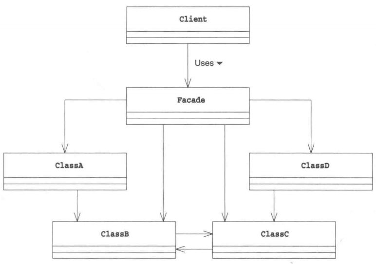

# Facade模式

外观模式（Facade Pattern）隐藏系统的复杂性，并向客户端提供了一个客户端可以访问系统的接口。这种类型的设计模式属于结构型模式，它向现有的系统添加一个接口，来隐藏系统的复杂性。

这种模式涉及到一个单一的类，该类提供了客户端请求的简化方法和对现有系统类方法的**委托调用**。

# 介绍

**意图：**为子系统中的一组接口提供一个一致的界面，外观模式定义了一个高层接口，这个接口使得这一子系统更加容易使用。

**主要解决：**降低访问复杂系统的内部子系统时的复杂度，简化客户端之间的接口。

**何时使用：** 1、客户端不需要知道系统内部的复杂联系，整个系统只需提供一个"接待员"即可。 2、定义系统的入口。

**如何解决：**客户端不与系统耦合，外观类与系统耦合。

**关键代码：**在客户端和复杂系统之间再加一层，这一层将调用顺序、依赖关系等处理好。

**应用实例：** 1、去医院看病，可能要去挂号、门诊、划价、取药，让患者或患者家属觉得很复杂，如果有提供接待人员，只让接待人员来处理，就很方便。 2、**JAVA 的三层开发模式**。

**优点：** 1、减少系统相互依赖。 2、提高灵活性。 3、提高了安全性。

**缺点：**不符合开闭原则，如果要改东西很麻烦，继承重写都不合适。

**使用场景：** 1、为复杂的模块或子系统提供外界访问的模块。 2、子系统相对独立。 3、预防低水平人员带来的风险。

**注意事项：**在层次化结构中，可以使用外观模式定义系统中每一层的入口。

# 示例程序

我们将创建一个 *Shape* 接口和实现了 *Shape* 接口的实体类。下一步是定义一个外观类 *ShapeMaker*。

*ShapeMaker* 类使用实体类来代表用户对这些类的调用。*FacadePatternDemo* 类使用 *ShapeMaker* 类来显示结果。

 

## Shape.java

创建一个接口。

```java
public interface Shape {
   void draw();
}
```

下面创建实现接口的实体类。

## Rectangle.java

```java
public class Rectangle implements Shape {
 
   @Override
   public void draw() {
      System.out.println("Rectangle::draw()");
   }
}
```

## Square.java

```java
public class Square implements Shape {
 
   @Override
   public void draw() {
      System.out.println("Square::draw()");
   }
}
```

## Circle.java

```java
public class Circle implements Shape {
 
   @Override
   public void draw() {
      System.out.println("Circle::draw()");
   }
}
```

## ShapeMaker.java

创建一个外观类

```java
public class ShapeMaker {
   private Shape circle;
   private Shape rectangle;
   private Shape square;
 
   public ShapeMaker() {
      circle = new Circle();
      rectangle = new Rectangle();
      square = new Square();
   }
 
   public void drawCircle(){
      circle.draw();
   }
   public void drawRectangle(){
      rectangle.draw();
   }
   public void drawSquare(){
      square.draw();
   }
}
```

## FacadePatternDemo.java

使用该外观类画出各种类型的形状。

```java
public class FacadePatternDemo {
   public static void main(String[] args) {
      ShapeMaker shapeMaker = new ShapeMaker();
 
      shapeMaker.drawCircle();
      shapeMaker.drawRectangle();
      shapeMaker.drawSquare();      
   }
}
```

执行程序，输出结果：

```java
Circle::draw()
Rectangle::draw()
Square::draw()
```

# 拓展思路的要点

> Facade模式类图

 

## Facade角色到底做什么工作

Facade模式可以让复杂的东西看起来简单。那么，这里说到的“复杂的东西”到底是什么呢？其实就是在后台工作的这些类之间的关系和它们的使用方法。使用Facade模式可以让我们不必在意这些复杂的东西。

这里的重点是**接口(API)变少了**。程序中如果有很多类和方法，我们在决定到底应该使用哪个类或是方法时就很容易迷茫。有时，类和方法的调用顺序也很容易弄错，必须格外注意。因此，如果有一个能够使接口(API)变少的Facade角色是一件多么美好的事情啊。

接口(API)变少了还意味着程序与外部的关联关系弱化了，这样更容易使我们的包（类的集合）作为组件被复用。

在设计类时，我们还需要考虑将哪些方法的可见性设为public。如果公开的方法过多，会导致类的内部的修改变得困难。字段也是一样的，如果不小心将某个字段公开出去了，那么其他类可能会读取或是修改这个字段，导致难以修改该类。

与设计类一样，在设计包时，需要考虑类的可见性。如果让外部（包的外部）看到了类，包内部代码的修改就会变得困难。

## 递归地使用Facade模式

既然上面我们从设计类谈到了设计包的问题，下面就让我们把思考范围再扩大一些。

假设现在有几个持有Facade角色的类的集合。那么，我们可以通过整合这几个集合来引人新的Facade角色。也就是说，我们可以递归地使用Facade模式。

在超大系统中，往往都含有非常多的类和包。如果我们在每个关键的地方都使用Facade模式，那么系统的维护就会变得轻松很多。

## 开发人员不愿意创建Facade角色的原因一心理原因

下面我们来讨论一个有意思的话题。通常，熟悉系统内部复杂处理的开发人员可能不太愿意创建Facade角色。也就是说，他们在下意识地回避创建Facade角色。

这是为什么呢？这可能是因为对熟练的开发人员而言，系统中的所有信息全部都记忆在脑中，他们对类之间的所有相互依赖关系都一清二楚。当然，也可能是出于他们对自己技术的骄傲，或是不懂装懂。

当某个程序员得意地说出“啊，在调用那个类之前需要先调用这个类。在调用那个方法之前需要先在这个类中注册一下”的时候，就意味着我们需要引人Facade角色了。

对于那些能够明确地用语言描述出来的知识，我们不应该将它们隐藏在自己脑袋中，而是应该用代码将它们表现出来。