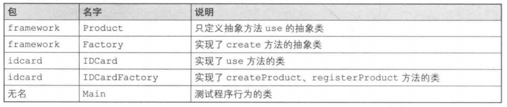
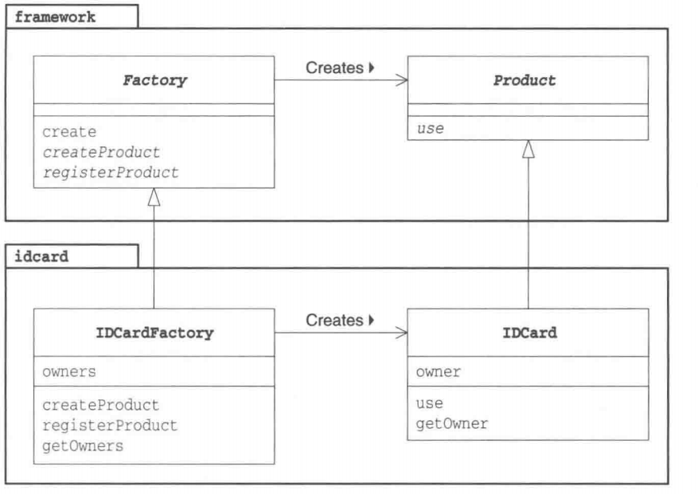
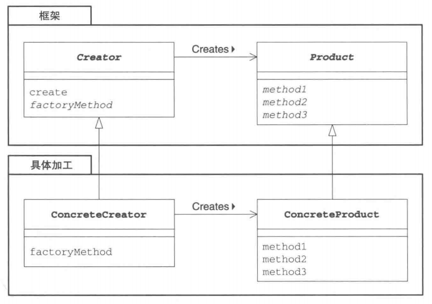

# Factory Method 模式

在学习该模式之前先要知道[模板方法模式](/框架架构/设计模式/TemplateMethod模式)。

在[Template Method模式](/框架架构/设计模式/TemplateMethod模式)中，我们在父类中规定处理的流程，在子类中实现具体的处理。如果我们将该模式用于生成实例，它就演变为本章中我们所要学习的Factory Method模式。

Factory有“工厂”的意思。用Template Method模式来构建生成实例的工厂，这就是**FactoryMethod模式**。

在Factory Method模式中，父类决定实例的生成方式，但并不决定所要生成的具体的类，具体的处理全部交给子类负责。这样就可以将生成实例的框架（framework）和实际负责生成实例的类解耦。

# 在 Java 中使用该模式

> 复杂度：⭐
>
> 流行度：⭐⭐⭐

首先让我们来看一段Factory Method模式的示例程序。这段示例程序的作用是制作身份证(ID卡)，它其中有5个类。

Product类和Factory类属于framework包。这两个类组成了生成实例的框架。

IDCard类和IDCardFactory类负责实际的加工处理，它们属于idcard包。

Main类是用于测试程序行为的类。

在阅读示例程序时，请注意所阅读的代码属于framework包还是idcard包。

- **生成实例的框架(framework包)**
- **加工处理(idcard包)**

> 类表一览



> 示例程序类图



## Product类

framework包中的Product类是用来表示“产品”的类。在该类中仅声明了use抽象方法。use方法的实现则被交给了Product类的子类负责。

在这个框架中，定义了产品是“任意的可以use的”的东西。

```java
package com.llh.factorymethod.factory;

/**
 * @ClassName: Product
 * @author: Maybe
 * @date: 2022/5/5  16:22
 */
public abstract class Product {
    public abstract void use();
}
```

## Factory类

在framework包中的Factory类中，我们使用了Template Method模式。该类还声明了用于“生成产品”的createProduct抽象方法和用于“注册产品”的registerProduct抽象方法。“生成产品”和“注册产品”的具体处理则被交给了Factory类的子类负责。

在这个框架中，我们定义了工厂是用来“调用create方法生成Product实例”的。而create方法的实现是先调用createProduct生成产品，接着调用registerProduct注册产品。

具体的实现内容根据Factory Method模式适用的场景不同而不同。但是，只要是Factory Method模式，在生成实例时就一定会使用到Template Method模式。

```java
package com.llh.factorymethod.factory;

/**
 * @ClassName: Factory
 * @author: Maybe
 * @date: 2022/5/5  16:25
 */
public abstract class Factory {
    public final Product create(String owner) {
        Product p = createProduct(owner);
        registerProduct(p);
        return p;
    }

    protected abstract Product createProduct(String owner);

    protected abstract void registerProduct(Product product);
}
```

## IDCard类

之前我们已经理解了框架(framework包)的代码。接下来让我们把关注点转移到负责加工处理的这一边(idcard包)。我们先来编写表示ID卡的类，即IDCard类。为了能够明显地体现出与框架的分离，我们将这个类放在idcard包中。IDCard类是产品Product类的子类。

```java
package com.llh.factorymethod.idcard;

import com.llh.factorymethod.factory.Product;

/**
 * @ClassName: IdCard
 * @author: Maybe
 * @date: 2022/5/5  16:31
 */
public class IdCard extends Product {
    private String owner;

    public IdCard(String owner) {
        System.out.println("制作了" + owner + "的Id卡");
        this.owner = owner;
    }

    @Override
    public void use() {
        System.out.println("使用了" + owner + "的Id卡");
    }

    public String getOwner() {
        return owner;
    }

}
```

## IDCardFactory类

IDCardFactory类实现了createProduct方法和registerProduct方法。

createProduct方法通过生成IDCard的实例来“生产产品”。

registerProduct方法则通过将IDCard的owner(持有人)保存到owners字段中来实现“注册产品”。

```java
package com.llh.factorymethod.idcard;

import com.llh.factorymethod.factory.Factory;
import com.llh.factorymethod.factory.Product;

import java.util.ArrayList;

/**
 * @ClassName: IdCardFactory
 * @author: Maybe
 * @date: 2022/5/5  16:35
 */
public class IdCardFactory extends Factory {
    private ArrayList owners = new ArrayList();

    @Override
    protected Product createProduct(String owner) {
        return new IdCard(owner);
    }

    @Override
    protected void registerProduct(Product product) {
        owners.add(((IdCard) product).getOwner());
    }

    public ArrayList getOwners() {
        return owners;
    }
}
```

## Main类

在Main类中，我们使用framework包和idcard包来制作和使用IDCard。

```java
package com.llh.factorymethod;

import com.llh.factorymethod.factory.Factory;
import com.llh.factorymethod.factory.Product;
import com.llh.factorymethod.idcard.IdCardFactory;

/**
 * @ClassName: Main
 * @author: Maybe
 * @date: 2022/5/5  16:40
 */
public class Main {
    public static void main(String[] args) {
        Factory idCardFactory = new IdCardFactory();
        Product p1 = idCardFactory.create("小明");
        Product p2 = idCardFactory.create("小王");
        Product p3 = idCardFactory.create("小李");
        p1.use();
        p2.use();
        p3.use();
    }
}

运行结果：
    
制作了小明的Id卡
制作了小王的Id卡
制作了小李的Id卡
使用了小明的Id卡
使用了小王的Id卡
使用了小李的Id卡
```

# Factory Method摸式中的登场角色

在Factory Method模式中有以下登场角色。通过查看Factory Method模式的类图，我们可以知道，父类（框架）这一方的Creator角色和Product角色的关系与子类（具体加工）这一方的ConcreteCreator角色和ConcreteProduct角色的关系是平行的。

> Factory Method模式的类图



- **Product(产品)**

  Product角色属于框架这一方，是一个抽象类。它定义了在Factory Method模式中生成的那些实例所持有的接口(API),但具体的处理则由子类ConcreteProduct角色决定。在示例程序中，由Product类扮演此角色。

- **Creator(创建者)**

  Creator角色属于框架这一方，它是负责生成Product角色的抽象类，但具体的处理则由子类ConcreteCreator角色决定。在示例程序中，由Factory类扮演此角色。

  Creator角色对于实际负责生成实例的ConcreteCreator角色一无所知，它唯一知道的就是，只要调用Product角色和生成实例的方法，就可以生成Productde的实例。在示例程序中，createProduct方法是用于生成实例的方法。**不用new关键字来生成实例，而是调用生成实例的专用方法来生成实例，这样就可以防止父类与其他具体类耦合。**

- **ConcreteProduct(具体的产品)**

  ConcreteProduct角色属于具体加工这一方，它决定了具体的产品。在示例程序中，由IDCard类扮演此角色。

- **ConcreteCreator(具体的创建者)**

  ConcreteCreator角色属于具体加工这一方，它负责生成具体的产品。在示例程序中，由IDCardFactory类扮演此角色。

# Factory Method模式中的思路要点

## 框架与具体加工

至此，我们分别学习了“框架”与“具体加工”这两方面的内容。它们分别被封装在framework包和idcard包中。

这里，让我们用相同的框架创建出其他的“产品”和“工厂”。例如，我们这次要创建表示电视机的类Televison和表示电视机工厂的类TelevisonFactory。这时，我们只需要引入(import)framework包就可以编写televison包。

请注意这里我们没有修改，也根本没有必要修改framework包中的任何内容，就可以创建出其他的“产品”和“工厂”。

请回忆一下，在framework包中我们并没有引入idcard包。在Product类和Factory类中，并没有出现IDCard和IDCardFactory等具体类的名字。因此，即使用已有的框架生成全新的类时，也完全不需要对framework进行修改，即不需要“将televison包引入到框架中”。关于这一点，我们称作是“framework包不依赖于idcard包”。

## 生成实例—方法的三种实现方式

在示例程序中，Factory类的createProduct方法是抽象方法，也就是说需要在子类中实现该方法。

createProduct方法的实现方式一般有以下3种。

- 指定其为抽象方法

  指定其为抽象方法。一旦将createProduct指定为抽象方法后，子类就必须实现该方法。如果子类不实现该方法，编译器将会报告编译错误。这也是示例程序所采用的方式。

  ```java
  abstract class Factory{
      public abstract Product createProduct(String name);
      ...
  }
  ```

- 为其实现默认处理

  为其实现默认处理。实现默认处理后，如果子类没有实现该方法，将进行默认处理。

  ```java
  class Factory{
      public Product createProduct(String name){
          return new Product (name);
      }
      ...
  }
  ```

  不过，这时是使用new关键字创建出实例的，因此不能将Product类定义为抽象类。

- 在其中抛出异常

  在其中抛出异常的方法。createProduct方法的默认处理为抛出异常，这样一来，如果未在子类中实现该方法，程序就会在运行时出错（报错，告知开发人员没有实现createProduct方法）。

  ```java
  class Factory{
      public Product createProduct(String name){
          throw new FactoryMethodRuntimeException ();
      }
      ...
  }
  ```

  不过，需要另外编写FactoryMethodRuntimeException异常类。

## 使用模式与开发人员之间的沟通

不论是Template Method模式还是本章中学习的Factory Method模式，在实际工作中使用时，都会让我们感觉到比较困难。这是因为，如果仅阅读一个类的代码，是很难理解这个类的行为的。必须要理解父类中所定义的处理的框架和它里面所使用的抽象方法，然后阅
读代码，了解这些抽象方法在子类中的实现才行。

通常，使用设计模式设计类时，必须要向维护这些类的开发人员正确地传达设计这些设计模式的意图。否则，维护人员在修改设计时可能会违背设计者最初的意图。

这时，我们建议在程序注释中和开发文档中记录所使用的设计模式的名称和意图。
