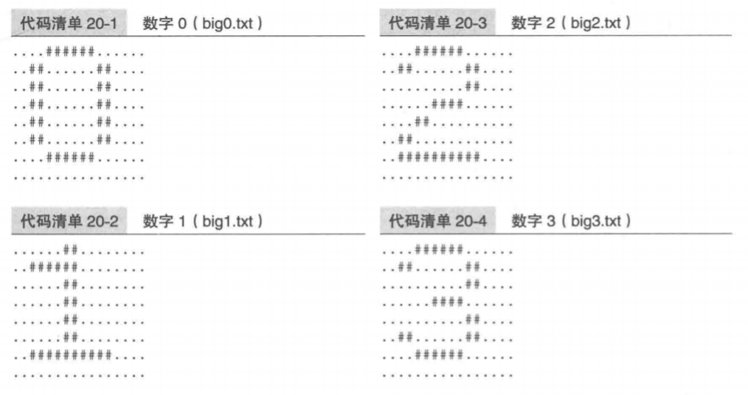
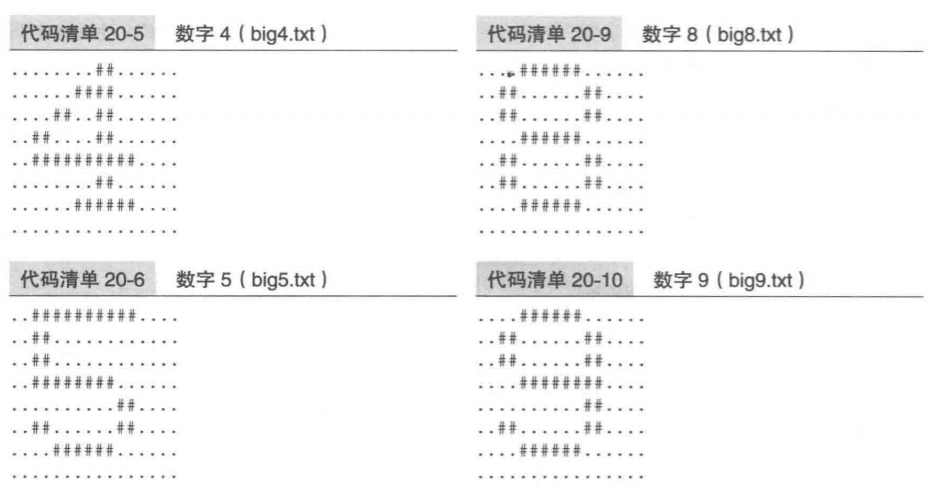
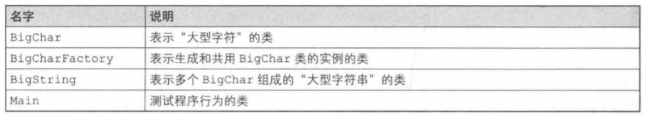
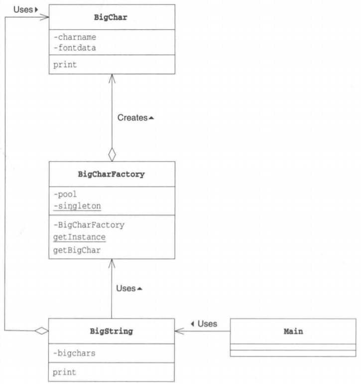
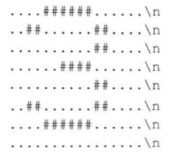
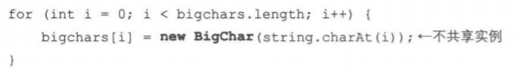
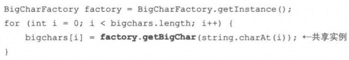
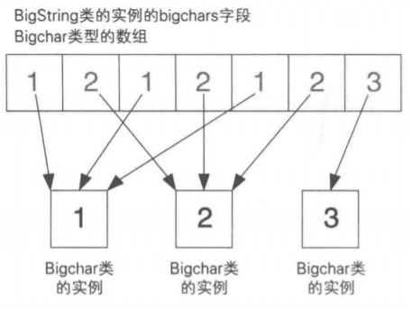
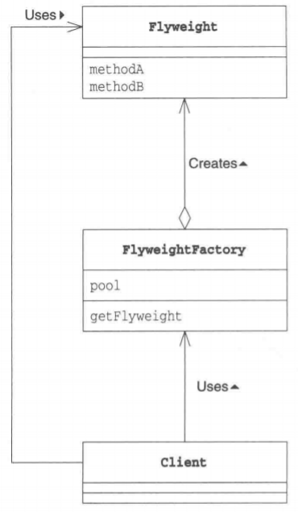

# Flyweight模式

Flyweight是“轻量级”的意思，指的是拳击比赛中选手体重最轻的等级。顾名思义，该设计模式的作用是为了让对象变“轻”。

对象在计算机中是虚拟存在的东西，它的“重”和“轻”并非指实际重量，而是它们“所使用的内存大小”。使用内存多的对象就是“重”对象，使用内存少的对象就是“轻”对象。

在Java中，可以通过`new Something()`生成Something类的实例。

为了能够在计算机中保存该对象，需要分配给其足够的内存空间。当程序中需要大量对象时，如果都使用new关键字来分配内存，将会消耗大量内存空间。

关于Flyweight模式，一言以蔽之就是**“通过尽量共享实例来避免new出实例”**。

当需要某个实例时，并不总是通过new关键字来生成实例，而是尽量共用已经存在的实例。这就是Flyweight模式的核心内容。下面让我们来一起学习Flyweight模式吧。

# 在 Java 中使用该模式

> 复杂度：⭐⭐⭐
>
> 流行度：⭐

首先来看一段使用了Flyweight模式的示例程序。在示例程序中，有一个将许多普通字符组合成为“大型字符”的类，它的实例就是重实例。为了进行测试，我们以文件形式保存了大型字符'0'到'9'和'-'的字体数据。

 




> 类的一览表



BigChar是表示“大型字符”的类。它会从文件中读取大型字符的字体数据，并将它们保存在内存中，然后使用print方法输出大型字符。大型字符会消耗很多内存，因此我们需要考虑如何共享BigChar类的实例。

BigCharFactory类会根据需要生成BigChar类的实例。不过如果它发现之前已经生成了某个大型字符的BigChar类的实例，则会直接利用该实例，而不会再生成新的实例。生成的实例全部被保存在Pool字段中。此外，为了能够快速查找出之前是否已经生成了某个大型字符所对应的实例，我们使用了java.util.Hashmap类。

BigString类用于将多个BigChar组成“大型字符串”。

Main类是用于测试程序行为的类。

> 示例程序类图

 

## BigChar类

BigChar类是表示“大型字符”的类。

它的构造函数会生成接收到的字符所对应的“大型字符”版本的实例，并将其保存在fontdata字段中。例如，如果构造函数接收到的字符是'3'，那么在fontdata字段中保存的就是下面这样的字符串（为了方便阅读，我们在“\”后换行了）。

 

我们将组成这些“大型字符”的数据（即字体数据）保存在文件中。文件的命名规则是在该字体数据所代表的字符前加上"big"，文件后缀名是".t×t"。例如，'3'对应的字体数据保存在"big3.txt"文件中。如果找不到某个字符对应的字体数据，就在该字符后面打上问号("？")作为其字体数据。

在该类中，没有出现关于Flyweight模式中“共享”的相关代码。关于控制共享的代码，请看BigCharFactory类。

```java
package com.llh.flyweight;

import java.io.BufferedReader;
import java.io.FileReader;
import java.io.IOException;

/**
 * ClassName: BigChar
 * Author: Maybe
 * Date: 2022/5/23  20:18
 */
public class BigChar {
    //字符名字
    private char charName;
    //大型字符对应的字符串（由'#'，'·'，'\n'组成）
    private String fontData;
    
    //构造函数
    public BigChar(char charName) {
        this.charName = charName;
        try {
            BufferedReader reader = new BufferedReader(new FileReader("big" + charName + ".txt"));
            String line;
            StringBuilder builder = new StringBuilder();
            while ((line = reader.readLine()) != null) {
                builder.append(line);
                builder.append("\n");
            }
            reader.close();
            this.fontData = builder.toString();
        } catch (IOException e) {
            e.printStackTrace();
        }
    }

    //显示大型字符
    public void print() {
        System.out.print(fontData);
    }
}
```

## BigCharFactory类

BigCharFactory类是生成BigChar类的实例的工厂(factory)。它实现了共享实例的功能。

pool字段用于管理已经生成的BigChar类的实例。Pool有泳池的意思。现在任何存放某些东西的地方都可以被叫作Pool。泳池存储的是水，而BigCharFactory的pool中存储的则是已经生成的BigChar类的实例。

在BigCharFactory类中，我们使用java.util.HashMap类来管理“字符串——实例”之间的对应关系。使用java.util.HashMap类的put方法可以将某个字符串（键）与一个实例（值）关联起来。之后，就可以通过键来获取它相应的值。在示例程序中，我们将接收到的单个字符（例如'3'）作为键与表示3的BigChar的类的实例对应起来。

我们使用了Singleton模式来实现BigCharFactory类，这是因为我们只需要一个BigCharFactory类的实例就可以了。getInstance方法用于获取BigCharFactory类的实例（注意不是BigChar类的实例哟）。

getBigChar方法是Flyweight模式的核心方法。该方法会生成接收到的字符所对应的BigChar类的实例。不过，如果它发现字符所对应的实例已经存在，就不会再生成新的实例，而是将之前的那个实例返回给调用者。

请仔细理解这段逻辑。该方法首先会通过pool.get()方法查找，以调查是否存在接收到的字符(charname)所对应的BigChar类的实例。如果返回值为null，表示目前为止还没有创建该实例，于是它会通过`new BigChar(charname);`来生成实例，并通过pool.put将该实例放
入HashMap中。如果返回值不为null，则会将之前生成的实例返回给调用者。

相信大家都看明白了，这里我们通过这种方式实现了共享BigChar类的实例。为什么我们要使用synchronized关键字修饰getBigChar方法呢？

```java
package com.llh.flyweight;

import java.util.HashMap;

/**
 * ClassName: BigCharFactory
 * Author: Maybe
 * Date: 2022/5/23  20:33
 */
public class BigCharFactory {
    //管理已经生成的BigChar的实例
    private HashMap pool = new HashMap();
    //Singleton模式
    private static BigCharFactory singleton = new BigCharFactory();

    //构造函数
    private BigCharFactory() {
    }

    //获取唯一的实例
    public static BigCharFactory getInstance() {
        return singleton;
    }

    //生成（共享）BigChar类的实例
    public synchronized BigChar getBigChar(char charName) {
        BigChar bc = (BigChar) pool.get("" + charName);
        if (bc == null) {
            bc = new BigChar(charName); //生成BigChar的实例
            pool.put("" + charName, bc);
        }
        return bc;
    }
}
```

## BigString类

BigString类表示由'BigChar组成的“大型字符串”的类。

bigchars字段是BigChar类型的数组，它里面保存着BigChar类的实例。在构造函数的for语句中，我们并没有像下面这样使用new关键字来生成BigChar类的实例。

 

而是调用了getBigChar方法，具体如下。

 

由于调用了BigCharFactory方法，所以对于相同的字符来说，可以实现BigChar类的实例共享。例如，当要生成字符串"1212123"对应的BigString类的实例时，bigchars字段如下所示。

```java
package com.llh.flyweight;

/**
 * ClassName: BigString
 * Author: Maybe
 * Date: 2022/5/23  20:55
 */
public class BigString {
    //“大型字符”的数组
    private BigChar[] bigChars;

    //构造函数
    public BigString(String string) {
        bigChars = new BigChar[string.length()];
        BigCharFactory factory = BigCharFactory.getInstance();
        for (int i = 0; i < bigChars.length; i++) {
            bigChars[i] = factory.getBigChar(string.charAt(i));
        }
    }

    //显示
    public void print() {
        for (int i = 0; i < bigChars.length; i++) {
            bigChars[i].print();
        }
    }
}
```

> 字符串"1212123"对应的BigString类的实例的样子

 

## Main类

Main类比较简单。它根据接收到的参数生成并显示BigString类的实例，仅此而已。

```java
package com.llh.flyweight;

/**
 * ClassName: Main
 * Author: Maybe
 * Date: 2022/5/23  21:02
 */
public class Main {
    public static void main(String[] args) {
        if (args.length == 0) {
            System.out.println("Usage:java Main digits");
            System.out.println("Example:java Main 1212123");
            System.exit(0);
        }
        BigString bs = new BigString(args[0]);
        bs.print();
    }
}
```

# Flyweight模式中的登场角色

- **Flyweight(轻量级)**

  按照通常方式编写程序会导致程序变重，所以如果能够共享实例会比较好，而Flyweight角色表示的就是那些实例会被共享的类。在示例程序中，由BigChar类扮演此角色。

- **FlyweightFactory(轻量级工厂)**

  FlyweightFactory角色是生成Flyweight角色的工厂。在工厂中生成Flyweight角色可以实现共享实例。在示例程序中，由BigCharFactory类扮演此角色。

- **Client(请求者)**

  Client角色使用FlyweightFactory角色来生成Flyweight角色。在示例程序中，由BigString类扮演此角色。

> Flyweight模式的类图

 

# 拓展思路的要点

## 对多个地方产生影响

Flyweight模式的主题是“共享”。那么，在共享实例时应当注意什么呢？

首先要想到的是“如果要改变被共享的对象，**就会对多个地方产生影响**”。也就是说，一个实例的改变会同时反映到所有使用该实例的地方。例如，假设我们改变了示例程序中BigChar类的'3'所对应的字体数据，那么BigString类中使用的所有’3‘的字体（形状）都会发生改变。在编程时，像这样修改一个地方会对多个地方产生影响并非总是不好。有些情况下这是好事，有些情况下这是坏事。不管怎样，“修改一个地方会对多个地方产生影响”，这就是共享的特点。

因此，在决定Flyweight角色中的字段时，需要精挑细选。只将那些真正应该在多个地方共享的字段定义在Flyweight角色中即可。

关于这一点，让我们简单地举个例子。假设我们要在示例程序中增加一个功能，实现显示“带颜色的大型文字”。那么此时，颜色信息应当放在哪个类中呢？

首先，假设我们将颜色信息放在BigChar类中。由于BigChar类的实例是被共享的，因此颜色信息也被共享了。也就是说，BigString类中用到的所有BigChar类的实例都带有相同的颜色。

如果我们不把颜色信息放在BigChar类中，而是将它放在BigString类中。那么BigString类会负责管理“第三个字符的颜色是红色的”这样的颜色信息。这样一来，我们就可以实现以不同的颜色显示同一个BigChar类的实例。

那么两种解决方案到底哪个是正确的呢？关于这个问题，其实并没有绝对的答案。哪些信息应当共享，哪些信息不应当共享，这取决于类的使用目的。设计者在使用Flyweight模式共享信息时必须仔细思考应当共享哪些信息。

## Intrinsic与Extrinsic

前面讲到的“应当共享的信息和不应当共享的信息”是有专有名词的。

应当共享的信息被称作Intrinsic信息。Intrinsic的意思是“本质的”“固有的”。换言之，它指的是不论实例在哪里、不论在什么情况下都不会改变的信息，或是不依赖于实例状态的信息。在示例程序中，BigChar的字体数据不论在BigString中的哪个地方都不会改变。因此，BigChar的字体数据属于Intrinsic信息。

另一方面，不应当共享的信息被称作Extrinsic信息。Extrinsic的意思是“外在的”、“非本质的”。也就是说，它是当实例的位置、状况发生改变时会变化的信息，或是依赖于实例状态的信息。在示例程序中，BigChar的实例在BigString中是第几个字符这种信息会根据BigChar在BigString中的位置变化而发生变化。因此，不应当在BigChar中保存这个信息，它属于Extrinsic信息。

因此，前面提到的是否共享“颜色”信息这个问题，我们也可以换种说法，即应当将”颜色“看作是Intrinsic信息还是Extrinsic信息。


## 不要让被共享的实例被垃圾回收器回收了

在BigCharFactory类中，我们使用java.util.HashMap来管理已经生成的BigChar的实例。像这样在Java中自己“管理”实例时，必须注意“不要让实例被垃圾回收器回收了”。

下面我们简单地学习一下Java中的垃圾回收器。在Java程序中可以通过new关键字分配内存空间。如果分配了过多内存，就会导致内存不足。这时，运行Java程序的虚拟机就会开始**垃圾回收处理**。它会查看自己的内存空间（堆空间）中是否存在没有被使用的实例，如果存在就释放该实例，这样就可以回收可用的内存空间。总之，它像垃圾回收车一样回收那些不再被使用的内存空间。

得益于垃圾回收器，Java开发人员对于new出来的实例可以放任不管（在C++中，使用new关键字分配内存空间后，必须显式地使用delete关键字释放内存空间。不过在Java中设没有必要进行delete处理。当然，Java也没有提供delete关键字)。

此处的关键是垃圾回收器会“释放没有被使用的实例”。垃圾回收器在进行垃圾回收的过程中，会判断实例是否是垃圾。如果其他对象引用了该实例，垃圾回收器就会认为“该实例正在被使用”，不会将其当作垃圾回收掉。

现在，让我们再回顾一下示例程序。在示例程序中，pool字段负责管理已经生成的BigChar的实例。因此，只要是pool字段管理的BigChar的实例，就不会被看作是垃圾，即使该BigChar的实例实际上已经不再被BigString类的实例所使用。也就是说，只要生成了一个BigChar的实例，它就会长期驻留在内存中。在示例程序中，字符串的显示处理很快就结束了，因此不会发生内存不足的问题。但是如果应用程序需要长期运行或是需要以有限的内存来运行，那么在设计程序时，开发人员就必须时刻警惕“不要让被共享的实例被垃圾回收器回收了”。

虽然我们不能显式地删除实例，但我们可以删除对实例的引用。要想让实例可以被垃圾回收器回收掉，只需要显式地将其置于管理对象外即可。例如，只要我们从HashMap中移除该实例的Entry,就删除了对该实例的引用。

## 内存之外的其他资源

在示例程序中，我们了解到共享实例可以减少内存使用量。一般来说，共享实例可以减少所需资源的使用量。这里的资源指的是计算机中的资源，而内存是资源中的一种。

时间也是一种资源。使用new关键字生成实例会花费时间。通过Flyweight模式共享实例可以减少使用new关键字生成实例的次数。这样，就可以提高程序运行速度。

文件句柄（文件描述符）和窗口句柄等也都是一种资源。在操作系统中，可以同时使用的文件句柄和窗口句柄是有限制的。因此，如果不共享实例，应用程序在运行时很容易就会达到资源极限而导致崩溃。
