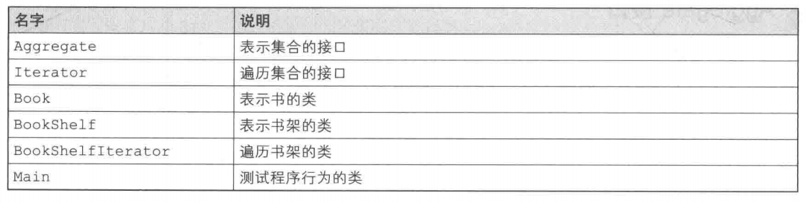

# Iterator 模式（迭代器模式）

# 什么是迭代器

使用Java语言显示数组arr中的元素时，我们可以使用下面这样的for循环语句遍历数组。

```java
for (int i 0;i arr.length;i++){
    System.out.println(arr[i]);
}
```

for语句中的i++的作用是让i的值在每次循环后自增1，这样就可以访问数组中的下一个元素、下下一个元素、再下下一个元素，也就实现了从头至尾逐一遍历数组元素的功能。

将这里的循环变量i的作用抽象化、通用化后形成的模式，在设计模式中称为**Iterator模式**。

Iterator模式用于在数据集合中按照顺序遍历集合。英语单词Iterate有反复做某件事情的意思，汉语称为**“迭代器”**。

# 示例程序

首先，让我们来看一段实现了Iterator模式的示例程序。这段示例程序的作用是将书(Book)

放置到书架(BookShelf)中，并将书的名字按顺序显示出来。

## Aggregate接口

Aggregate接口（代码如下）是所要遍历的集合的接口。实现了该接口的类将成为一个可以保存多个元素的集合，就像数组一样。Aggregate有 “使聚集” “集合” 的意思。

> 示例程序类图


> 类和接口的一览表



**Aggregate接口(Aggregate.java)**

```java
public interface Aggregate{
    public abstract Iterator iterator();
}
```

在Aggregate接口中声明的方法只有一个一iterator方法。该方法会生成一个用于遍历集合的迭代器。

想要遍历集合中的元素时，可以调用iterator方法来生成一个实现了Iterator接口的类的实例。

## Iterator接口

接下来我们看看Iterator接口。Iterator接口用于遍历集合中的元素，其作用相当于循环语句中的循环变量。那么，在Iterator接口中需要有哪些方法呢？Iterator接口的定义方式有很多种，这里我们编写了最简单的Iterator接口。

**Iterator接口(Iterator.java)**

```java
public interface Iterator{
    public abstract boolean hasNext();
    public abstract object next();
}
```

这里我们声明了两个方法，即判断是否存在下一个元素的hasNext方法，和获取下一个元素的next方法。

hasNext方法的返回值是boolean类型的，其原因很容易理解。当集合中存在下一个元素时，该方法返回txue；当集合中不存在下一个元素，即已经遍历至集合末尾时，该方法返回false。hasNext方法主要用于循环终止条件。

这里有必要说明一下next方法。该方法的返回类型是Object,这表明该方法返回的是集合中的一个元素。但是，next方法的作用并非仅仅如此。为了能够在下次调用next方法时正确地返回下一个元素，该方法中还隐含着将迭代器移动至下一个元素的处理。说“隐含”，是因为
Iterator接口只知道方法名。想要知道next方法中到底进行了什么样的处理，还需要看一下实现了Iterator接口的类(BookShelfIterator)。这样，我们才能看懂next方法的作用。

## Book类

Book类是表示书的类。但是这个类的作用有限，它可以做的事情只有一件一通过getName方法获取书的名字。书的名字是在外部调用Book类的构造函数并初始化Book类时，作为参数传递给Book类的。

**Book类(Book.java)**

```java
public class Book{
    private String name;
    public Book(String name){
        this.name name;
    }
    public String getName(){
        return name;
    }
}
```

## BookShelf类

BookShelf类是表示书架的类。由于需要将该类作为集合进行处理，因此它实现了Aggregate接口。代码中的implements Aggregate部分即表示这一点。此外，请注意在BookShelf类中还实现了Aggregate接口的iterator方法。

**BookShelf类(BookShelf.java)**

```java
public class Bookshelf implements Aggregate{
    private Book[]books;
    private int last 0;
    public BookShelf(int maxsize){
        this.books new Book [maxsize];
    }
    public Book getBookAt(int index){
        return books[index];
    }
    public void appendBook(Book book){
        this.books [last]book;
        last++;
    }
    public int getLength(){
        return last;
    }
    public Iterator iterator(){
        return new BookshelfIterator(this)
    }
}
```

这个书架中定义了books字段，它是Book类型的数组。该数组的大小（maxsize)在生成BookShelf的实例时就被指定了。之所以将books字段的可见性设置为private,是为了防止外部不小心改变了该字段的值。

接下来我们看看iterator方法。该方法会生成并返回BookShelfIterator类的实例作为BookShelf类对应的Iterator。当外部想要遍历书架时，就会调用这个方法。

## BookShelfIterator类

**BookShelflterator(BookShelflterator.java)**

```java
public class BookShelfIterator implements Iterator{
    private BookShelf bookShelf;
    private int index;
    public BookShelfIterator(BookShelf bookShelf){
        this.bookshelf bookshelf;
        this.index 0;
    }
    public boolean hasNext(){
        if (index bookshelf.getLength()){
            return true;
        }else{
            return false;
        }
    }
    public Object next(){
        Book book bookshelf.getBookAt (index);
        index++;
        return book;
    }
}
```

因为BookShelfIterator类需要发挥Iterator的作用，所以它实现了Iterator接口。

bookShelf字段表示BookShelfIterator所要遍历的书架。index字段表示迭代器当前所指向的书的下标。

构造函数会将接收到的BookShelf的实例保存在bookShelf字段中，并将index初始化为0。

hasNext方法是Iterator接口中所声明的方法。该方法将会判断书架中还有没有下一本书，如果有就返回true,如果没有就返回false。而要知道书架中有没有下一本书，可以通过比较index和书架中书的总册数（`bookShelf.getLength()`的返回值）来判断。

next方法会返回迭代器当前所指向的书(Book的实例)，并让迭代器指向下一本书。它也是Iterator接口中所声明的方法。next方法稍微有些复杂，它首先取出book变量作为返回值，然后让index指向后面一本书。

如果与本章开头的for语句来对比，这里的“让index指向后面一本书”的处理相当于其中的i++,它让循环变量指向下一个元素。

## Main类

```java
public class Main{
    public static void main(String[]args){
        BookShelf bookShelf new BookShelf(4);
        bookShelf.appendBook(new Book ("Around the World in 80 Days"));
        bookShelf.appendBook (new Book ("Bible"));
        bookShelf.appendBook(new Book ("cinderella"));
        bookShelf.appendBook (new Book ("Daddy-Long-Legs"));
        Iterator it bookShelf.iterator();
        while (it.hasNext ()){
            Book book (Book)it.next ()
                System.out.println(book.getName ())
        }
    }
}
```

通过`bookShelf.iterator()`得到的it是用于遍历书架的Iterator实例。while部分的条件当然就是`it.hasNext()`了。只要书架上有书，while循环就不会停止。然后，程序会通过`it.next()`一本一本地遍历书架中的书。

# Iterator模式中登场的角色

- **Iterator(迭代器)**

  该角色负责定义按顺序逐个遍历元素的接口(API)。在示例程序中，由Iterator接口扮演这个角色，它定义了hasNext和next两个方法。其中，hasNext方法用于判断是否存在下一个元素，next方法则用于获取该元素。

- **Concretelterator(具体的迭代器)**

  该角色负责实现Iterator角色所定义的接口(API)。在示例程序中，由BookShelfIterator类扮演这个角色。该角色中包含了遍历集合所必需的信息。在示例程序中，BookShelf类的实例保存在bookShelf字段中，被指向的书的下标保存在index字段中。

- **Aggregate(集合)**

  该角色负责定义创建Iterator角色的接口(API)。这个接口(API)是一个方法，会创建出“按顺序访问保存在我内部元素的人”。在示例程序中，由Aggregate接口扮演这个角色，它里面定义了iterator方法。

- **ConcreteAggregate(具体的集合)**

  该角色负责实现Aggregate角色所定义的接口(API)。它会创建出具体的Iterator角色，即Concretelterator角色。在示例程序中，由BookShelf类扮演这个角色，它实现了iterator方法。

> Iterator模式的类图


# Iterator模式的思路要点

> **不管实现如何变化，都可以使用Iterator**

为什么一定要考虑引人Iterator这种复杂的设计模式呢？如果是数组，直接使用for循环语句进行遍历处理不就可以了吗？为什么要在集合之外引入Iterator这个角色呢？一个重要的理由是，引入Iterator后可以将遍历与实现分离开来。请看下面的代码：

```java
while (it.hasNext()){
    Book book = (Book)it.next();
    System.out.println(book.getName());
}
```

这里只使用了Iterator的hasNext方法和next方法，并没有调用BookShelf的方法。也就是说，**这里的while循环并不依赖于BookShelf的实现**。

如果编写BookShelf的开发人员决定放弃用数组来管理书本，而是用java.util.Vector取而代之，会怎样呢？不管BookShelf如何变化，只要BookShelf的iterator方法能正确地返回Iterator的实例（也就是说，返回的Iterator类的实例没有问题，hasNext和next方法都可以正常工作)，即使不对上面的wiIe循环做任何修改，代码都可以正常工作。

这对于BookShelf的调用者来说真是太方便了。设计模式的作用就是帮助我们编写可复用的类。所谓“可复用”，就是指将类实现为“组件”，当一个组件发生改变时，不需要对其他的组件进行修改或是只需要很小的修改即可应对。

这样也就能理解为什么在示例程序中iterator方法的返回值不是BookShelfIterator类型而是Iterator类型了。这表明，这段程序就是要使用Iterator的方法进行编程，而不是BookShelfIterator的方法。

> **难以理解抽象类和接口**

难以理解抽象类和接口的人常常使用ConcreteAggregate角色和Concretelterator角色编程，而不使用Aggregate接口和Iterator接口，他们总想用具体的类来解决所有的问题。

但是如果只使用具体的类来解决问题，很容易导致类之间的强耦合，这些类也难以作为组件被再次利用。为了弱化类之间的耦合，进而使得类更加容易作为组件被再次利用，我们需要引入抽象类和接口。

这也是贯穿本书的思想。即使大家现在无法完全理解，相信随着深入阅读本书，也一定能够逐渐理解。请大家将**“不要只使用具体类来编程，要优先使用抽象类和接口来编程”**印在脑海中。

> **Aggregate和Iterator的对应**

请大家仔细回忆一下我们是如何把BookShelfIterator类定义为BookShelf类的Concretelterator角色的。BookShelfIterator类知道BookShelf是如何实现的。也正是因为如此，我们才能调用用来获取下一本书的getBookAt方法。

也就是说，如果BookShelf的实现发生了改变，即getBookAt方法这个接口(API)发生变化时，我们必须修改BookShelfIterator类。

正如Aggregate和Iterator这两个接口是对应的一样，ConcreteAggregate和ConcreteIterator这两个类也是对应的。

> **容易弄错“下一个”**

在Iterator模式的实现中，很容易在next方法上出错。该方法的返回值到底是应该指向当前
元素还是当前元素的下一个元素呢？更详细地讲，next方法的名字应该是下面这样的。

```
returnCurrentElementAndAdvanceToNextPosition
```

也就是说，next方法是“返回当前的元素，并指向下一个元素”。

> **还容易弄错“最后一个”**

在Iterator模式中，不仅容易弄错“下一个”，还容易弄错“最后一个”。hasNext方法在返回最后一个元素前会返回true,当返回了最后一个元素后则返回false。稍不注意，就会无法正确地返回“最后一个”元素。

请大家将hasNext方法理解成“确认接下来是否可以调用next方法”的方法就可以了。

> **多个Iterator**

“将遍历功能置于Aggregate角色之外”是Iterator模式的一个特征。根据这个特征，可以针对一个ConcreteAggregate角色编写多个ConcreteIterator角色。

> **迭代器的种类多种多样**

在示例程序中展示的Iterator类只是很简单地从前向后遍历集合。其实，遍历的方法是多种多样的。

- 从最后开始向前遍历
- 既可以从前向后遍历，也可以从后向前遍历（既有next方法也有previous方法）
- 指定下标进行“跳跃式”遍历

>  **不需要deletelterator**

在Java中，没有被使用的对象实例将会自动被删除（垃圾回收，GC)。因此，在iterator中不需要与其对应的deleteIterator方法。

> [!tip]**参考文献：**
>
> 《图解设计模式》
