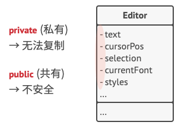
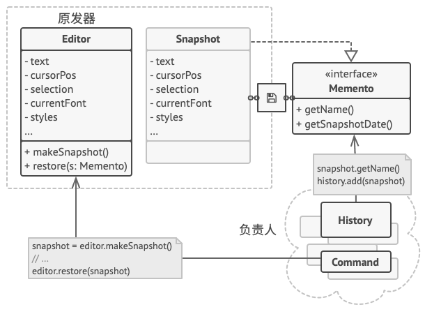

# Memento模式

**备忘录模式**是一种行为设计模式， 允许在不暴露对象实现细节的情况下保存和恢复对象之前的状态。

 

# 问题

假如你正在开发一款文字编辑器应用程序。 除了简单的文字编辑功能外， 编辑器中还要有设置文本格式和插入内嵌图片等功能。

后来， 你决定让用户能撤销施加在文本上的任何操作。 这项功能在过去几年里变得十分普遍， 因此用户期待任何程序都有这项功能。 你选择采用直接的方式来实现该功能： 程序在执行任何操作前会记录所有的对象状态， 并将其保存下来。 当用户此后需要撤销某个操作时， 程序将从历史记录中获取最近的快照， 然后使用它来恢复所有对象的状态。

 

让我们来思考一下这些状态快照。 首先， 到底该如何生成一个快照呢？ 很可能你会需要遍历对象的所有成员变量并将其数值复制保存。 但只有当对象对其内容没有严格访问权限限制的情况下， 你才能使用该方式。 不过很遗憾， 绝大部分对象会使用私有成员变量来存储重要数据， 这样别人就无法轻易查看其中的内容。

现在我们暂时忽略这个问题， 假设对象都像嬉皮士一样： 喜欢开放式的关系并会公开其所有状态。 尽管这种方式能够解决当前问题， 让你可随时生成对象的状态快照， 但这种方式仍存在一些严重问题。 未来你可能会添加或删除一些成员变量。 这听上去很简单， 但需要对负责复制受影响对象状态的类进行更改。

 

还有更多问题。 让我们来考虑编辑器 （Editor） 状态的实际 “快照”， 它需要包含哪些数据？ 至少必须包含实际的文本、 光标坐标和当前滚动条位置等。 你需要收集这些数据并将其放入特定容器中， 才能生成快照。

你很可能会将大量的容器对象存储在历史记录列表中。 这样一来， 容器最终大概率会成为同一个类的对象。 这个类中几乎没有任何方法， 但有许多与编辑器状态一一对应的成员变量。 为了让其他对象能保存或读取快照， 你很可能需要将快照的成员变量设为公有。 无论这些状态是否私有， 其都将暴露一切编辑器状态。 其他类会对快照类的每个小改动产生依赖， 除非这些改动仅存在于私有成员变量或方法中， 而不会影响外部类。

我们似乎走进了一条死胡同： 要么会暴露类的所有内部细节而使其过于脆弱； 要么会限制对其状态的访问权限而无法生成快照。 那么， 我们还有其他方式来实现 “撤销” 功能吗？

# 解决方案

我们刚才遇到的所有问题都是封装 “破损” 造成的。 一些对象试图超出其职责范围的工作。 由于在执行某些行为时需要获取数据， 所以它们侵入了其他对象的私有空间， 而不是让这些对象来完成实际的工作。

备忘录模式将创建状态快照 （Snapshot） 的工作委派给实际状态的拥有者*原发器* （Originator） 对象。 这样其他对象就不再需要从 “外部” 复制编辑器状态了， 编辑器类拥有其状态的完全访问权， 因此可以自行生成快照。

模式建议将对象状态的副本存储在一个名为*备忘录* （Memento） 的特殊对象中。 除了创建备忘录的对象外， 任何对象都不能访问备忘录的内容。 其他对象必须使用受限接口与备忘录进行交互， 它们可以获取快照的元数据 （创建时间和操作名称等）， 但不能获取快照中原始对象的状态。

 

这种限制策略允许你将备忘录保存在通常被称为*负责人* （Caretakers） 的对象中。 由于负责人仅通过受限接口与备忘录互动， 故其无法修改存储在备忘录内部的状态。 同时， 原发器拥有对备忘录所有成员的访问权限， 从而能随时恢复其以前的状态。

在文字编辑器的示例中， 我们可以创建一个独立的历史 （History） 类作为负责人。 编辑器每次执行操作前， 存储在负责人中的备忘录栈都会生长。 你甚至可以在应用的 UI 中渲染该栈， 为用户显示之前的操作历史。

当用户触发撤销操作时， 历史类将从栈中取回最近的备忘录， 并将其传递给编辑器以请求进行回滚。 由于编辑器拥有对备忘录的完全访问权限， 因此它可以使用从备忘录中获取的数值来替换自身的状态。

# 备忘录模式结构

 

1. **原发器** （Originator） 类可以生成自身状态的快照， 也可以在需要时通过快照恢复自身状态。

2. **备忘录** （Memento） 是原发器状态快照的值对象 （value object）。 通常做法是将备忘录设为不可变的， 并通过构造函数一次性传递数据。

3. **负责人** （Caretaker） 仅知道 “何时” 和 “为何” 捕捉原发器的状态， 以及何时恢复状态。

   负责人通过保存备忘录栈来记录原发器的历史状态。 当原发器需要回溯历史状态时， 负责人将从栈中获取最顶部的备忘录， 并将其传递给原发器的恢复 （restoration） 方法。

4. 在该实现方法中， 备忘录类将被嵌套在原发器中。 这样原发器就可访问备忘录的成员变量和方法， 即使这些方法被声明为私有。 另一方面， 负责人对于备忘录的成员变量和方法的访问权限非常有限： 它们只能在栈中保存备忘录， 而不能修改其状态。

# 在 Java 中使用该模式

> 复杂度：⭐⭐⭐
>
> 流行度：⭐

**使用示例：** 备忘录的基本原则可通过序列化来实现， 这在 Java 语言中很常见。 尽管备忘录不是生成对象状态快照的唯一或最有效方法， 但它能在保护原始对象的结构不暴露给其他对象的情况下保存对象状态的备份。

下面是核心 Java 程序库中该模式的一些示例：

- 所有 [`java.io.Serializable`](https://docs.oracle.com/javase/8/docs/api/java/io/Serializable.html) 的实现都可以模拟备忘录。
- 所有 [`javax.faces.component.StateHolder`](https://docs.oracle.com/javaee/7/api/javax/faces/component/StateHolder.html) 的实现。

## 示例

备忘录模式使用三个类 *Memento*、*Originator* 和 *CareTaker*。Memento 包含了要被恢复的对象的状态。Originator 创建并在 Memento 对象中存储状态。Caretaker 对象负责从 Memento 中恢复对象的状态。

*MementoPatternDemo*，我们的演示类使用 *CareTaker* 和 *Originator* 对象来显示对象的状态恢复。


## Memento.java

创建 Memento 类。

```java
package com.llh.memento;

/**
 * ClassName: Memento
 * Author: Maybe
 * Date: 2022/5/29  17:40
 */
public class Memento {
    private String state;

    public Memento(String state) {
        this.state = state;
    }

    public String getState() {
        return state;
    }
}
```

## Originator.java

创建 Originator 类。

```java
package com.llh.memento;

/**
 * ClassName: Originator
 * Author: Maybe
 * Date: 2022/5/29  17:41
 */
public class Originator {
    private String state;

    public void setState(String state) {
        this.state = state;
    }

    public String getState() {
        return state;
    }

    public Memento saveStateToMemento() {
        return new Memento(state);
    }

    public void getStateFromMemento(Memento Memento) {
        state = Memento.getState();
    }
}
```

## CareTaker.java

创建 CareTaker 类。

```java
package com.llh.memento;

import java.util.ArrayList;
import java.util.List;

/**
 * ClassName: CareTaker
 * Author: Maybe
 * Date: 2022/5/29  17:41
 */
public class CareTaker {
    private List<Memento> mementoList = new ArrayList<Memento>();

    public void add(Memento state) {
        mementoList.add(state);
    }

    public Memento get(int index) {
        return mementoList.get(index);
    }
}
```

## MementoPatternDemo.java

使用 *CareTaker* 和 *Originator* 对象。

```java
package com.llh.memento;

/**
 * ClassName: MementoPatternDemo
 * Author: Maybe
 * Date: 2022/5/29  17:41
 */
public class MementoPatternDemo {
    public static void main(String[] args) {
        Originator originator = new Originator();
        CareTaker careTaker = new CareTaker();
        originator.setState("State #1");
        originator.setState("State #2");
        careTaker.add(originator.saveStateToMemento());
        originator.setState("State #3");
        careTaker.add(originator.saveStateToMemento());
        originator.setState("State #4");

        System.out.println("Current State: " + originator.getState());
        originator.getStateFromMemento(careTaker.get(0));
        System.out.println("First saved State: " + originator.getState());
        originator.getStateFromMemento(careTaker.get(1));
        System.out.println("Second saved State: " + originator.getState());
    }
}
```

**运行结果：**

```
Current State: State #4
First saved State: State #2
Second saved State: State #3
```

# 备忘录模式适合应用场景

 **当你需要创建对象状态快照来恢复其之前的状态时， 可以使用备忘录模式。**

 备忘录模式允许你复制对象中的全部状态 （包括私有成员变量）， 并将其独立于对象进行保存。 尽管大部分人因为 “撤销” 这个用例才记得该模式， 但其实它在处理事务 （比如需要在出现错误时回滚一个操作） 的过程中也必不可少。

---

 **当直接访问对象的成员变量、 获取器或设置器将导致封装被突破时， 可以使用该模式。**

 备忘录让对象自行负责创建其状态的快照。 任何其他对象都不能读取快照， 这有效地保障了数据的安全性。

# 实现方式

1. 确定担任原发器角色的类。 重要的是明确程序使用的一个原发器中心对象， 还是多个较小的对象。

2. 创建备忘录类。 逐一声明对应每个原发器成员变量的备忘录成员变量。

3. 将备忘录类设为不可变。 备忘录只能通过构造函数一次性接收数据。 该类中不能包含设置器。

4. 如果你所使用的编程语言支持嵌套类， 则可将备忘录嵌套在原发器中； 如果不支持， 那么你可从备忘录类中抽取一个空接口， 然后让其他所有对象通过接口来引用备忘录。 你可在该接口中添加一些元数据操作， 但不能暴露原发器的状态。

5. 在原发器中添加一个创建备忘录的方法。 原发器必须通过备忘录构造函数的一个或多个实际参数来将自身状态传递给备忘录。

   该方法返回结果的类型必须是你在上一步中抽取的接口 （如果你已经抽取了）。 实际上， 创建备忘录的方法必须直接与备忘录类进行交互。

6. 在原发器类中添加一个用于恢复自身状态的方法。 该方法接受备忘录对象作为参数。 如果你在之前的步骤中抽取了接口， 那么可将接口作为参数的类型。 在这种情况下， 你需要将输入对象强制转换为备忘录， 因为原发器需要拥有对该对象的完全访问权限。

7. 无论负责人是命令对象、 历史记录或其他完全不同的东西， 它都必须要知道何时向原发器请求新的备忘录、 如何存储备忘录以及何时使用特定备忘录来对原发器进行恢复。

8. 负责人与原发器之间的连接可以移动到备忘录类中。 在本例中， 每个备忘录都必须与创建自己的原发器相连接。 恢复方法也可以移动到备忘录类中， 但只有当备忘录类嵌套在原发器中， 或者原发器类提供了足够多的设置器并可对其状态进行重写时， 这种方式才能实现。

# 备忘录模式优缺点

> [!tip|label:优点]
>
> -  你可以在不破坏对象封装情况的前提下创建对象状态快照。
> -  你可以通过让负责人维护原发器状态历史记录来简化原发器代码。

> [!danger|label:缺点]
>
> -  如果客户端过于频繁地创建备忘录， 程序将消耗大量内存。
> -  负责人必须完整跟踪原发器的生命周期， 这样才能销毁弃用的备忘录。
> -  绝大部分动态编程语言 （例如 PHP、 Python 和 JavaScript） 不能确保备忘录中的状态不被修改。

# 与其他模式的关系

- 你可以同时使用[命令模式](https://refactoringguru.cn/design-patterns/command)和[备忘录模式](https://refactoringguru.cn/design-patterns/memento)来实现 “撤销”。 在这种情况下， 命令用于对目标对象执行各种不同的操作， 备忘录用来保存一条命令执行前该对象的状态。
- 你可以同时使用[备忘录](https://refactoringguru.cn/design-patterns/memento)和[迭代器模式](https://refactoringguru.cn/design-patterns/iterator)来获取当前迭代器的状态， 并且在需要的时候进行回滚。
- 有时候[原型模式](https://refactoringguru.cn/design-patterns/prototype)可以作为[备忘录](https://refactoringguru.cn/design-patterns/memento)的一个简化版本， 其条件是你需要在历史记录中存储的对象的状态比较简单， 不需要链接其他外部资源， 或者链接可以方便地重建。
