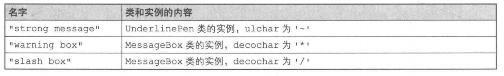

# Prototype模式

我们通常会使用以下方式生成Something类的实例。

```java
new Something();
```

在Java中，我们可以使用new关键字指定类名来生成类的实例。像这样使用new来生成实例时，是必须指定类名的。但是，在开发过程中，有时候也会有“在不指定类名的前提下生成实例”的需求。例如，在以下情况下，我们就不能根据类来生成实例，而要根据现有的实例来生成新的实例。

**(1)对象种类繁多，无法将它们整合到一个类中时**

第一种情况是需要处理的对象太多，如果将它们分别作为一个类，必须要编写很多个类文件。

**(2)难以根据类生成实例时**

第二种情况是生成实例的过程太过复杂，很难根据类来生成实例。例如，我们假设这里有一个实例，即表示用户在图形编辑器中使用鼠标制作出的图形的实例。想在程序中创建这样的实例是非常困难的。通常，在想生成一个和之前用户通过操作所创建出的实例完全一样的实例的时候，我们会事先将用户通过操作所创建出的实例保存起来，然后在需要时通过复制来生成新的实例。

**(3)想解耦框架与生成的实例时**

第三种情况是想要让生成实例的框架不依赖于具体的类。这时，不能指定类名来生成实例，而要事先“注册”一个“原型”实例，然后通过复制该实例来生成新的实例。

根据实例生成实例与使用复印机复印文档相类似。即使不知道原来的文档中的内容，我们也可以使用复印机复制出完全相同的文档，无论多少份都行。

在本章中，我们将要学习不根据类来生成实例，而是根据实例来生成新实例的Prototype模式。Prototype有“原型”、“模型”的意思。在设计模式中，它是指根据实例原型、实例模型来生成新的实例。

在Java语言中，我们可以使用clone创建出实例的副本。在本章中，我们将学习clone方法与Cloneable接口的使用方法。

# 示例程序

首先让我们来看一段使用了Prototype模式的示例程序。以下这段示例程序的功能是将字符串放入方框中显示出来或是加上下划线显示出来。

示例程序中的类和接口的一览表请参见表6-l。Product接口和Manager类属于framework包，负责复制实例。虽然Manager类会调用createClone方法，但是对于具体要复制哪个类一无所知。不过，只要是实现了Product接口的类，调用它的createClone方法就可以复制出新的实例。

MessageBox类和UnderlinePen类是两个实现了Product接口的类。只要事先将这两个类“注册”到Manager类中，就可以随时复制新的实例。

> 示例程序类和接口一览表


> 示例程序类图


## Product接口

Product接口是复制功能的接口。该接口继承了java.lang.Cloneable接口。稍后，我们会在对cloneable接口进行详细讲解。现在大家只需要知道实现了该接口的类的实例可以调用clone方法来自动复制实例即可。

use方法是用于“使用”的方法。具体怎么“使用”，则被交给子类去实现。

createClone方法是用于复制实例的方法。

```java
package framework;
public interface Product extends Cloneable {
    public abstract void use(String s);
    public abstract Product createClone();
}
```

## Manager类

Manager类使用Product接口来复制实例。

showcase字段是java.util.HashMap类型，它保存了实例的“名字”和“实例”之间的对应关系。

register方法会将接收到的1组“名字”和“Product接口”注册到showcase中。这里的Product类型的参数proto具体是什么呢？现在我们还无法知道proto到底是哪个类，但有一点可以确定的是，它肯定是实现了Product接口的类的实例（也就是说可以调用它的use方法和createClone方法)。

请注意，在Product接口和Manager类的代码中完全没有出现MessageBox类和UnderlinePen类的名字，这也意味着我们可以独立地修改Product和Manager，不受MessageBox类和UnderlinePen类的影响。这是非常重要的，**因为一旦在类中使用到了别的类名，就意味着该类与其他类紧密地耦合在了一起**。在Manager类中，并没有写明具体的类名，仅仅使用了Product这个接口名。也就是说，Product接口成为了连接Manager类与其他具体类之间的桥梁。

```java
package framework;
import java.util.*;

public class Manager {
    private HashMap showcase = new HashMap();
    public void register(String name,Product proto){
        showcase.put (name,proto);
    }
    public Product create(String protoname){
        Product p = (Product)showcase.get(protoname);
        return p.createclone();
    }
}
```

## MessageBox类

接下来让我们看看具体的子类。MessageBox类实现(implements)了Product接口。

decochar字段中保存的是像装饰方框那样的环绕着字符串的字符。use方法会使用decochar字段中保存的字符把要显示的字符串框起来。例如，当decochar中保存的字符为'*'，use方法接收到的字符串为Hello的时候，显示结果如下。

 

createclone方法用于复制自己。它内部所调用的clone方法是Java语言中定义的方法，用于复制自己。在进行复制时，原来实例中的字段的值也会被复制到新的实例中。我们之所以可以调用clone方法进行复制，仅仅是因为该类实现了java.lang.cloneable接口。如果没有实现这个接口，在运行时程序将会抛出CloneNotSupportedException异常，因此必须用try...catch语句块捕捉这个异常。虽然此处MessageBox类只实现了Product接口，但是前文讲到过，Product接口继承了java.lang.Cloneable接口，因此程序不会抛出CloneNotSupportedException异常。此外，需要注意的是，java.lang.Cloneable接口只是起到告诉程序可以调用clone方法的作用，它自身并没有定义任何方法。

只有类自己（或是它的子类）能够调用Java语言中定义的clone方法。当其他类要求复制实例时，必须先调用createclone这样的方法，然后在该方法内部再调用clone方法。


## UnderlinePen类

UnderlinePen类的实现与MessageBox几乎完全相同，不同的是在ulchar字段中保存的是修饰下划线样式的字符。use方法的作用是将字符串用双引号括起来显示，并在字符串下面加上下划线。例如，当ulchar保存的字符为'~'，use方法接收到的字符串为Hello时，显示结果如下。

 

 

## Main类

Main类首先生成了Manager的实例。接着，在Manager实例中注册了UnderlinePen的实例（带名字）和MessageBox的实例（带名字）

> 向Manager中注册的内容



 

运行结果：

 

# Prototype模式中的登场角色

- **Prototype(原型)**

  Product角色负责定义用于复制现有实例来生成新实例的方法。在示例程序中，由Product接口扮演此角色。

- **ConcretePrototype(具体的原型)**

  ConcretePrototype角色负责实现复制现有实例并生成新实例的方法。在示例程序中，由MessageBox类和UnderlinePen类扮演此角色。

- **Client(使用者)**

  Client角色负责使用复制实例的方法生成新的实例。在示例程序中，由Manager类扮演此角色。

> Prototype模式的类图


# Prototype模式的思路要点

> **不能根据类来生成实例吗**

我在最初学习Prototype模式时也曾感觉到迷茫，既然是要创建新的实例，直接用下面这个语句不就好了吗？为什么还需要Prototype模式呢？

```java
new Something ();
```

在本章开头，我们对这个问题做了简单的回答，现在让我们回顾一下示例程序，并谈谈这个问题。

**(1)对象种类繁多，无法将它们整合到一个类中时**

在示例程序中，一共出现了如下3种样式。

- 使用'~'为字符串添加下划线
- 使用'*'为字符串添加边框
- 使用'/'为字符串添加边框

本例比较简单，只生成了3种样式，不过只要想做，不论多少种样式都可以生成。但是请试想一下，如果将每种样式都编写为一个类，类的数量将会非常庞大，源程序的管理也会变得非常困难。

**(2)难以根据类生成实例时**

本例中感觉不到这一点。大家可以试想下要开发一个用户可以使用鼠标进行操作的、类似于图形编辑器的应用程序，这样可能更加容易理解。假设我们想生成一个和用户通过一系列鼠标操作所创建出来的实例完全一样的实例。这个时候，与根据类来生成实例相比，根据实例来生成实例要简单得多。

**(3)想解耦框架与生成的实例时**

在示例程序中，我们将复制(clone)实例的部分封装在framework包中了。

在Manager类的create方法中，我们并没有使用类名，取而代之使用了"strong message"和"slash box"等字符串为生成的实例命名。与Java语言自带的生成实例的newSomething()方式相比，这种方式具有更好的通用性，而且将框架从类名的束缚中解脱出来了。

> **类名是束缚吗**

话说回来，在源程序中使用类名到底会有什么问题呢？在代码中出现要使用的类的名字不是理所当然的吗？

这里，让我们再回忆一下面向对象编程的目标之一，即“作为组件复用”。

在代码中出现要使用的类的名字并非总是坏事。不过，**一旦在代码中出现要使用的类的名字，就无法与该类分离开来，也就无法实现复用。**

当然，可以通过替换源代码或是改变类名来解决这个问题。但是，此处说的“作为组件复用"中不包含替换源代码。以Java来说，重要的是当手边只有class文件(.class)时，该类能否被复用。**即使没有Java文件(.java)也能复用该类才是关键**。

当多个类必须紧密结合时，代码中出现这些类的名字是没有问题的。但是如果那些需要被独立出来作为组件复用的类的名字出现在代码中，那就有问题了。

