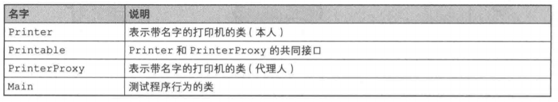
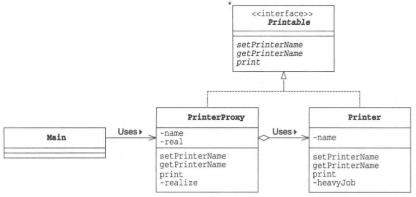
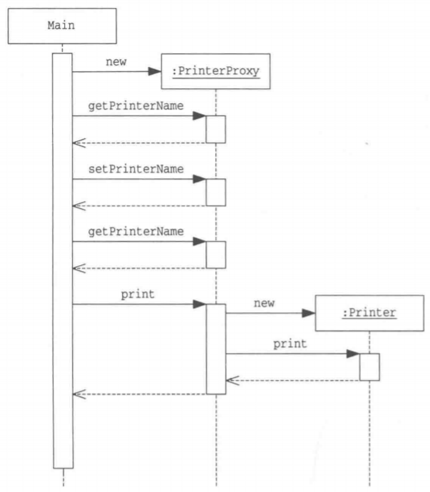
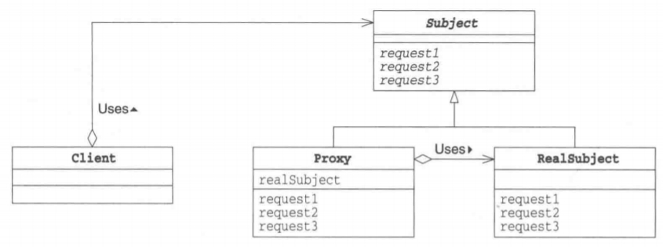

# Proxy模式

Proxy是“代理人”的意思，它指的是代替别人进行工作的人。当不一定需要本人亲自进行工作时，就可以寻找代理人去完成工作。但代理人毕竟只是代理人，能代替本人做的事情终究是有限的。因此，当代理人遇到无法自己解决的事情时就会去找本人解决该问题。

在面向对象编程中，“本人”和“代理人”都是对象。如果“本人”对象太忙了，有些工作无法自己亲自完成，就将其交给“代理人”对象负责。

# 在 Java 中使用该模式

> 复杂度：⭐⭐
>
> 流行度：⭐

下面我们来看一段使用了Poxy模式的示例程序。这段示例程序实现了一个“带名字的打印机”。说是打印机，其实只是将文字显示在界面上而已。在Main类中会生成PrinterProxy类的实例（即“代理人”）。首先我们会给实例赋予名字A11ce并在界面中显示该名字。接着会将实例名字改为Bob,然后显示该名字。在设置和获取名字时，都不会生成真正的Printer类的实例(即本人)，而是由PrinterProxy类代理。最后，直到我们调用print方法，**开始进入实际打印阶段后，PrinterProxy类才会生成Printer类的实例**。

为了让PrinterProxy类与Printer类具有一致性，我们定义了Printable接口。示例程序的前提是“生成Printer类的实例”这一处理需要花费很多时间。为了在程序中体现这一点，我们在Printer类的构造函数中调用了heavyJob方法，让它干一些“重活”（虽说是重活，也不过是让程序睡眠5秒钟)。

>示例程序类和接口一览表

 

> 示例程序的类图

 

> 示例程序时序图

 

## Printer类

Printer类是表示“本人”的类。

在之前的学习中我们也了解到了，在它的构造函数中，我们让它做一些所谓的“重活”（heavyJob)。

setPrinterName方法用于设置打印机的名字；getPrinterName用于获取打印机的名字。

print方法则用于显示带一串打印机名字的文字。

heavyJob是一个千5秒钟“重活”的方法，它每秒(1000毫秒)以点号(.)显示一次干活的进度。

Proxy模式的核心是PrinterProxy类。Printer类自身并不难理解。

```java
package com.llh.proxy;

/**
 * ClassName: Printer
 * Author: Maybe
 * Date: 2022/5/23  14:03
 */
public class Printer implements Printable {
    private String name;

    public Printer() {
        heavyJob("正在生成Printer的实例");
    }

    public Printer(String name) {
        this.name = name;
        heavyJob("正在生成Printer的实例(" + name + ")");
    }

    @Override
    public void setPrinterName(String name) {
        this.name = name;
    }

    @Override
    public String getPrinterName() {
        return name;
    }

    @Override
    public void print(String string) {
        System.out.println("===" + name + "===");
        System.out.println(string);
    }

    private void heavyJob(String msg) { //重活
        System.out.print(msg);
        for (int i = 0; i < 5; i++) {
            try {
                Thread.sleep(1000);
                System.out.print(".");
            } catch (InterruptedException e) {
                e.printStackTrace();
            }
        }
        System.out.println("结束。");
    }
}
```

## Printable接口

Printable接口用于使PrinterProxy类和Printer类具有一致性。

setprinterName方法用于设置打印机的名字；getPrinterName用于获取打印机的名字；print用于显示文字（打印输出）。

```java
package com.llh.proxy;

/**
 * ClassName: Printable
 * Author: Maybe
 * Date: 2022/5/23  13:51
 */
public interface Printable {
    void setPrinterName(String name); //设置名字

    String getPrinterName(); //获取名字

    void print(String string); //显示文字（打印输出）
}
```

## PrinterProxy类

PrinterProxy类是扮演“代理人”角色的类，它实现了Printable接口。

name字段中保存了打印机的名字，而real字段中保存的是“本人”。

在构造函数中设置打印机的名字（此时还没有生成“本人”）。

setPrinterName方法用于设置新的打印机名字。如果real字段不为null（也就是已经生成了“本人”)，那么会设置“本人”的名字。但是当real字段为null时（即还没有生成“本人”)，那么只会设置自己（PrinterProxy的实例)的名字。

getPrinterName会返回自己的name字段。

print方法已经超出了代理人的工作范围，因此它会调用realize方法来生成本人。Realize有“实现”（使成为真的东西）的意思。在调用realize方法后，real字段中会保存本人(Print类的实例)，因此可以调用real.print方法。这就是“委托”。

**不论setPrinterName方法和getPrinterName方法被调用多少次，都不会生成Printer类的实例**。只有当真正需要本人时，才会生Printer类的实例(PrinterProxy类的调用者完全不知道是否生成了本人，也不用在意是否生成了本人)。

realize方法很简单，当real字段为null时，它会使用new Printer来生成Printer类的实例：如果real字段不为null（即已经生成了本人)，则什么都不做。

这里希望大家记住的是，**Printer类并不知道PrinterProxy类的存在**。即，Printer类并不知道自己到底是通过PrinterProxy被调用的还是直接被调用的。

但反过来，PrinterProxy类是知道Printer类的。这是因为PrinterProxy类的real字段是Printer类型的。在PrinterProxy类的代码中，显式地写出了Printer这个类名。因此，PrinterProxy类是与Printer类紧密地关联在一起的组件（关于它们之间的解耦方法，下面会说)。

相信细心的读者应该已经发现了Printer类的setPrinterName方法和realize方法都是synchronized方法。也是考虑到线程安全问题。

```java
package com.llh.proxy;

/**
 * ClassName: PrinterProxy
 * Author: Maybe
 * Date: 2022/5/23  14:14
 */
public class PrinterProxy implements Printable {
    private String name; //名字
    private Printer real; //“本人”

    public PrinterProxy() {
    }

    public PrinterProxy(String name) {
        this.name = name;
    }

    @Override
    public synchronized void setPrinterName(String name) {
        if (real != null)
            real.setPrinterName(name);
        this.name = name;
    }

    @Override
    public String getPrinterName() {
        return name;
    }

    @Override
    public void print(String string) {
        realize();
        real.print(string);
    }

    private synchronized void realize() { //生成“本人”
        if (real == null)
            real = new Printer(name);
    }
}
```

## Main类

Main类通过PrinterProxy类使用Printer类。Main类首先会生成PrinterProxy，然后调用getprinterName方法获取打印机名并显示它。之后通过setPrinterName方法重新设置打印机名。最后，调用print方法输出"Hello,world."。

示例程序的运行结果如下所示。请注意，在设置名字和显示名字之间并没有生成Printer的实例（本人），直至调用print方法后，Printer的实例才被生成。

```java
package com.llh.proxy;

/**
 * ClassName: Main
 * Author: Maybe
 * Date: 2022/5/23  14:22
 */
public class Main {
    public static void main(String[] args) {
        Printable p = new PrinterProxy("Alice");
        System.out.println("现在的名字是：" + p.getPrinterName());
        p.setPrinterName("Json");
        System.out.println("现在的名字是：" + p.getPrinterName());
        p.print("Hello,World.");
    }
}
```

运行结果：

```
现在的名字是：Alice
现在的名字是：Json
正在生成Printer的实例(Json).....结束。
===Json===
Hello,World.
```

# Proxy模式中的登场角色

- **Subject(主体)**

  Subject角色定义了使Proxy角色和RealSubject角色之间具有一致性的接口。由于存在Subject角色，所以Client角色不必在意它所使用的究竟是Proxy角色还是RealSubject角色。在示例程序中，由Printable接口扮演此角色。

- **Proy(代理人)**

  Proxy角色会尽量处理来自Client角色的请求。只有当自己不能处理时，它才会将工作交给RealSubject角色。Proxy角色只有在必要时才会生成RealSubject角色。Proxy角色实现了在Subject角色中定义的接口(API)。在示例程序中，由PrinterProxy类扮演此角色。

- **RealSubject(实际的主体)**

  “本人”RealSubject角色会在“代理人”Proxy角色无法胜任工作时出场。它与Proxy角色一样，也实现了在Subject角色中定义的接口(API)。在示例程序中，由Printer类扮演此角色。

- **Client(请求者)**

  使用Proxy模式的角色。在GoF书中，Client角色并不包含在Proxy模式中。在示例程序中，由Main类扮演此角色。

> Proxy模式的类图

 

# 拓展思路的要点

## 使用代理人来提升处理速度

在Proxy模式中，Proxy角色作为代理人尽力肩负着工作使命。例如，在示例程序中，通过使用Proxy角色，我们成功地将耗时处理（生成实例的处理）推迟至print方法被调用后才进行。

示例程序中的耗时处理的消耗时间并不算太长，大家可能感受不深。请大家试想一下，假如在一个大型系统的初始化过程中，存在大量的耗时处理。如果在启动系统时连那些暂时不会被使用的功能也初始化了，那么应用程序的启动时间将会非常漫长，这将会引发用户的不满。而如果我们只在需要使用某个功能时才将其初始化，则可以帮助我们改善用户体验。

GoF书在讲解Proxy模式时，使用了一个可以在文本中嵌入图形对象(例如图片等)的文本编辑器作为例子。为了生成这些图形对象，需要读取图片文件，这很耗费时间。因此如果在打开文档时就生成有所的图形对象，就会导致文档打开时间过长。所以，最好是当用户浏览至文本中各个图形对象时，再去生成它们的实例。这时，Poxy模式就有了用武之地。

## 有必要划分代理人和本人吗

当然，我们也可以不划分PrinterProxy类和Printer类，而是直接在Printer类中加入惰性求值功能（即只有必要时才生成实例的功能）。不过，通过划分PrinterProxy角色和Printer角色，可以使它们成为独立的组件，在进行修改时也不会互相之间产生影响（分而治之）。

只要改变了PrinterProxy类的实现方式，即可改变在Printable接口中定义的那些方法，即对于“哪些由代理人负责处理，哪些必须本人负责处理”进行更改。而且，不论怎么改变，都不必修改Printer类。如果不想使用惰性求值功能，只需要修改Main类，将它使用new关键字生成的实例从PrinterProxy类的实例变为Printer类的实例即可。由于PrinterProxy类和Printer类都实现了Printable接口，因此Main类可以放心地切换这两个类。

在示例程序中，PrinterProxy类代表了“Proxy角色”。因此使用或是不使用PrinterProxy类就代表了使用或是不使用代理功能。

## 代理与委托

代理人只代理他能解决的问题。当遇到他不能解决的问题时，还是会“转交”给本人去解决。这里的“转交”就是在本书中多次提到过的“委托”。从PrinterProxy类的print方法中调用real.print方法正是这种“委托”的体现。

在现实世界中，应当是本人将事情委托给代理人负责，而在设计模式中则是反过来的。

## 透明性

PrinterProxy类和Printer类都实现了Printable接口，因此Main类可以完全不必在意调用的究竟是PrinterProxy类还是Printer类。无论是直接使用Printer类还是通过PrinterProxy类间接地使用Printer类都可以。

在这种情况下，可以说PrinterProxy类是具有“透明性”的。就像在人和一幅画之间放置了一块透明的玻璃板后，我们依然可以透过它看到画一样，即使在Main类和Printer类之间加入一个PrinterProxy类，也不会有问题。

## HTTP代理

提到代理，许多人应该都会想到HTTP代理。HTTP代理是指位于HTTP服务器(Wb服务器)和HTTP客户端(Wb浏览器)之间，为Web页面提供高速缓存等功能的软件。我们也可以认为它是一种Proxy模式。

HTTP代理有很多功能。作为示例，我们只讨论一下它的页面高速缓存功能。

通过Web浏览器访问Web页面时，并不会每次都去访问远程Web服务器来获取页面的内容，而是会先去获取HTTP代理缓存的页面。只有当需要最新页面内容或是页面的缓存期限过期时，才去访问远程Web服务器。

在这种情况下，Web服务器扮演的是Client角色，HTTP代理扮演的是Proxy角色，而Web服务器扮演的则是RealSubject角色。

# 各种Proxy模式

Proxy模式有很多种变化形式。

- **Virtual Proxy(虚拟代理)**

  Virtual Proxy就是本章中学习的Proxy模式。只有当真正需要实例时，它才生成和初始化实例。

- **Remote Proxy(远程代理)**

  Remote Proxy可以让我们完全不必在意RealSubject角色是否在远程网络上，可以如同它在自己身边一样（透明性地）调用它的方法。Java的RMI(RemoteMethodInvocation：远程方法调用)就相当于Remote Proxy。

- **Access Proxy**
  Access Proxy用于在调用RealSubject角色的功能时设置访问限制。例如，这种代理可以只允许指定的用户调用方法，而当其他用户调用方法时则报错。