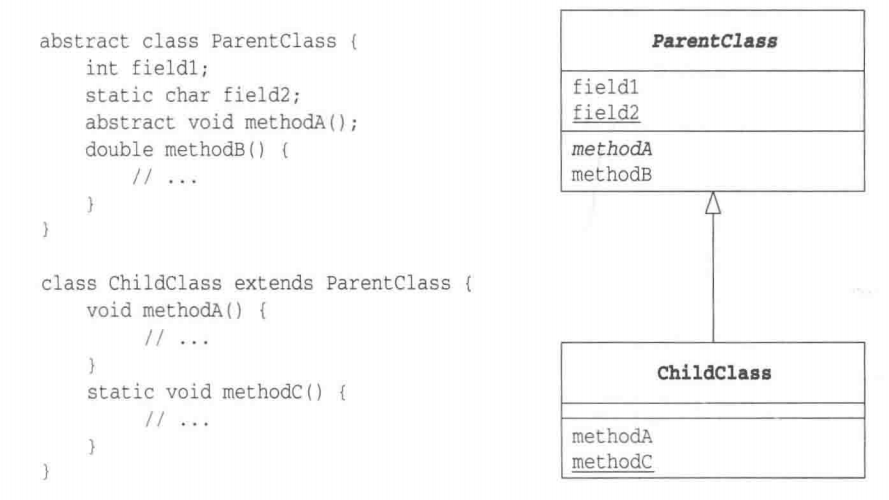
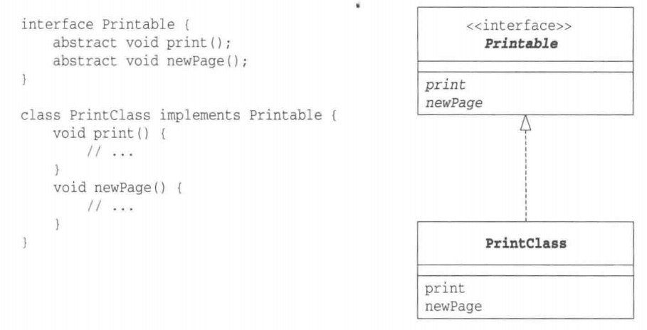
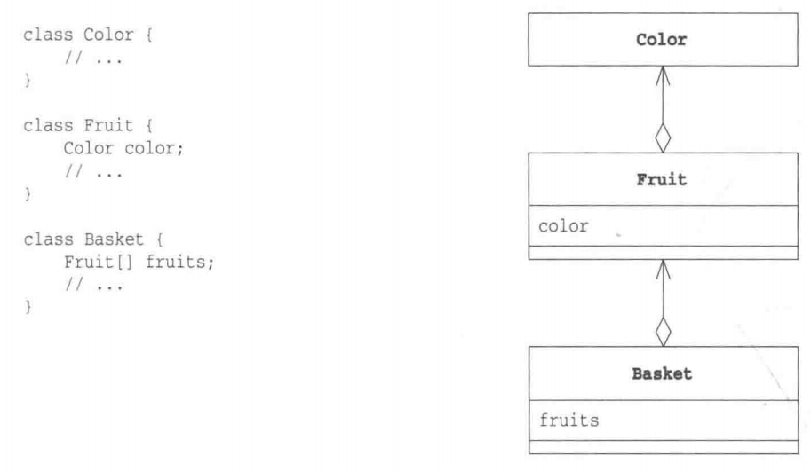
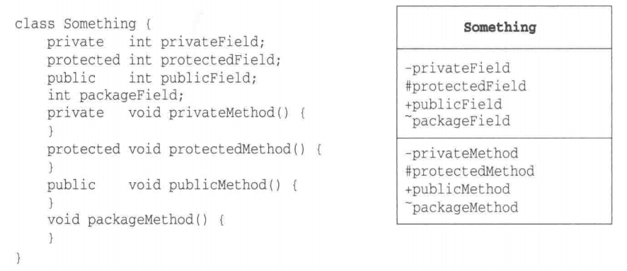
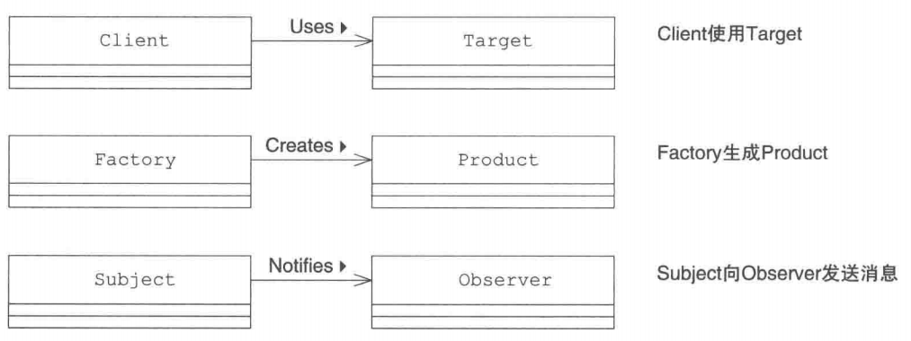
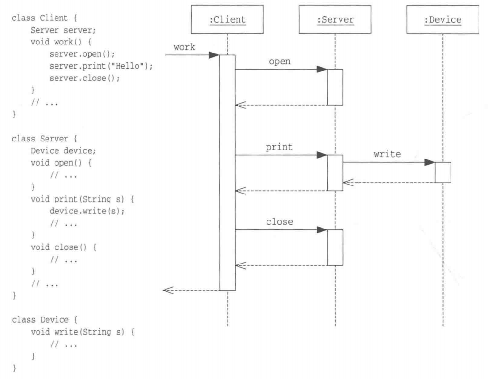

> [!note|label:目录：]

**创建型模式**：对象实例化的模式，创建型模式用于解耦对象的实例化过程

- [Singleton 模式（单例模式）](/框架架构/设计模式/Singleton模式 "Singleton模式")
- [Factory Method 模式（工厂方法模式）](/框架架构/设计模式/FactoryMethod模式 "Factory Method 模式")
- [Abstract Factory 模式（抽象工厂）](/框架架构/设计模式/AbstractFactory模式 "AbstractFactory模式")
- [Builder 模式（建造者模式）](/框架架构/设计模式/Builder模式 "Builder模式")
- [Prototype模式（原型模式）](/框架架构/设计模式/Prototype模式 "Prototype模式")

**结构型模式**：把类或对象结合在一起形成一个更大的结构

- [Adapter 模式（适配器模式）](/框架架构/设计模式/Adapter模式 "Adapter模式")
- [Composite模式（组合模式）](/框架架构/设计模式/Composite模式 "Composite模式")
- [Decorator模式（装饰器模式）](/框架架构/设计模式/Decorator模式 "Decorator模式")
- [Proxy模式（代理模式）](/框架架构/设计模式/Proxy模式 "Proxy模式")
- [Flyweight模式（享元模式）](/框架架构/设计模式/Flyweight模式 "Flyweight模式")
- [Facade模式（外观模式）](/框架架构/设计模式/Facade模式 "Facade模式")
- [Bridge模式（桥接模式）](/框架架构/设计模式/Bridge模式 "Bridge模式")

**行为型模式**：类和对象如何交互，及划分责任和算法

- [Iterator 模式（迭代器模式）](/框架架构/设计模式/Iterator模式 "Iterator模式")
- [Template Method 模式（模板方法模式）](/框架架构/设计模式/TemplateMethod模式 "TemplateMethod模式")
- [Strategy模式（策略模式）](/框架架构/设计模式/Strategy模式 "Strategy模式")
- [Command模式（命令模式）](/框架架构/设计模式/Command模式 "Command模式")
- [State模式（状态模式）](/框架架构/设计模式/State模式 "State模式")
- [Chain of Responsibility模式（责任链模式）](/框架架构/设计模式/ChainofResponsibility模式 "Chain of Responsibility模式")
- [Memento模式（备忘录模式）](/框架架构/设计模式/Memento模式 "Memento模式")
- [Mediator模式（中介者模式）](/框架架构/设计模式/Mediator模式 "Mediator模式")
- [Observer模式（观察者模式）](/框架架构/设计模式/Observer模式 "Observer模式")
- [Visitor模式（访问者模式）](/框架架构/设计模式/Visitor模式 "Visitor模式")

> [!warning|label:什么是 GOF（四人帮，全拼 Gang of Four）？]

在 1994 年，由 Erich Gamma、Richard Helm、Ralph Johnson 和 John Vlissides 四人合著出版了一本名为 **Design Patterns - Elements of Reusable Object-Oriented Software（中文译名：设计模式 - 可复用的面向对象软件元素）** 的书，该书首次提到了软件开发中设计模式的概念。

四位作者合称 **GOF（四人帮，全拼 Gang of Four）**。他们所提出的设计模式主要是基于以下的面向对象设计原则。

- 对接口编程而不是对实现编程。
- 优先使用对象组合而不是继承。

> [!note|label:设计模式的六大原则]

**1、开闭原则（Open Close Principle）**

开闭原则的意思是：**对扩展开放，对修改关闭**。在程序需要进行拓展的时候，不能去修改原有的代码，实现一个热插拔的效果。简言之，是为了使程序的扩展性好，易于维护和升级。想要达到这样的效果，我们需要使用接口和抽象类，后面的具体设计中我们会提到这点。

**2、里氏代换原则（Liskov Substitution Principle）**

里氏代换原则是面向对象设计的基本原则之一。 里氏代换原则中说，任何基类可以出现的地方，子类一定可以出现。LSP 是继承复用的基石，只有当派生类可以替换掉基类，且软件单位的功能不受到影响时，基类才能真正被复用，而派生类也能够在基类的基础上增加新的行为。里氏代换原则是对开闭原则的补充。实现开闭原则的关键步骤就是抽象化，而基类与子类的继承关系就是抽象化的具体实现，所以里氏代换原则是对实现抽象化的具体步骤的规范。

**3、依赖倒转原则（Dependence Inversion Principle）**

这个原则是开闭原则的基础，具体内容：针对接口编程，依赖于抽象而不依赖于具体。

**4、接口隔离原则（Interface Segregation Principle）**

这个原则的意思是：使用多个隔离的接口，比使用单个接口要好。它还有另外一个意思是：降低类之间的耦合度。由此可见，其实设计模式就是从大型软件架构出发、便于升级和维护的软件设计思想，它强调降低依赖，降低耦合。

**5、迪米特法则，又称最少知道原则（Demeter Principle）**

最少知道原则是指：一个实体应当尽量少地与其他实体之间发生相互作用，使得系统功能模块相对独立。

**6、合成复用原则（Composite Reuse Principle）**

合成复用原则是指：尽量使用合成/聚合的方式，而不是使用继承。

> [!tip|label:前言：]

> 展示类的层次关系的类图

  

> 展示接口与实现类的类图

> 展示聚合关系的类图

> 标识出了可见性的类图

 

> 类的关联

> 时序图示例（方法的调用）

在上图中，右侧是时序图示例，左侧是与之对应的代码片段

该图中共有3个实例，如图中最上方的3个长方形所示。在长方形内部写有类名，类名跟在冒号( : )之后，并带有下划线，如<u>:Client</u>、<u>:Server</u>、<u>:Device</u>，它们分别代表c1ient类、Server类、Device类的实例。

如果需要，还可以在冒号( : )之前表示出实例名，如<u>server:Servero</u>。

每个实例都带有一条向下延伸的虚线，我们称其为生命线。这里可以理解为时间从上向下流逝，上面是过去，下面是未来。生命线仅存在于实例的生命周期内。

在生命线上，有一些细长的长方形，它们表示实例处于某种活动中。

横方向上有许多箭头，请先看带有open字样的箭头。黑色实线箭头表示**方法的调用**，这里表示client调用server的open方法。当server的open方法被调用后，server实例处于活动中，因此在open箭头处画出了一个细长的长方形。

而在open箭头画出的长方形下方，还有一条指向client实例的虚线箭头，它表示**返回open方法**。在上图中，我们画出了所有的返回箭头，但是有些时序图也会省略返回箭头。

由于程序控制已经返回至client,所以表示server实例处于活动状态的长方形就此结束了。

接着，client实例会调用server实例的print方法。不过这次不同的是在print方法中，server会调用device实例的write方法。

这样，我们就将多个对象之间的行为用图示的方式展示出来了。**时序图的阅读顺序是沿着生命线从上至下阅读**。然后当遇到箭头时，我们可以顺着箭头所指的方向查看对象间的协作。