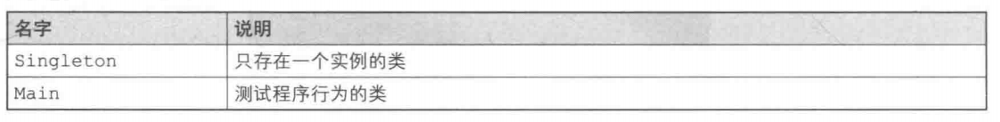
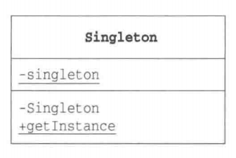

# Singleton 模式（单例模式）

# 什么是Singleton模式

程序在运行时，通常都会生成很多实例。例如，表示字符串的`java.lang.String`类的实例与字符串是一对一的关系，所以当有1000个字符串的时候，会生成1000个实例。

但是，当我们想在程序中表示某个东西只会存在一个时，就会有“只能创建一个实例”的需求。典型的例子有表示程序所运行于的那台计算机的类、表示软件系统相关设置的类，以及表示视窗系统（window system）的类。

当然，只要我们在编写程序时多加注意，确保只调用一次`new MyClass()`，就可以达到只生成一个实例的目的。但是，如果我们不想“必须多加注意才能确保生成一个实例”，而是要达到如下目的时，应当怎么做呢？

- **想确保任何情况下都绝对只有1个实例**
- **想在程序上表现出“只存在一个实例”**

像这样的确保只生成一个实例的模式被称作**Singleton模式**。Singleton是指只含有一个元素的集合。因为本模式只能生成一个实例，因此以Singleton命名。

# 在 Java 中使用该模式

> 复杂度：⭐
>
> 流行度：⭐⭐

> 类的一览表



> 示例程序的类图

 

构造函数Singleton前带有“-”，表示Singleton函数是private。此外，getInstance方法带有下划线，表示该方法是static方法。

## Singleton类

Singleton类只会生成一个实例。Singleton类定义了static字段（类的成员变量)singleton，并将其初始化为Singleton类的实例。初始化行为仅在该类被加载时进行一次。

Singleton类的构造函数是Private的，这是为了禁止从Singleton类外部调用构造函数。如果从Singleton类以外的代码中调用构造函数new Singleton(),就会出现编译错误。

如果程序员十分小心，不会使用new关键字生成实例，就不需要定义构造函数为private。但是这样的话，Singleton模式也就没有意义了。Singleton模式的作用在于可以确保任何情况下都只能生成一个实例。为了达到这个目的，必须设置构造函数为private。

为了便于测试Singleton类的行为，我们在构造函数中输出了“生成了一个实例。”这一信息。

我们还准备了getInstance方法，以便于程序从Singleton类外部获取Singleton类唯一的实例。在本例中，方法名为getInstance,不过并不是必须用这个名字。但是作为获取唯一实例的方法，通常情况下都会这样为其命名。

```java
public class Singleton {
    private static Singleton singleton = new Singleton();

    private Singleton() {
        System.out.println("生成了一个实例");
    }

    public static Singleton getInstance() {
        return singleton;
    }
}
```

## Main类

Main类使用了Singleton模式。在Main类中，我们调用了两次Singleton类的getInstance方法，来获取Singleton类的实例，并将返回值分别保存在instance1和instance2中。然后通过表达式`instance1 == instance2`是否成立来判断instance1和instance2是否为同一个实例。

```java
public class Main {
    public static void main(String[] args) {
        System.out.println("Start.");
        Singleton instance1 = Singleton.getInstance();
        Singleton instance2 = Singleton.getInstance();
        if (instance1 == instance2) {
            System.out.println("instance1和instance2是相同的实例");
        } else {
            System.out.println("instance1和instance2是相同的实例");
        }
    }
}

运行结果：
Start.
生成了一个实例
instance1和instance2是相同的实例    
```

# Singleton模式中登场的角色

- **Singleton**

  在Singleton模式中，只有Singleton这一个角色。Singleton角色中有一个返回唯一实例的static方法。该方法总是会返回同一个实例。

# Singleton模式的思路要点

## 为什么必须设置限制

Singleton模式对实例的数量设置了限制。为什么要在程序中特意设置这个限制呢？设置限制其实就是为程序增加一项前提条件。

当存在多个实例时，实例之间相互影响，可能会产生意想不到的Bug。

但是，如果我们可以确保只有一个实例，就可以在这个前提条件下放心地编程了。

## 何时生成这个唯一的实例

稍微注意一下示例程序的运行结果就会发现，在“Start.”之后就显示出了“生成了一个实例。”

程序运行后，在第一次调用getInstance方法时，Singleton类会被初始化。也就是在这个时候，static字段singleton被初始化，生成了唯一的一个实例。
