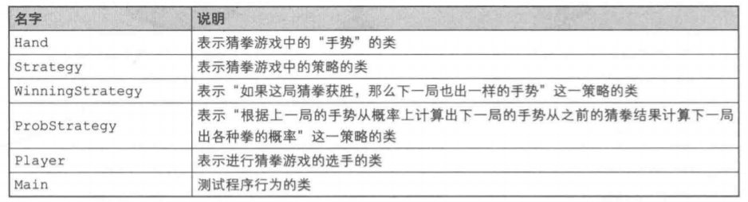
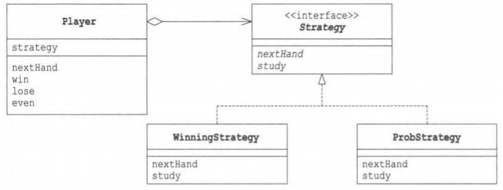
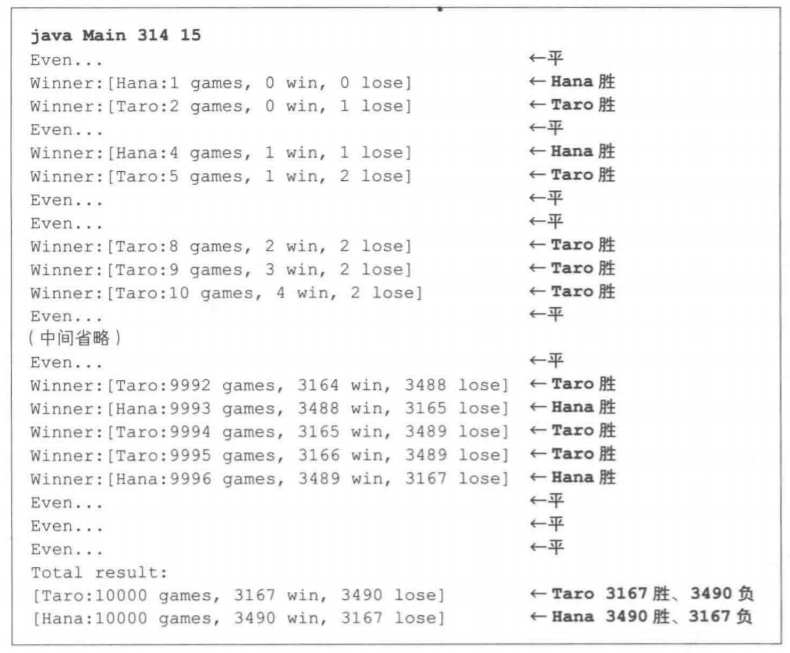
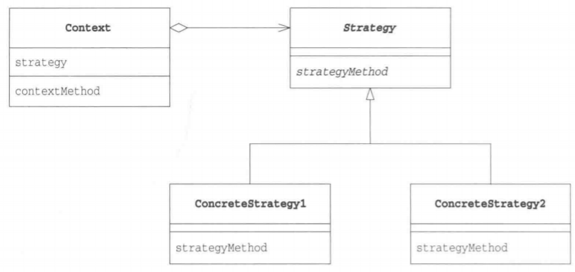

# Strategy模式

Strategy的意思是“策略”，指的是与敌军对垒时行军作战的方法。在编程中，我们可以将它理解为“算法”。

无论什么程序，其目的都是解决问题。而为了解决问题，我们又需要编写特定的算法。使用Strategy模式可以整体地替换算法的实现部分。能够整体地替换算法，能让我们轻松地以不同的算法去解决同一个问题，这种模式就是Strategy模式。

# Java伪代码

> 复杂度：⭐
>
> 流行度：⭐⭐⭐

下面我们来看一段使用了Strategy模式的示例程序。这段示例程序的功能是让电脑玩“猜拳”游戏。

我们考虑了两种猜拳的策略。第一种策略是“如果这局猜拳获胜，那么下一局也出一样的手势”(WinningStrategy)，这是一种稍微有些笨的策略；另外一种策略是“根据上一局的手势从概率上计算出下一局的手势”(ProbStrategy)。

> 类与接口一览表



> 示例程序类图



## Hand类

Hand类是表示猜拳游戏中的“手势”的类。在该类的内部，用int表示所出的手势，其中0表示石头，1表示剪刀，2表示布，并将值保存在handValue字段中。

我们只需要3个Hand类的实例。在程序的开始，创建这3个实例，并将它们保存在hand数组中。

Hand类的实例可以通过使用类方法getHand来获取。只要将表示手势的值作为参数传递给getHand方法，它就会将手势的值所对应的Hand类的实例返回给我们。这也是一种Singleton模式。

isStrongerThan方法和isWeakerThan方法用于判断猜拳结果。例如，如果有手势hand1和手势hand2，那么可以像下面这样判断猜拳结果。

```java
hand1.isStrongerThan(hand2);
hand1.isWeakerThan(hand2);
```

在该类的内部，实际负责判断猜拳结果的是fight方法，其判断依据是手势的值。

代码中的`(this.handValue + 1) % 3 == h.handValue`表达式可能会有些难以理解，所以这里稍微说明一下。如果this的手势值加1后是h的手势值（例如，如果this的手势是石头，而h是剪刀，或是this的手势是剪刀，而h是布，或是this的手势是布，而h是石头)，那么判断this获胜。之所以使用“号”运算符进行取余数计算，是希望布(2)加1后，变成石头(0)。

在上面的语句中，出现了this.handValue，这是为了让读者能够注意到它与h.handValue的区别。在程序中，即使写作`(handValue + 1) % 3 == h.handValue`，意思也是完全一样的。

虽然Hand类会被其他类(Player类、winningStrategy类、ProbStrategy类)使用，但它并非Strategy模式中的角色。

```java
package com.llh.strategy;

/**
 * ClassName: Hand
 * Author: Maybe
 * Date: 2022/5/26  13:52
 */
public class Hand {
    public static final int HANDVALUE_GUU = 0; //表示石头的值
    public static final int HANDVALUE_CHO = 1; //表示剪刀的值
    public static final int HANDVALUE_PAA = 2; //表示布的值
    public static final Hand[] hand = { //表示猜拳中3种手势的实例
            new Hand(HANDVALUE_GUU),
            new Hand(HANDVALUE_CHO),
            new Hand(HANDVALUE_PAA),
    };

    private static final String[] name = { //表示猜拳中手势所对应的字符串
            "石头", "剪刀", "布",
    };

    private int handValue;

    public Hand(int handValue) {
        this.handValue = handValue;
    }

    public static Hand getHand(int handValue) { //根据手势的值获取其对应的实例
        return hand[handValue];
    }

    public boolean isStrongerThan(Hand h) { //如果this胜了h则返回true
        return fight(h) == 1;
    }

    public boolean isWeakThan(Hand h) { //如果this输给h则返回true
        return fight(h) == -1;
    }

    private int fight(Hand h) { //计分：平0，胜1，负-1
        if (this == h)
            return 0;
        else if ((this.handValue + 1) % 3 == h.handValue)
            return 1;
        else
            return -1;
    }

    public String toString() { //返回石头剪刀布对应的字符串
        return name[handValue];
    }
}
```

## Strategy接口

Strategy接口是定义了猜拳策略的抽象方法的接口。

nextHand方法的作用是“获取下一局要出的手势”。调用该方法后，实现了Strategy接口的类会绞尽脑汁想出下一局出什么手势。

study方法的作用是学习“上一局的手势是否获胜了”。如果在上一局中调用nextHand方法获胜了，就接着调用study(true)，如果输了，就接着调用study(false)。这样，Strategy接口的实现类就会改变自己的内部状态，从而为下一次nextHand被调用时究竟是返回“石头”、“剪刀”还是“布”提供判断依据。

```java
package com.llh.strategy;

/**
 * ClassName: Strategy
 * Author: Maybe
 * Date: 2022/5/26  14:06
 */
public interface Strategy {
    Hand nextHand();

    void study(boolean win);
}
```

## WinningStrategy类

WinningStrategy类是Strategy接口的实现类之一，它实现了nextHand和study两个方法。

该类的猜拳策略有些笨，如果上一局的手势获胜了，则下一局的手势就与上局相同（上一局出石头，下一局继续出石头；上一局出布，下一局继续出布)。如果上一局的手势输了，则下一局就随机出手势。

由于在WinningStrategy类中需要使用随机值，因此我们在random字段中保存了java.util.Random的实例。也可以说，random字段是该类的一个随机数生成器。

在won字段中保存了上一局猜拳的输赢结果。如果上一局猜拳获胜了，则won值为txue;如果输了，则won值为falseo

在prevHand字段中保存的是上一局出的手势。

```java
package com.llh.strategy;

import java.util.Random;

/**
 * ClassName: WinningStrategy
 * Author: Maybe
 * Date: 2022/5/26  14:10
 */
public class WinningStrategy implements Strategy {
    private Random random;
    private boolean won = false;
    private Hand preHand;

    public WinningStrategy(int seed) {
        random = new Random(seed);
    }

    @Override
    public Hand nextHand() {
        if (!won)
            preHand = Hand.getHand(random.nextInt(3));
        return preHand;
    }

    @Override
    public void study(boolean win) {
        won = win;
    }
}
```

## ProbStrategy类

ProbStrategy类是另外一个具体策略，这个策略就需要“动点脑筋”了。

虽然它与winningStrategy类一样，也是随机出手势，但是每种手势出现的概率会根据以前的猜拳结果而改变。

history字段是一个表，被用于根据过去的胜负来进行概率计算。它是一个二维数组，每个数组下标的意思如下。

`history[上一局出的手势][这一局所出的手势]`

这个表达式的值越大，表示过去的胜率越高。下面稍微详细讲解下。

假设我们上一局出的是石头。

`history[0][0]` 两局分别出石头、石头时胜了的次数

`history[0][1]` 两局分别出石头、剪刀时胜了的次数

`history[0][2]` 两局分别出石头、布时胜了的次数

那么，我们就可以根据`history[0][0]`、`history[0][1]`、`history[0][2]`这3个表达式的值从概率上计算出下一局出什么。简而言之，就是先计算3个表达式的值的和(getSum方法)，然后再从0与这个和之间取一个随机数，并据此决定下一局应该出什么(nextHand方法)。例如，如果

`history[0][0]` 是3

`history[0][1]` 是5

`history[0][2]` 是7

那么，下一局出什么就会以石头、剪刀和布的比率为3：5：7来决定。然后在0至15（不含15，15是3+5+7的和）之间取一个随机数。

- **如果该随机数在0至3（不含3）之间，那么出石头**
- **如果该随机数在3至8（不含8）之间，那么出剪刀**
- **如果该随机数在8至15（不含15）之间，那么出布**

study方法会根据nextHand方法返回的手势的胜负结果来更新history字段中的值。

```java
package com.llh.strategy;

import java.util.Random;

/**
 * ClassName: ProbStrategy
 * Author: Maybe
 * Date: 2022/5/26  14:23
 */
public class ProbStrategy implements Strategy {
    private Random random;
    private int prevHandValue = 0;
    private int currentHandValue = 0;
    private int[][] history = {
            {1, 1, 1,},
            {1, 1, 1,},
            {1, 1, 1,},
    };

    public ProbStrategy(int seed) {
        random = new Random(seed);
    }

    @Override
    public Hand nextHand() {
        int bet = random.nextInt(getSum(currentHandValue));
        int handValue = 0;
        if (bet < history[currentHandValue][0])
            handValue = 0;
        else if (bet < history[currentHandValue][0] + history[currentHandValue][1])
            handValue = 1;
        else
            handValue = 2;
        prevHandValue = currentHandValue;
        currentHandValue = handValue;
        return Hand.getHand(handValue);
    }

    @Override
    public void study(boolean win) {
        if (win)
            history[prevHandValue][currentHandValue]++;
        else {
            history[prevHandValue][(currentHandValue + 1) % 3]++;
            history[prevHandValue][(currentHandValue + 2) % 3]++;
        }
    }

    private int getSum(int hv) {
        int sum = 0;
        for (int i = 0; i < 3; i++)
            sum += history[hv][i];
        return sum;
    }
}
```

## Player类

Player类是表示进行猜拳游戏的选手的类。在生成Player类的实例时，需要向其传递“姓名”和“策略”。nextHand方法是用来获取下一局手势的方法，不过实际上决定下一局手势的是各个策略。Player类的nextHand方法的返回值其实就是策略的nextHand方法的返回值。

nextHand方法将自己的工作委托给了Strategy，这就形成了一种委托关系。在决定下一局要出的手势时，需要知道之前各局的胜(win)、负(lose)、平(even)等结果，因此Player类会通过strategy字段调用study方法，然后study方法会改变策略的内部状态。wincount、losecount和gamecount用于记录选手的猜拳结果。

```java
package com.llh.strategy;

/**
 * ClassName: Player
 * Author: Maybe
 * Date: 2022/5/26  14:35
 */
public class Player {
    private String name;
    private Strategy strategy;
    private int winCount;
    private int loseCount;
    private int gameCount;

    public Player(String name, Strategy strategy) {
        this.name = name;
        this.strategy = strategy;
    }

    public Hand nextHand() { //策略决定下一局要出的手势
        return strategy.nextHand();
    }

    public void win() { //胜
        strategy.study(true);
        winCount++;
        gameCount++;
    }

    public void lose() { //负
        strategy.study(false);
        loseCount++;
        gameCount++;
    }

    public void even() { //平
        gameCount++;
    }

    @Override
    public String toString() {
        return "Player{" +
                "name='" + name + '\'' +
                ", strategy=" + strategy +
                ", winCount=" + winCount +
                ", loseCount=" + loseCount +
                ", gameCount=" + gameCount +
                '}';
    }
}
```

## Main类

Main类负责使用以上类让电脑进行猜拳游戏。这里Main类让以下两位选手进行10000局比赛，然后显示比赛结果。

- **姓名："Taro"、策略：WinningStrategy**
- **姓名："Hana"、策略：ProbStrategy**

此外，"winner:"+player1与"winner:"+player1.toString()的意思是一样的。

```java
package com.llh.strategy;

/**
 * ClassName: Main
 * Author: Maybe
 * Date: 2022/5/26  15:05
 */
public class Main {
    public static void main(String[] args) {
        if (args.length != 2) {
            System.out.println("Usage:java Main randomSeed1 randomSeed2");
            System.out.println("Example:java Main 314 15");
            System.exit(0);
        }
        int seed1 = Integer.parseInt(args[0]);
        int seed2 = Integer.parseInt(args[1]);
        Player player1 = new Player("Taro", new WinningStrategy(seed1));
        Player player2 = new Player("Hana", new ProbStrategy(seed2));
        for (int i = 0; i < 10000; i++) {
            Hand nextHand1 = player1.nextHand();
            Hand nextHand2 = player2.nextHand();
            if (nextHand1.isStrongerThan(nextHand2)) {
                System.out.println("Winner:" + player1);
                player1.win();
                player2.lose();
            } else if (nextHand2.isStrongerThan(nextHand1)) {
                System.out.println("Winner:" + player2);
                player1.lose();
                player2.win();
            } else
                System.out.println("Even...");
            player1.even();
            player2.even();
        }
        System.out.println("Total result:");
        System.out.println(player1.toString());
        System.out.println(player2.toString());
    }
}
```

运行结果：

 

# Strategy模式中的登场角色

- **Strategy(策略)**

  Strategy角色负责决定实现策略所必需的接口(API)。在示例程序中，由Strategy接口扮演此角色。

- **ConcreteStrategy(具体的策略)**

  ConcreteStrategy角色负责实现Strategy角色的接口(API)，即负责实现具体的策略（战略、方向、方法和算法)。在示例程序中，由winningStrategy类和ProbStrategy类扮演此角色。

- **Context(上下文)**

  负责使用Strategy角色。Context角色保存了ConcreteStrategy角色的实例，并使用ConcreteStrategy角色去实现需求（总之，还是要调用Strategy角色的接口(API)。在示例程序中，由Player类扮演此角色。

> Strategy模式的类图

 

# 拓展思路的要点

## 为什么需要特意编写Strategy角色

通常在编程时算法会被写在具体方法中。Strategy模式却特意将算法与其他部分分离开来，只是定义了与算法相关的接口(API),然后在程序中以委托的方式来使用算法。

这样看起来程序好像变复杂了，其实不然。例如，当我们想要通过改善算法来提高算法的处理速度时，如果使用了Strategy模式，就不必修改Strategy角色的接口(API)了，仅仅修改ConcreteStrategy角色即可。而且，**使用委托这种弱关联关系可以很方便地整体替换算法**。例如，如果想比较原来的算法与改进后的算法的处理速度有多大区别，简单地替换下算法即可进行测试。

使用Strategy模式编写象棋程序时，可以方便地根据棋手的选择切换AI例程的水平。

## 程序运行中也可以切换策略

如果使用Strategy模式，在程序运行中也可以切换ConcreteStrategy角色。例如，在内存容量少的运行环境中可以使用 slowButLessMemoryStrategy（速度慢但省内存的策略）,而在内存容量多的运行环境中则可以使用 FastButMoreMemoryStrategy（速度快但耗内存的策略）。

此外，还可以用某种算法去“验算”另外一种算法。例如，假设要在某个表格计算软件的开发版本中进行复杂的计算。这时，我们可以准备两种算法，即“高速但计算上可能有 Bug 的算法”和“低速但计算准确的算法”，然后让后者去验算前者的计算结果。