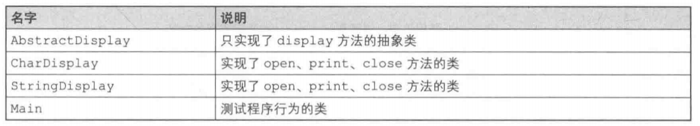
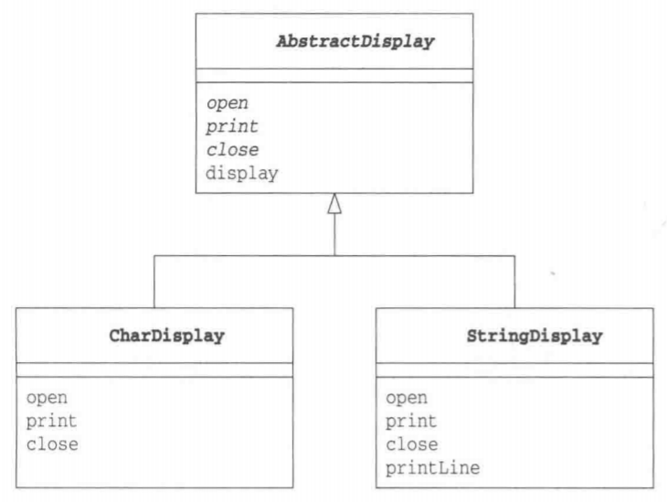
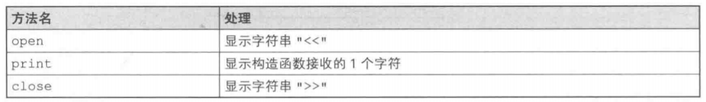
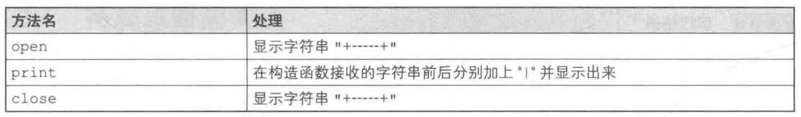
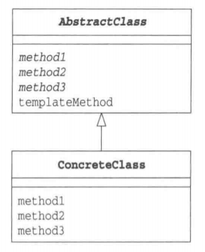

# Template Method 模式（模板方法模式）

# 什么是Template Method模式

Template Method模式是带有模板功能的模式，组成模板的方法被定义在父类中。由于这些方法是抽象方法，所以只查看父类的代码是无法知道这些方法最终会进行何种具体处理的，唯一能知道的就是父类是如何调用这些方法的。

实现上述这些抽象方法的是子类。在子类中实现了抽象方法也就决定了具体的处理。也就是说，只要在不同的子类中实现不同的具体处理，当父类的模板方法被调用时程序行为也会不同。但是，不论子类中的具体实现如何，处理的流程都会按照父类中所定义的那样进行。

像这样**在父类中定义处理流程的框架，在子类中实现具体处理**的模式就称为**Template Method模式**。

# 示例程序

首先让我们来看一段Template Method模式的示例程序。这里的示例程序是一段将字符和字符串循环显示5次的简单程序。

在示例程序中会出现AbstractDisplay、CharDisplay、StringDisplay、Main这4个类。

在AbstractDisplay类中定义了display方法，而且在该方法中依次调用了open、print、close这3个方法。虽然这3个方法已经在AbstractDisplay中被声明了，但都是没有实体的抽象方法。这里，调用抽象方法的display方法就是模板方法。

而实际上实现了open、print、close这3个抽象方法的是AbstractDisplay的子类CharDisplay类和StringDisplay类。Main类是用于测试程序行为的类。

> 类的一览表



> 示例程序的类图



## AbstractDisplay类

AbstractDisplay类有4个方法，分别是disp1ay、open、print、close。其中只有display方法实现了，open、print、close都是抽象方法。通过查看AbstractDisplay类中display方法的代码，我们可以知道display方法进行了以下处理。

- **调用open方法**
- **调用5次print方法**
- **调用close方法**

那么在open方法、print方法、close方法中各进行了什么处理呢？通过查看AbstractDisplay类的代码，我们可以知道这3个方法都是抽象方法。也就是说，如果仅仅查看AbstractDisplay类的代码，我们无法知道这3个方法中到底进行了什么样的处理。这是因为open方法、print方法、close方法的实际处理被交给了AbstractDisplay类的子类。

```java
package com.llh.templatemethod;

/**
 * @ClassName: AbstractDisplay
 * @author: Maybe
 * @date: 2022/5/5  13:40
 */
public abstract class AbstractDisplay { //抽象类AbstractDisplay
    public abstract void open(); //交给子类去实现的抽象方法(1)open

    public abstract void print(); //交给子类去实现的抽象方法(2)print

    public abstract void close(); //交给子类去实现的抽象方法(3)c1ose

    public final void display() { //本抽象类中实现的display方法
        open(); //首先打开...
        for (int i = 0; i < 5; i++) { //循环调用5次print
            print();
        }
        close(); //...最后关闭。这就是display方法所实现的功能
    }
}
```

## CharDisplay类

理解了前面的内容后，我们再来看看子类之一的CharDisplay类。由于CharDisplay类实现了父类AbstractDisplay类中的3个抽象方法open、print、close,因此它并不是抽象类。

> CharDisplay类中的open、print、close方法的处理



这样，当dipslay方法被调用时，结果会如何呢？假设我们向CharDisplay的构造函数中传递的参数是H这个字符，那么最终显示出来的会是如下结果。

`<<HHHHH>>`

```java
package com.llh.templatemethod;

/**
 * @ClassName: CharDisplay
 * @author: Maybe
 * @date: 2022/5/5  13:51
 */
public class CharDisplay extends AbstractDisplay {
    private char ch;

    public CharDisplay(char ch) {
        this.ch = ch;
    }

    /**
     * open在父类中是抽象方法
     * 此处重写该方法
     * 显示开始字符"<<”
     */
    @Override
    public void open() {
        System.out.print("<<");
    }

    /**
     * 同样地，此处重写print方法
     * 该方法会在display中被重复调用
     * 显示保存在字段ch中的字符
     */
    @Override
    public void print() {
        System.out.print(ch);
    }

    /**
     * 同样地，此处重写c1ose方法
     * 显示结束字符">>"
     */
    @Override
    public void close() {
        System.out.println(">>");
    }
}
```

## StringDisplay类

接下来让我们看看另外一个子类一StringDisplay类。与CharDisplay类一样，它也实现了open、print、close方法。这次，这3个方法中会进行怎样的处理呢？

> StringDisplay类中的open、print、close方法的处理



此时，如果dipslay方法被调用，结果会如何呢？假设我们向CharDisplay的构造函数中传递的参数是"He11o,wor1d."这个字符串，那么最终结果会像下面这样，文字会被显示在方框内部。

```
<<HHHHH>>
+-----------+
|hello world|
|hello world|
|hello world|
|hello world|
|hello world|
+-----------+
```

```java
package com.llh.templatemethod;

/**
 * @ClassName: StringDisplay
 * @author: Maybe
 * @date: 2022/5/5  13:58
 */
public class StringDisplay extends AbstractDisplay {
    private String string;
    private int width; //以字节为单位计算出的字符串长度

    public StringDisplay(String string) {
        this.string = string;
        this.width = string.getBytes().length;
    }

    @Override
    public void open() {
        printLine();
    }

    @Override
    public void print() {
        System.out.println("|" + string + "|");
    }

    @Override
    public void close() {
        printLine();
    }

    private void printLine() {
        System.out.print("+");
        for (int i = 0; i < width; i++) {
            System.out.print("-");
        }
        System.out.println("+");
    }
}
```

## Main类

Main类的作用是测试程序行为。在该类中生成了CharDisplay类和StringDisplay类的实例，并调用了display方法。

```java
package com.llh.templatemethod;

/**
 * @ClassName: Main
 * @author: Maybe
 * @date: 2022/5/5  14:04
 */
public class Main {
    public static void main(String[] args) {
        AbstractDisplay d1 = new CharDisplay('H');
        AbstractDisplay d2 = new StringDisplay("hello world");
        d1.display();
        d2.display();
    }
}

运行结果：

<<HHHHH>>
+-----------+
|hello world|
|hello world|
|hello world|
|hello world|
|hello world|
+-----------+    
```

# Template Method模式中的登场角色

- **AbstractClass(抽象类)**

  AbstractClass角色不仅负责实现模板方法，还负责声明在模板方法中所使用到的抽象方法。这些抽象方法由子类ConcreteClass角色负责实现。在示例程序中，由AbstractDisplay类扮演此角色。

- **ConcreteClass(具体类)**

  该角色负责具体实现AbstractClass角色中定义的抽象方法。这里实现的方法将会在AbstractClass角色的模板方法中被调用。在示例程序中，由CharDisplay类和StringDisplay类扮演此角色。

> Template Method模式的类图

 

# Template Method模式中的思路要点

> **可以使逻辑处理通用化**

使用Template Method模式究竟能带来什么好处呢？这里，它的优点是由于在父类的模板方法中编写了算法，因此无需在每个子类中再编写算法。
例如，我们没使用Template Method模式，而是使用文本编辑器的复制和粘贴功能编写了多个ConcreteClass角色。此时，会出现ConcreteClass1、ConcreteClass2、Concreteclass3等很多相似的类。编写完成后立即发现了Bug还好，但如果是过一段时间才发现在ConcreteC1ass1中有Bug,该怎么办呢？这时，我们就必须将这个Bug的修改反映到所有的ConcreteClass角色中才行。

关于这一点，如果是使用Template Method模式进行编程，当我们在模板方法中发现Bug时，只需要修改模板方法即可解决问题。

> **父类与子类之间的协作**

在Template Method模式中，父类和子类是紧密联系、共同工作的。因此，在子类中实现父类中声明的抽象方法时，必须要理解这些抽象方法被调用的时机。在看不到父类的源代码的情况下，想要编写出子类是非常困难的。

> **父类与子类的一致性**

在示例程序中，不论是CharDisplay的实例还是StringDisplay的实例，都是先保存在AbstractDisplay类型的变量中，然后再来调用display方法的。

使用父类类型的变量保存子类实例的优点是，即使没有用instanceof等指定子类的种类，程序也能正常工作。

无论在父类类型的变量中保存哪个子类的实例，程序都可以正常工作，这种原则称为**里氏替换原则**(The Liskov Substitution Principle，LSP)。当然，LSP并非仅限于Template Method模式，它是通用的继承原则。